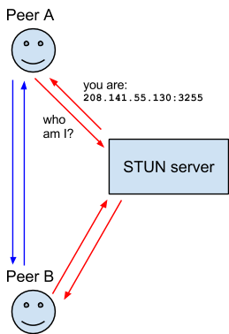

## 1. What is WebRTC?

WebRTC(Web Real-Time Communication) is an open source that enables real-time transmission of video, audio, and general data between peers, also available in web browser environments and Android and IOS applications.
It is implemented as an open web standard and is available in all major browsers as a regular JavaScript API. (Supported by Apple, Google, Microsoft, and Mozilla)

## 2. Introduction to WebRTC’s Technologies and Protocols

### 2–1. ICE(Interactive Connectivity Establishment)

A framework that allows browsers to connect through peers.
Reasons why simple connections between peers might not work

-   Need to go through firewall trying to connect
-   If your device does not have a Public IP, you must assign the only address value.
-   When a router does not allow direct connections between peers, it is necessary to relay data.

ICE uses both STUN and TURN servers or one server to perform the above tasks.

### 2–2. STUN(Session Traversal Utilities for NAT) Server

Provides the client’s own Public Address (IP:PORT).
Protocols that determine router restrictions, such as preventing direct connections between peers (determining whether other peers are currently accessible)
The client asks the STUN server to answer the client’s Public Address over the Internet and whether the client behind NAT on the router is accessible.

### 2–3. NAT(Network Address Transilation)

It is used to assign a public IP (Public IP) address to a terminal.
The router has a public IP address, and all terminals are connected to the router and have a private IP address.
Requests are translated from the terminal’s private address based on the router’s public address and unique port. Thanks to this, each terminal can be searched on the Internet without a unique public IP.
Some routers employ NAT for restrictions called Symmetric NAT. That is, only connections that peers have connected to before are allowed. So even if the STUN server discovers a public IP address, it doesn’t mean that everyone can connect. (The reason for requesting whether other peers can access the STUN server in the above explanation)
That is why TURN is necessary.

### 2–4. TURN(Traversal Using Relays around NAT) Server

By connecting to a TURN server and passing all information to that server, it means bypassing the symmetric NAT restrictions.
To do this, you need to connect with the TURN server, send all packets to that server to all peers, and send them back to TURN server.
Obviously there is an overhead, so this method should only be used if there is no other alternative.

### 2–5. SDP(Session Description Protocol)

It is a standard to describe the connection of multimedia contents such as resolution, format, codec, and encryption. The two peers let the other know that data is being transferred.
Basically, it is a description of metadata about the content, not the media content itself.
Technically speaking, SDP is not a protocol. However, the data format is used to describe the connection for sharing media between devices.

## [Reference]

-   https://webrtc.org/
-   https://developer.mozilla.org/en/docs/Web/API/WebRTC_API
