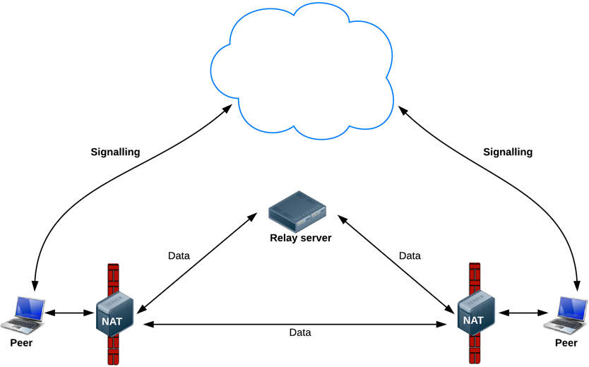
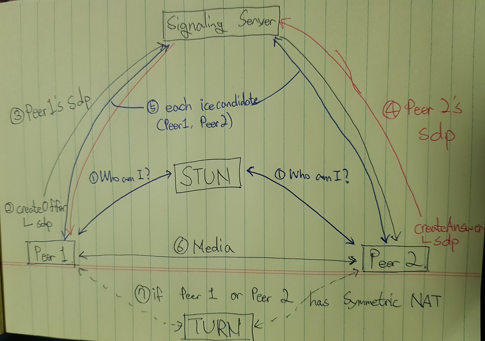

## 1. 서론

이전까지의 포스트에서는 WebRTC가 어떤 기술을 사용하고 개발자가 상황에 따라 어떤 서버를 같이 개발해야 하는지에 대해 알아봤다. 드디어 기다리고 기다리던 구현의 시간이다. 오늘의 목표는 ReactJS와 Typescript를 이용한 Client 1:1(P2P) WebRTC 구현과 node.js를 이용한 Signaling Server를 구현하는 것이다. 만약 이 말이 이해가 잘 되지 않는다면 [이전의 포스트](<https://millo-l.github.io/WebRTC-%EA%B5%AC%ED%98%84-%EB%B0%A9%EC%8B%9D(Mesh-SFU-MCU)>)를 보고오기 바란다. 또한, 본 게시물은 ReactJS, Typescript 그리고 node.js를 설명하기 위한 글이 아니므로 WebRTC 구현을 위한 코드에만 초점을 맞춰서 설명하도록 하겠다.

## 2. 데이터 용어 정리

### 2-1. MediaStream(getUserMedia)

-   사용자의 카메라와 마이크 같은 곳의 데이터 스트림에 접근한다.
-   navigator.mediaDevices.getUserMedia()에서 생성된 입력과 video 태그 또는 RTCPeerConnection으로 넘겨주는 출력을 갖는다.
-   navigator.mediaDevices.getUserMedia()가 받는 3개의 매개변수

    -   제약 오브젝트(video 사용 여부(또는 해상도), audio 사용 여부 등)
    -   성공 시 콜백(MediaStream)
    -   실패 시 콜백(error)

-   getUserMedia()는 반드시 로컬 파일 시스템이 아닌 서버에서 사용되어야하며, 이외의 경우에는 PERMISSION_DENIED: 1 에러가 발생한다.

### 2-2. RTCPeerConnection

-   암호화 및 대역폭 관리를 하는 기능을 가지고 있고, 오디오 또는 비디오 연결을 한다.
-   Peer들 간의 데이터를 안정적이고 효율적으로 통신하게 처리하는 WebRTC 컴포넌트이다.
-   아래는 RTCPeerConnection의 역할을 보여주는 WebRTC 아키텍쳐 다이어그램이다. RTCPeerConnection이 뒤에 숨겨진 녹색 부분은 매우 복잡하지만 웹개발자들이 처리하지 않아도 되는 부분이다.
    -   packet loss concealment
    -   echo cancellation
    -   bandwidth adaptivity
    -   dynamic jitter buffering
    -   automatic gain control
    -   noise reduction and suppression
    -   image 'cleaning'.


#### PS. 사실 RTCDataChannel이라는 (영상, 오디오 외의) 실시간 데이터를 전송하는 방식이 있는 데 실시간 영상 송수신과는 별도의 기술이라 혹시나 원하시는 분이 계시면 나중에 포스팅하겠습니다.

## 3. 구현 방식

### 3-1. 간략한 연결 구조

아래의 그림은 오늘 우리가 구현할 방식을 간략하게 나타낸 것이다. 그림에서는 Caller와 Callee라는 표현으로 카카오톡의 보이스톡이나 페이스톡을 연상시키는 방식을 나타내고 있다. Caller가 Signaling 서버를 통해 자신의 SessionDescription을 보내면 Callee도 마찬가지로 Signaling 서버를 통해 자신의 SessionDescription을 보낸다. 그 외에도 ICECandidate를 Signaling 서버를 통해 주고 받으며 peer 간 연결을 완료하고 Caller와 Callee 간에 Media 데이터를 주고 받는다.


### 3-2. STUN 서버 동작

아래의 그림에서는 STUN 서버를 통해 자신의 Public Address를 알아내고 접근 가능한 지 여부(Symmetric NAT 제한 여부)를 알아낸다. 다른 부분은 위의 그림 설명과 동일하다. Relay server란 TURN 서버를 나타내는 것으로 Symmetric NAT 제한을 우회하는 방식이다. 이 방식은 오버헤드가 발생하므로 대안이 없을 경우에만 사용해야 한다.


### 3-3. 연결 후 데이터 흐름

아래의 그림은 peer 연결이 완료됐을 때 peer간의 데이터 흐름을 보여준 것으로 만약 TURN 서버가 필요하지 않다면(Symmetric NAT 제한이 걸리지 않는 다면) Relay server 없이 peer 간의 통신이 이루어지고, 만약 TURN 서버가 필요하다면(Symmetric NAT 제한이 걸렸다면) 모든 peer들에게 서로가 주고 받는 데이터를 TURN 서버에 같이 전달해야한다.



### 3-4. 주고 받는 Signal 데이터

아래의 그림은 위의 그림들에서 실제 Signaling 서버를 통해 주고 받는 데이터가 분명하게 그려져 있지는 않아 이해를 돕기 위해 글쓴이가 직접 그렸다. 위의 그림들에서 peer의 NAT이 STUN 서버에게 어떤 요청을 보내는 지는 설명했기 때문에 직접 그린 그림에서는 NAT 부분 그림을 제외시켰다.(실제로는 peer에 각각 NAT이 존재한다.) 해당 그림의 순서는 글쓴이가 직접 client와 signaling server에 log를 찍어가며 직접 확인한 부분이다.(혹시 잘못된 부분이 있다면 댓글로 설명해주시면 바로 수정하겠습니다!)

#### 순서를 살펴보자.

#### 1. 우선 각각의 peer들은 STUN 서버에 자신의 Public Address와 접근 가능한지 여부를 전달 받는다.

#### 2. Peer1이 createOffer를 통해 먼저 자신의 SessionDescription을 생성하고 Signaling Server를 통해 Peer2에게 전달한다. (해당 그림에서는 Peer1이 위 그림의 Caller 역할이므로)

#### 3. Peer2가 Peer1의 SessionDescription을 전달 받고 이에 대한 답으로 createAnswer을 통해 자신의 SessionDescription을 생성하고 Signaling Server를 통해 Peer1에 전달한다.

#### 4. Peer1과 Peer2 모두 자신의 SessionDescription을 생성한 후부터 자신의 ICECandidate 정보를 생성하기 시작하고 이를 각각 서로에게 전달한다.

#### 5. 서로의 MediaStream을 peer간 통신으로 주고 받는다.

#### 6. 만약 Peer1과 Peer2 둘 중 Symmetric NAT을 가진 Peer가 있는 경우 TURN 서버를 사용해 data relay로 연결을 진행해야 한다.

위의 설명은 주고 받는 Signal에 대한 설명으로 사실 코드를 구현할 때에는 신경쓸 부분이 더 있다.



## 4. 실제 코드

### 4-1. Signaling Server(Node.js)

#### 주의할 점: socket.io version=2.3.0을 사용하셔야 합니다.

```js
let users = {};
let socketToRoom = {};
const maximum = 2;

io.on("connection", socket => {
    // 1:1 에서는 이런 식으로 구현하지 않아도 되지만 글쓴이는 1:N을 먼저 구현해서 이 형태로 남겨뒀습니다.
    // email 부분은 무시하셔도 무방합니다.
    socket.on("join_room", data => {
        // user[room]에는 room에 있는 사용자들이 배열 형태로 저장된다.
        // room이 존재한다면
        if (users[data.room]) {
            const length = users[data.room].length;
            // 최대 인원을 충족시켰으면 더 이상 접속 불가
            if (length === maximum) {
                socket.to(socket.id).emit("room_full");
                return;
            }
            // 인원이 최대 인원보다 적으면 접속 가능
            users[data.room].push({ id: socket.id, email: data.email });
        } else {
            // room이 존재하지 않는다면 새로 생성
            users[data.room] = [{ id: socket.id, email: data.email }];
        }
        // 해당 소켓이 어느 room에 속해있는 지 알기 위해 저장
        socketToRoom[socket.id] = data.room;

        socket.join(data.room);
        console.log(`[${socketToRoom[socket.id]}]: ${socket.id} enter`);

        // 본인을 제외한 같은 room의 user array
        const usersInThisRoom = users[data.room].filter(
            user => user.id !== socket.id
        );

        console.log(usersInThisRoom);

        // 본인에게 해당 user array를 전송
        // 새로 접속하는 user가 이미 방에 있는 user들에게 offer(signal)를 보내기 위해
        io.sockets.to(socket.id).emit("all_users", usersInThisRoom);
    });

    // 다른 user들에게 offer를 보냄 (자신의 RTCSessionDescription)
    socket.on("offer", sdp => {
        console.log("offer: " + socket.id);
        // room에는 두 명 밖에 없으므로 broadcast 사용해서 전달
        // 여러 명 있는 처리는 다음 포스트 1:N에서...
        socket.broadcast.emit("getOffer", sdp);
    });

    // offer를 보낸 user에게 answer을 보냄 (자신의 RTCSessionDescription)
    socket.on("answer", sdp => {
        console.log("answer: " + socket.id);
        // room에는 두 명 밖에 없으므로 broadcast 사용해서 전달
        // 여러 명 있는 처리는 다음 포스트 1:N에서...
        socket.broadcast.emit("getAnswer", sdp);
    });

    // 자신의 ICECandidate 정보를 signal(offer 또는 answer)을 주고 받은 상대에게 전달
    socket.on("candidate", candidate => {
        console.log("candidate: " + socket.id);
        // room에는 두 명 밖에 없으므로 broadcast 사용해서 전달
        // 여러 명 있는 처리는 다음 포스트 1:N에서...
        socket.broadcast.emit("getCandidate", candidate);
    });

    // user가 연결이 끊겼을 때 처리
    socket.on("disconnect", () => {
        console.log(`[${socketToRoom[socket.id]}]: ${socket.id} exit`);
        // disconnect한 user가 포함된 roomID
        const roomID = socketToRoom[socket.id];
        // room에 포함된 유저
        let room = users[roomID];
        // room이 존재한다면(user들이 포함된)
        if (room) {
            // disconnect user를 제외
            room = room.filter(user => user.id !== socket.id);
            users[roomID] = room;
        }
        // 어떤 user가 나갔는 지 room의 다른 user들에게 통보
        socket.broadcast.to(room).emit("user_exit", { id: socket.id });
        console.log(users);
    });
});
```

#### 이전에 설명했던 대로 Signaling Server는 WebRTC의 peer간의 연결을 도와줄 뿐 서버의 부하가 없습니다. 따라서, 매우 간단하게 서버가 구성됩니다.

### 4-2. Client(ReactJS, Typescript)

#### 주의할 점: socket.io-client version=2.3.0, @types/socket.io-client version=1.4.34을 사용하셔야 합니다.

#### 1. Client에서 사용할 변수들

-   pc: RTCPeerConnetion
-   socket: Signaling Server와 통신할 socket
-   localVideoRef: 본인의 video, audio를 재생할 video 태그의 ref
-   remoteVideoRef: 상대방의 video, audio를 재생할 video 태그의 ref
-   pc_config: RTCPeerConnection을 생성할 때의 config

```ts
const [pc, setPc] = useState<RTCPeerConnection>();
const [socket, setSocket] = useState<SocketIOClient.Socket>();

let localVideoRef = useRef<HTMLVideoElement>(null);
let remoteVideoRef = useRef<HTMLVideoElement>(null);

const pc_config = {
    iceServers: [
        // {
        //   urls: 'stun:[STUN_IP]:[PORT]',
        //   'credentials': '[YOR CREDENTIALS]',
        //   'username': '[USERNAME]'
        // },
        {
            urls: "stun:stun.l.google.com:19302",
        },
    ],
};
```

##### 2. Socket 수신 이벤트

-   all_user
    -   자신을 제외한 같은 방의 모든 user 목록을 받아온다.
    -   해당 user에게 offer signal을 보낸다(createOffer() 함수 호출).
-   getOffer
    -   상대방에게서 offer signal 데이터로 상대방의 RTCSessionDescription을 받는다.
    -   해당 user에게 answer signal을 보낸다(createAnswer(sdp) 함수 호출).
-   getAnswer
    -   본인 RTCPeerConnection의 RemoteDescription으로 상대방의 RTCSessionDescription을 설정한다.
-   getCandidate
    -   본인 RTCPeerConnection의 IceCandidate로 상대방의 RTCIceCandidate를 설정한다.

```ts
let newSocket = io.connect("http://localhost:8080");
let newPC = new RTCPeerConnection(pc_config);

newSocket.on("all_users", (allUsers: Array<{ id: string; email: string }>) => {
    let len = allUsers.length;
    if (len > 0) {
        createOffer();
    }
});

newSocket.on("getOffer", (sdp: RTCSessionDescription) => {
    //console.log(sdp);
    console.log("get offer");
    createAnswer(sdp);
});

newSocket.on("getAnswer", (sdp: RTCSessionDescription) => {
    console.log("get answer");
    newPC.setRemoteDescription(new RTCSessionDescription(sdp));
    //console.log(sdp);
});

newSocket.on("getCandidate", (candidate: RTCIceCandidateInit) => {
    newPC.addIceCandidate(new RTCIceCandidate(candidate)).then(() => {
        console.log("candidate add success");
    });
});

setSocket(newSocket);
setPc(newPC);
```

#### 3. MediaStream 설정 및 RTCPeerConnection 이벤트

-   onicecandidate
    -   offer 또는 answer signal을 생성한 후부터 본인의 icecadidate 정보 이벤트가 발생한다.
    -   offer 또는 answer를 보냈던 상대방에게 본인의 icecandidate 정보를 Signaling Server를 통해 보낸다.
-   oniceconnectionstatechange
    -   ICE connection 상태가 변경됐을 때의 log
-   ontrack
    -   상대방의 RTCSessionDescription을 본인의 RTCPeerConnection에서의 remoteSessionDescription으로 지정하면 상대방의 track 데이터에 대한 이벤트가 발생한다.
    -   해당 데이터에서 MediaStream을 상대방의 video, audio를 재생할 video 태그에 등록한다.

```ts
navigator.mediaDevices
    .getUserMedia({
        video: true,
        audio: true,
    })
    .then(stream => {
        if (localVideoRef.current) localVideoRef.current.srcObject = stream;

        // 자신의 video, audio track을 모두 자신의 RTCPeerConnection에 등록한다.
        stream.getTracks().forEach(track => {
            newPC.addTrack(track, stream);
        });
        newPC.onicecandidate = e => {
            if (e.candidate) {
                console.log("onicecandidate");
                newSocket.emit("candidate", e.candidate);
            }
        };
        newPC.oniceconnectionstatechange = e => {
            console.log(e);
        };

        newPC.ontrack = ev => {
            console.log("add remotetrack success");
            if (remoteVideoRef.current)
                remoteVideoRef.current.srcObject = ev.streams[0];
        };

        // 자신의 video, audio track을 모두 자신의 RTCPeerConnection에 등록한 후에 room에 접속했다고 Signaling Server에 알린다.
        // 왜냐하면 offer or answer을 주고받을 때의 RTCSessionDescription에 해당 video, audio track에 대한 정보가 담겨 있기 때문에
        // 순서를 어기면 상대방의 MediaStream을 받을 수 없음
        newSocket.emit("join_room", {
            room: "1234",
            email: "sample@naver.com",
        });
    })
    .catch(error => {
        console.log(`getUserMedia error: ${error}`);
    });
```

#### 4. 상대방에게 offer signal 전달

```ts
const createOffer = () => {
    console.log("create offer");
    newPC
        .createOffer({ offerToReceiveAudio: true, offerToReceiveVideo: true })
        .then(sdp => {
            newPC.setLocalDescription(new RTCSessionDescription(sdp));
            newSocket.emit("offer", sdp);
        })
        .catch(error => {
            console.log(error);
        });
};
```

#### 5. 상대방에게 answer signal 전달

```ts
const createAnswer = (sdp: RTCSessionDescription) => {
    newPC.setRemoteDescription(new RTCSessionDescription(sdp)).then(() => {
        console.log("answer set remote description success");
        newPC
            .createAnswer({
                offerToReceiveVideo: true,
                offerToReceiveAudio: true,
            })
            .then(sdp1 => {
                console.log("create answer");
                newPC.setLocalDescription(new RTCSessionDescription(sdp1));
                newSocket.emit("answer", sdp1);
            })
            .catch(error => {
                console.log(error);
            });
    });
};
```

#### 6. 본인과 상대방의 video 렌더링

```tsx
return (
    <div>
        <video
            style={{
                width: 240,
                height: 240,
                margin: 5,
                backgroundColor: "black",
            }}
            muted
            ref={localVideoRef}
            autoPlay
        ></video>
        <video
            id="remotevideo"
            style={{
                width: 240,
                height: 240,
                margin: 5,
                backgroundColor: "black",
            }}
            ref={remoteVideoRef}
            autoPlay
        ></video>
    </div>
);
```

## 5. 느낀 점

코로나 사태로 인해 크리스마스를 가족 외에 다른 사람과 만나지 못하고 지내다보니 시간이 많이 남아 하루 종일 덧붙일 자료를 찾으며 이 포스팅을 썼다. 처음에는 간단하게 쓸 생각이었지만 쓰다보니 정확한 정보를 포스팅하고 싶은 욕심에 자료를 많이 찾아보다보니 시간이 어느덧 몇 시간이 지나버렸다. 가족들과 즐거운 저녁식사와 작은 축하 파티를 하고 보낸 소소하고 행복한 크리스마스다. 어쩌다보니 신세한탄을 하게 되버렸는 데...
일단 이 코드들은 정말 간단하게 WebRTC를 1:1 P2P형식 연결을 해본 결과물이다. 물론 나는 위에서 적어놓은 주석처럼 코드의 실행순서를 정확히 이해하지 않고 도전을 하다보니 엄청나게 많은 디버깅과 시간을 쏟아서 결국 성공하게 됐고, 성공을 하고 나니 더욱 이해가 잘 가는 신기한 공부 순서를 경험했다. 어쩔때는 머리로 이해하는 것보다 몸이 먼저 나서는 게 나은 건가 싶기도 하다. 나는 그렇게 시간을 많이 쏟았지만 다른 분들은 시간을 좀 아끼셨으면 좋겠다는 마음에 이 포스팅을 쓴다. 물론 미래의 나도 쓸 일이 있다면 좋겠다.

## [GitHub]

-   https://github.com/millo-L/Typescript-ReactJS-WebRTC-1-1-P2P

## [참고]

-   https://www.html5rocks.com/ko/tutorials/webrtc/basics/
-   https://developer.mozilla.org/en-US/docs/Web/API/RTCPeerConnection
