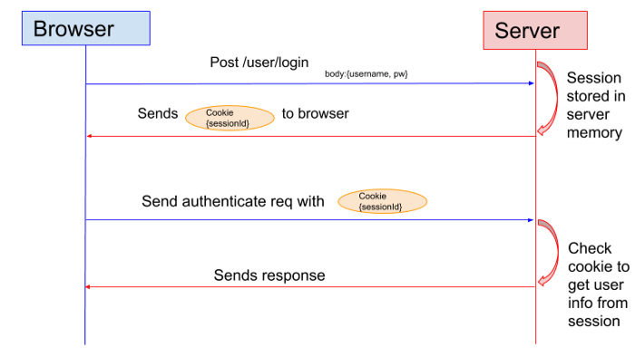

## 1. 서론

일반적으로 웹 서버는 HTTP. 즉, stateless 프로토콜을 사용하기 때문에 웹사이트에서 사용자가 로그인한 회원인지에 대한 인증을 관리하는 방안이 필요하다. 한 번 로그인한 사용자가 버튼 하나를 누를 때마다 로그인을 다시 하게 된다면 어떤 일이 벌어질까? 아마 아무도 그 사이트를 사용하려 하지 않을 것이다. 이때 로그인한 사용자에 대한 정보를 저장하는 방식의 첫 번째로 Session 기반 인증 방식이 있다. 그렇다면 어떻게 동작하는지에 대해 그리고 장단점에 대해 알아보자.

## 2. 간단한 용어 정리

### 2-1. Session이란?

세션이란 일정 시간 동안 같은 사용자(정확하게 브라우저를 말한다)로 부터 들어오는 일련의 요구를 하나의 상태로 보고 그 상태를 일정하게 유지시키는 기술이라고 한다. 또한 여기서 일정 시간이란 방문자가 웹 브라우저를 통해 웹 서버에 접속한 시점으로부터 웹 브라우저를 종료함으로써 연결을 끝내는 시점을 말한다. 즉, 방문자가 웹서버에 접속해 있는 상태를 하나의 단위로 보고 세션이라고 칭한다.

### 2-2. Cookie란?

특정 웹 사이트를 방문했을 때 만들어지는 정보를 담는 파일을 지칭하는 것이 쿠키이며 쉽게 말해 상태 정보를 유지하는 기술이다.

### 2-3. Session과 Cookie의 차이점

-   쿠키의 경우는 방문자의 정보를 방문자 컴퓨터의 메모리에 저장하는 것을 말한다. 예를 들어, ID나 비밀번호를 저장하거나 방문한 사이트를 저장하는 데에 사용한다.
-   세션은 방문자의 요청에 따른 정보를 방문자 메모리에 저장하는 것이 아닌 웹 서버가 세션 아이디 파일을 만들어 서비스가 돌아가고 있는 서버에 저장을 하는 것을 말한다.

## 3. 동작 방식

1.  사용자가 로그인을 요청하고 id, pw 정보가 유효하다면, 세션이 서버의 메모리 상에 저장된다. 이때 세션 식별키로 SessionId를 기준으로 정보를 저장한다.
2.  서버에서 sessionId를 cookie에 담아 브라우저로 전달한다.
3.  브라우저는 모든 request에 cookie(sessionId)를 함께 전송한다.
4.  서버는 브라우저가 보낸 sessionId를 키로 서버 메모리에서 사용자의 session 정보를 식별하고 유효하다면, 원하는 응답을 제공해준다.

## 4. 특징

1.  서버에서 클라이언트의 session 정보를 메모리나 디스크 또는 DB 등을 통해 저장하고 있다.
2.  세션 기반 인증 방식은 클라이언트로부터 요청을 받으면, 클라이언트의 상태를 서버에서 계속 유지하고 이 정보를 서비스에 이용하는 Stateful 서버이다.

## 5. 장점

1.  서버에서 클라이언트의 상태를 유지하고 있으므로, 사용자의 로그인 여부 확인이 용이하고, 경우에 따라서 강제 로그아웃 등의 제재를 가할 수 있다.
2.  클라이언트가 임의로 정보를 변경시키더라도 서버에서 클라이언트의 상태 정보를 가지고 있으므로 상대적으로 안전하다.

## 6. 단점

1.  서버에서 클라이언트의 상태를 모두 유지하고 있어야 하므로, 클라이언트 수에 따른 메모리나 디스트 또는 DB에 부하가 심하다.
2.  사용자가 많아지는 경우 로드 밸런싱을 사용한 서버 확장을 이용해야 하는 데 이 때 세션의 관리가 어려워진다.
3.  웹 브라우저에서 세션 관리에 사용하는 쿠키는 단일 도메인 및 서브 도메인에서만 작동하도록 설계되어 CORS 방식(여러 도메인에 request를 보내는 브라우저)을 사용할 때 쿠키 및 세션 관리가 어렵다.
4.  멀티 디바이스 환경(모바일, 브라우저 공동 사용 등)에서 로그인 시 중복 로그인 처리가 되지 않는 등의 신경 써줘야 할 부분들이 생긴다.

## [참고]

-   https://medium.com/@sherryhsu/session-vs-token-based-authentication-11a6c5ac45e4#:~:text=Many%20web%20applications%20use%20JSON,instead%20of%20sessions%20for%20authentication.&text=The%20biggest%20difference%20here%20is,on%20the%20client%20side%20instead.
-   https://mangkyu.tistory.com/55?category=925341
-   https://jins-dev.tistory.com/entry/Session-%EA%B8%B0%EB%B0%98-%EC%9D%B8%EC%A6%9D%EA%B3%BC-Token-%EA%B8%B0%EB%B0%98-%EC%9D%B8%EC%A6%9D
-   https://88240.tistory.com/190
