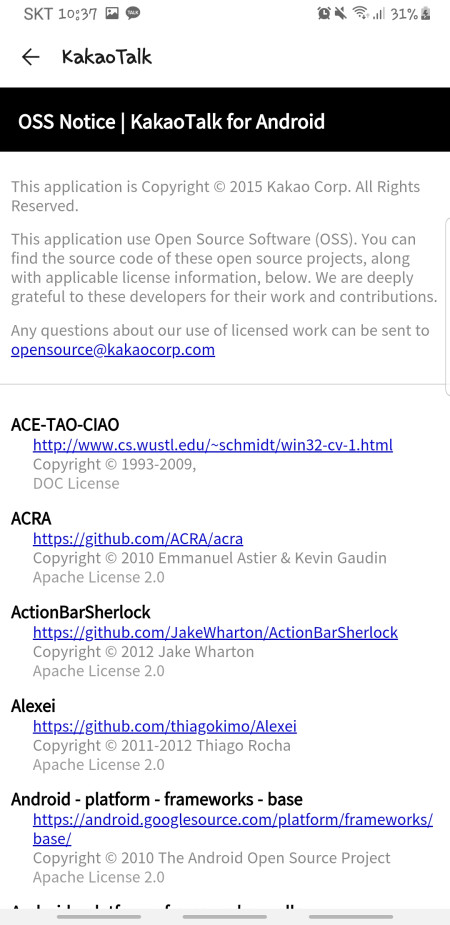
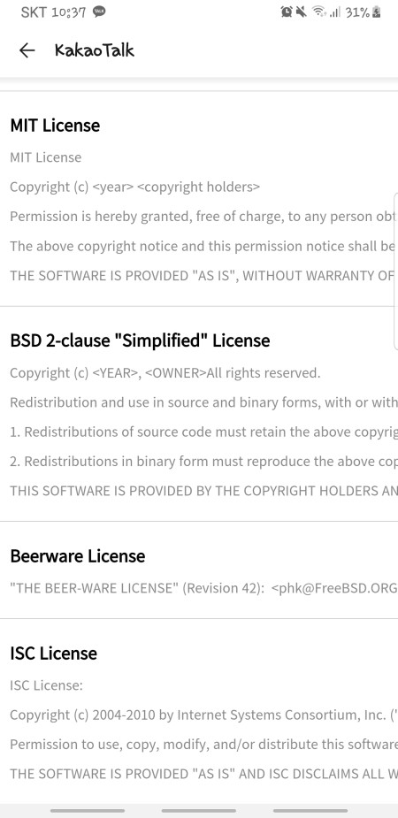
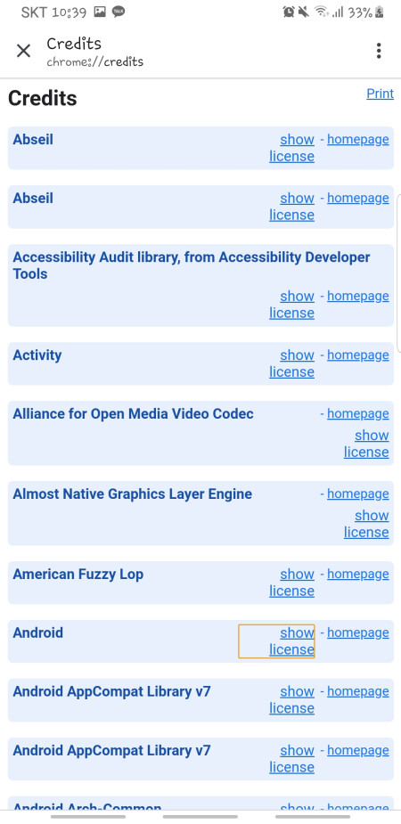
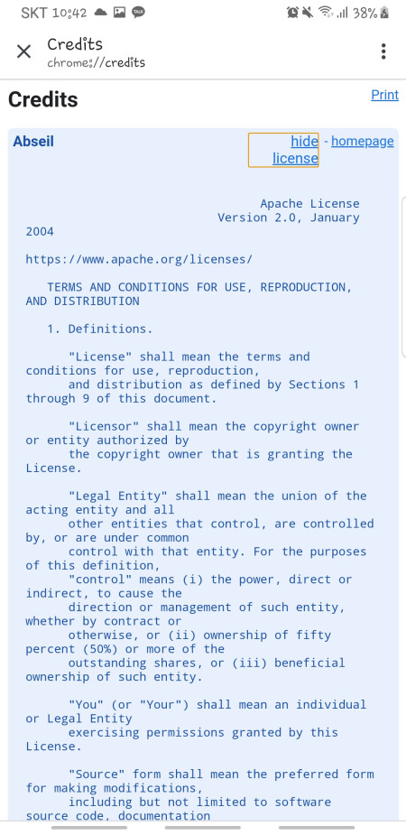

## 1. 서론

지난 포스팅까지 오픈소스 라이선스의 개념과 종류별 특징에 대해서 알아봤다. 이번에는 실제 모바일 애플리케이션에서의 고지 방법에 대해 알아보도록 하자.

## 2. 고지 방법 예시

### 2-1. 카카오톡

카카오톡을 먼저 살펴보면 공통적으로 모든 오픈소스 라이선스를 표기하는 특징이 있다.

-   오픈소스명
-   공식 홈페이지 주소
-   저작권
-   라이선스 종류

이렇게 어떤 오픈소스들을 사용했는지 표기를 한다. 하지만 이상한 점이 있다. 오픈소스는 항상 라이선스의 공식 문서 내용도 함께 기록되어 있어야 한다. 카카오톡의 경우 아래와 같이 사용한 라이선스의 문서를 따로 명시를 해두었다.

### 2-2. Chrome

다음으로 구글의 크롬을 살펴보자. 구글은 각 오픈소스의 리스트를 보여준다. 링크 형태로 제공한다. 위의 카카오톡의 오픈소스 라이선스와 비교해보면 저작권 부분이 제외되어 있다.

-   오픈소스명
-   공식 홈페이지 주소
-   라이선스 종류

또 다른 점을 찾자면, show license를 클릭하면 각각의 오픈소스의 라이선스를 별도로 표기하고 있다.

## 3. 고지 방법

위의 예시들로 보아 반드시 포함되어야 할 정보는

-   오픈소스명
-   공식 홈페이지 주소
-   라이센스 종류
-   라이선스 공식 문서

로 보인다.

물론, 라이선스 별로 코드 공개 여부 등을 알아봐야 한다. 오픈소스를 사용할 때는 반드시 각각의 라이선스 별로 어떤 필수 및 의무사항이 있는지 확인하고 반드시 의무들을 이행해야 한다. 만약 궁금한 사항이 생긴다면, 이 사이트에 문의를 해보기 바란다.

## 4. 느낀 점

이로써 오픈소스 라이선스에 관한 포스팅은 끝났다. 워낙 라이선스의 종류가 다양하다 보니 지켜야할 의무 사항도 각각 다르다. 그래도 좋은 오픈소스를 공유하고 사용할 수 있다는 점을 생각하면 그렇게 밑 보는 장사는 아닌 듯하다. 이 포스팅을 보는 모든 사람들도 꼭 의무사항을 반드시 이행하여 법적인 문제가 생기지 않았으면 좋겠다.
