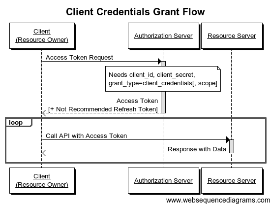

## 1. 서론

지난 포스팅까지 Session과 JWT 기반 인증 방식에 대해 알아봤다. Session과 JWT 기반 인증 방식은 모두 자신의 사이트에서 인증을 진행하기 위한 방식이다. 이 방식들로는 내가 만든 사이트의 유저가 google 또는 facebook 등에 접근할 수 있는 권한을 가질 수 없다. 생각해보면 당연한 것이다. 해당 사이트들이 우리가 신뢰할 수 있는지 확인할 수 있는 방법이 없고, 우리 사이트에서 사용자들의 google 또는 facebook 계정 비밀번호를 보관할 수는 없는 노릇이기 때문이다. 이 문제를 해결하기 위해 OAuth 2.0이 하나의 표준으로 자리 잡고 타사의 사이트에 대한 접근 권한을 얻고, 그 권한을 이용하여 개발할 수 있는 환경을 제공하는 프로토콜로써 등장했다. 그럼 더 자세히 알아보도록 하자.

## 2. OAuth 2.0이란?

> **정의**  
> OAuth 2.0은 로그인하지 않고도 제삼자에게 서비스를 제공할 수 있도록 하는 표준 사용자 인증 프로토콜이다.

쉽게 말하면 서론에서 설명한 대로 google, facebook 등과 같은 서비스의 계정으로 제3의 서비스에 로그인하여 등록되어 있는 정보나 해당 사이트들(google, facebook 등)의 기능을 사용할 권한을 부여받는 표준 프로토콜이다.
OAuth 2.0은 HTTPS 환경에서만 작동한다. 만약, Ubuntu:18.04를 사용한다면 이 포스팅에서 HTTPS를 무료 발급 받으면 된다.

## 3. OAuth 2.0과 JWT의 차이점

둘 다 token 인증 방식을 사용한다는 점이 동일하지만, 사실 둘은 다르다. OAuth 2.0은 표준 프로토콜로 정의되고 JWT는 token의 형식으로 정의된다. 아래의 stackoverflow 사이트를 참고한 것이므로 자세한 사항은 사이트를 방문해 보기 바란다.

-   https://stackoverflow.com/questions/39909419/what-are-the-main-differences-between-jwt-and-oauth-authentication#:~:text=OAuth%202.0%20defines%20a%20protocol,JWT%20defines%20a%20token%20format.&text=So%20the%20real%20difference%20is,JWT%20as%20a%20token%20format).

## 4. 용어 정리

|         term          |                                           description                                           |
| :-------------------: | :---------------------------------------------------------------------------------------------: |
|    Authentication     |                                            신원 확인                                            |
|     Authorization     |                                            권한 부여                                            |
|        Client         |                  google, facebook 등의 아이디로 로그인이 가능한 제 3의 서비스                   |
|    Resource Owner     |                        google, facebook 등의 아이디로 로그인하는 사용자                         |
|    Resource Server    |                      회원의 정보를 저장하고 있는 서버(google, facebook 등)                      |
| Authorization Server  |                 로그인을 통해 인증 후 권한을 부여하는 서버(google, facebook 등)                 |
| Authentication Server |                    실제로 로그인 서비스를 제공하는 서버(google, facebook 등)                    |
|     Access Token      |           실제 요청을 보낼 때 사용하는 토큰 (google, facebook 등에서 로그인 시 발급)            |
|     Refresh Token     | Access Token이 만료된 경우 재발급을 위해 사용하는 토큰 (google, facebook 등에서 로그인 시 발급) |

## 5. Auth 2.0의 인증 방식

### 5-1. Authorization Code Grant 방식

클라이언트가 웹 서버인 경우 사용한다. 권한 부여 서버가 허용한 경우 access token 만료 시에 refresh token으로 갱신할 수 있으므로 access token을 오래 사용할 수 있다. 안정성이 높아 일반적으로 가장 많이 사용하는 방식이다.

작동 방식은 아래와 같다.

1. 웹 사이트에서 사용자의 Google 프로필에 대한 정보를 얻고자 한다.
2. 클라이언트(웹 사이트)에 의해 권한 부여 서버(Google)로 리다이렉션 된다.
3. 액세스를 승인하면 권한 부여 서버는 콜백 응답으로 클라이언트(웹 사이트)로 권한 부여 코드를 전송한다.
4. 그런 다음 이 코드는 클라이언트와 권한 부여 서버 간의 액세스 토큰과 교환된다.
5. 이제 웹 사이트에서 이 액세스 토큰을 사용하여 리소스 서버를 쿼리 하고(Google 다시) 프로필 데이터를 검색할 수 있다.

_아래의 예시에서 액세스 토큰은 웹 사이트에 의해 저장된다(예: 세션). 구글은 또한 토큰 수명 및 refresh token과 같은 다른 정보를 액세스 토큰과 함께 보낸다. 또한, Resource Server를 제외하고는 access token이 전달되지 않으므로 매우 이상적이고 안정적인 구현 상태이다._

### 5-2. Implicit Grant 방식

일반적으로 클라이언트가 브라우저에서 Javascript와 같은 스크립트 언어를 사용하여 실행된다. 이 방식은 refresh token을 발급할 수 없다.

작동 방식은 아래와 같다.

1. 클라이언트는 resource owner의 Facebook 프로필에 대한 정보를 얻고자 한다.
2. 브라우저에 의해 권한 부여 서버(Facebook)로 리디렉션 됩니다.
3. 액세스를 인증하면 권한 부여 서버는 액세스 토큰과 함께 사용자를 웹 사이트로 리디렉션 한다.(웹 서버로 전송되지 않음)
   콜백의 예: http://example.com/oauthcallback#access_token=MzJmNDc3M2VjMmQzN.
4. 이제 클라이언트에서 이 액세스 토큰을 사용하여 리소스 서버(Facebook)에 쿼리를 보낼 수 있다.
   쿼리 예: https://graph.facebook.com/me?access_token=MzJmNDc3M2VjMmQzN.

_Same Origin Policy로 인해 클라이언트가 차단되지 않고 Javascript로 Facebook API에 어떻게 요청을 보낼 수 있는지 궁금할 수도 있다. 이 cross-domain request(CORS)은 페이스북이 응답에 있는 Access-Control-Allow-Origin라는 헤더로 이를 승인하기 때문에 가능하다._

>  **주의 사항!**   
> 이 유형의 인증은 다른 유형의 인증을 사용할 수 없는 경우에만 사용해야 한다. 실제로 액세스 토큰이 클라이언트 측에 노출되어 있기 때문에(따라서 취약하기 때문에) 가장 안전하지 않다.

## 5-3. Resource Owner Password Credentials Grant 방식

이러한 유형의 인증을 사용하면 인증 정보(및 암호)가 클라이언트로 전송된 다음 인증 서버로 전송된다. 그러므로 이 두 실체 사이에 절대적인 신뢰가 있어야 한다. 클라이언트가 권한 부여 서버와 동일한 권한에 의해 개발되었을 때 주로 사용된다.

_예를 들어, 우리는 example.com이라는 이름의 웹사이트가 자체 서브 도메인 api.example.com의 보호된 리소스에 대한 액세스를 찾는 경우를 자주 볼 수 있다. 사용자는 example.com 사이트에 자신의 로그인/비밀번호를 입력해도 놀라지 않을 것이다._

작동 방식은 아래와 같다.

1. Acme 회사는 다른 응용 프로그램에서도 RESTful API를 사용할 수 있게 제공하고자 했다.
2. 이 회사는 비효율성을 피하기 위해 자체 API를 사용하는 것이 편리할 것이라고 생각했다.
3. 회사의 자체 API 메서드를 호출하기 위해 액세스 토큰이 필요하다.
4. 이를 위해 회사는 일반적인 경우처럼 표준 HTML 양식을 통해 로그인 자격 증명을 입력하도록 요청한다.
5. 서버 측 응용 프로그램(acme.com)은 인증 정보가 유효한 경우 인증 서버의 액세스 토큰과 자격 증명을 교환한다.
6. 이제 이 응용 프로그램은 액세스 토큰을 사용하여 자체 리소스 서버(api.acme.com)를 쿼리 할 수 있다.

### 5-4. Client Credentials Grant 방식

이 방식은 클라이언트가 resource owner일 때 사용된다.

_예를 들어, AWS S3, Google Cloud Storage 등과 같이 클라이언트의 웹 서버 자체가 resource owner인 경우_

작동 방식은 아래와 같다.

1. 웹 사이트는 모든 종류의 파일을 Google 클라우드 스토리지에 저장한다.
2. 웹 사이트는 파일을 검색하거나 수정하기 위해 Google API를 통과해야 하며 인증 서버로 인증해야 한다.
3. 인증되면 웹 사이트가 리소스 서버(Google Cloud Storage)를 쿼리 하는 데 사용할 수 있는 액세스 토큰을 가져온다.

## [참고]

-   http://www.bubblecode.net/en/2016/01/22/understanding-oauth2/
