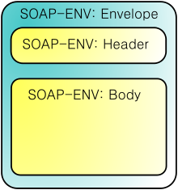

## 1. 서론

최근 GO 언어를 공부하다 보니 RPC, gRPC에 대해 새롭게 알게 됐다. 아직 자세히는 모르지만 추후 정리하는 포스팅을 쓸 예정이다. 그러다 보니 자연스레 이전에 사용하던 RESTful API에 대한 포스팅을 먼저 작성하려 했는 데 SOAP 방식이 존재한다는 사실을 알고, 궁금증이 생겨 공부를 하며 이 포스팅을 먼저 작성하게 됐다. SOAP, RPC, gRPC, RESTful API 등은 모두 각기 다른 온라인 데이터 전송 방식이다. 각각의 특성과 장단점이 존재하기 때문에 알아두면 좋을 것 같아 시리즈물로써 포스팅을 작성해보려 한다. 그럼 SOAP 방식에 대한 정리를 시작해보자.

## 2. SOAP란 무엇인가?

SOAP란 Simple Object Access Protocol의 약자로 객체 접근을 간단하게 해주는 프로토콜이다. 그럼 어떻게 간단하게 해주는 걸까? 해답은 바로 **플랫폼에 종속적이지 않기 때문에 다른 기종 간의 통신이 용이한 XML을 데이터 송수신의 기본 format으로 사용**하는 것이다. SOAP는 이러한 장점을 가진 XML을 이용해서 분산처리 환경에서의 정보교환을 쉽게 할 수 있도록 해주는 프로토콜이다.<br/> 또한, SOAP는 Client가 물리적으로 인접하지 않은 서버에게 객체나 함수를 호출하여 그 값을 반환받는 RPC 중 하나이다. 무엇보다 아주 표준화가 잘 되어있는 HTTP 또한 사용 가능하기 때문에 거의 모든 기종에서 호환성을 보장한다.

## 3. SOAP의 탄생 배경

위에서 설명해서 짐작은 했겠지만, 이 때는 최근 자주 사용하는 RESTful API가 존재하기도 이전이었다. 따라서, 서로 다른 플랫폼 또는 언어 사이에서 데이터 및 정보 교환의 마땅한 표준이 없는 상태였다. SOAP는 이러한 문제점을 해결하기 위해 설계된 최초의 표준 프로토콜이다.

## 4. SOAP의 특징

1. SOAP는 다른 언어로 다른 플랫폼에서 빌드된 애플리케이션이 통신할 수 있도록 설계된 최초의 표준 프로토콜이다.
2. 프로토콜이기 때문에 복잡성과 오버헤드를 증가시키는 빌트인 룰을 적용하므로, 페이지 로드 시간이 길어질 수 있다.
3. XML만을 데이터 송수신 format으로 사용할 수 있다.
4. HTTP를 이용하기 때문에 다른 RPC에 비해 Proxy와 방화벽에 제약을 받지 않고 쉽게 통신이 가능하다.
5. HTTP 외에도 다양한 네트워크 프로토콜을 사용할 수 있다.
6. SOAP API에 대한 완료된 요청은 브라우저에서 캐시 할 수 없으므로, API로 재전송하지 않는 한 이후에 액세스 할 수 없다.

## 5. SOAP 구문 규칙

1. SOAP 메세지는 XML 형식으로 encoding 돼야 한다.
2. SOAP 메세지는 SOAP Envelope namespace를 사용해야 한다.
3. SOAP 메세지는 DTD 참조를 포함해서는 안된다.
4. SOAP 메세지는 XML 처리 명령어를 포함해서는 안된다.

### 5-1. SOAP 메세지의 기본 틀



```xml
<?xml version="1.0"?>

<soap:Envelope
xmlns:soap="http://www.w3.org/2003/05/soap-envelope/"
soap:encodingStyle="http://www.w3.org/2003/05/soap-encoding">

<soap:Header>
...
</soap:Header>

<soap:Body>
...
  <soap:Fault>
  ...
  </soap:Fault>
</soap:Body>

</soap:Envelope>
```

## [참고]

-   https://www.w3schools.com/xml/xml_soap.asp
-   http://wiki.hash.kr/index.php/SOAP
-   https://www.redhat.com/ko/topics/integration/whats-the-difference-between-soap-rest
-   https://www.guru99.com/comparison-between-web-services.html#:~:text=KEY%20DIFFERENCE,REST%20is%20an%20architectural%20pattern.&text=SOAP%20only%20works%20with%20XML,%2C%20XML%2C%20HTML%20and%20JSON.
-   https://j2enty.tistory.com/entry/SOAP-Soap-%EB%9E%80
-   https://smartbear.com/blog/soap-vs-rest-whats-the-difference/
-   https://ko.wikipedia.org/wiki/SOAP
