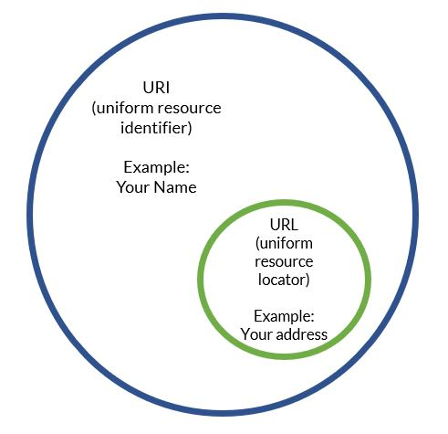

## 1. 서론

최근 네트워크 관련 웹 문서나 도서를 많이 읽는 데 어떤 부분에서는 URL로 칭하고 어떤 부분에서는 URI로 칭하는 게 너무 헷갈려서 한 번 정리하고자 포스팅을 작성한다. 잘 모르는 상태에서 볼 때는 분명 형태도 비슷한 것 같은 데 무슨 차이인가 싶기도 하다. 지금부터 그 차이에 대해 명확히 알아보도록 하자.

## 2. URI(Uniform Resource Identifier)란?

> **Uniform Resource Identifier (URI)**   > &nbsp;consists of a string of characters used to identify or name a resource on the Internet

네트워크 상에서 **자원을 식별하기 위한 문자열의 구성**이다. URI는 인터넷에서 요구되는 기본 조건으로써 인터넷 프로토콜에 항상 붙어 다닌다.

## 3. URL(Uniform Resource Locator)란?

> **Uniform Resource Locator (URL)**   > &nbsp;colloquially termed a web address, is a reference to a web resource that specifies its location on a computer network and a mechanism for retrieving it.

구어적으로 웹 주소라고 일컫고, 네트워크 상에서 웹 자원의 위치를 지정하는 웹 자원에 대한 참조이다. 즉, 쉽게 말하면 네트워크 상의 **자원의 위치를 나타내는 주소**이다.

#### 가장 중요한 점은 URL은 URI에 포함된다는 점이다.

## 4. URI와 URL 구분 예시

1.  https://example.io 의 경우 https://example.io 라는 서버를 나타내기 때문에 **URL이면서 URI이다.**

2.  https://example.io/images 의 경우 example.io 서버의 images라는 네트워크 상의 자원의 위치를 의미하기 때문에 **URL이면서 URI이다.**

3.  https://example.io/images/dog.jpeg 의 경우 example.io 서버의 images 디렉터리 아래의 dog.jpeg를 가리키므로 **URL이면서 URI이다.**

4.  https://example.io/user/123 의 경우 URL은 https://example.io/user 까지고 원하는 정보에 도달하기 위한 식별자 123을 포함하면 URI이다. 즉, **URI이지만 URL은 아니다.**

5.  https://example.io/profile?id=11 의 경우도 마찬가지로 https://example.io/profile 까지는 URL이지만 원하는 정보에 도달하기 위한 식별자(여기서는 ?id=11)를 포함하면 URI가 된다. 즉, **URI이지만 URL은 아니다.**

## [참고]

-   https://en.wikipedia.org/wiki/URL
-   https://en.wikipedia.org/wiki/Uniform_Resource_Identifier
-   https://medium.com/@js230023/url-%EA%B3%BC-uri%EC%9D%98-%EC%B0%A8%EC%9D%B4-154d70814d2a
-   https://lambdaexp.tistory.com/39#:~:text=URI%EB%8A%94%20%EC%9D%B8%ED%84%B0%EB%84%B7%20%EC%83%81%EC%9D%98%20%EC%9E%90%EC%9B%90,%EC%9C%BC%EB%A1%9C%20%ED%95%B4%EC%84%9D%20%EB%90%A0%20%EC%88%98%20%EC%9E%88%EA%B2%A0%EB%8B%A4.&text=URI%EC%9D%98%20%ED%95%9C%20%ED%98%95%ED%83%9C%EC%9D%B8,%EC%9D%84%20%ED%8F%AC%ED%95%A8%20%ED%95%98%EB%8A%94%20%EA%B0%9C%EB%85%90%EC%9D%B4%EB%8B%A4.
-   https://dev.to/flippedcoding/what-is-the-difference-between-a-uri-and-a-url-4455
