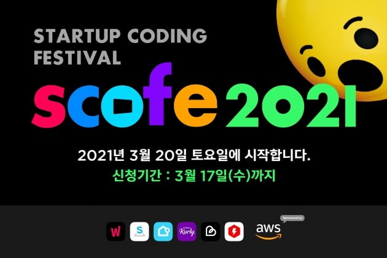
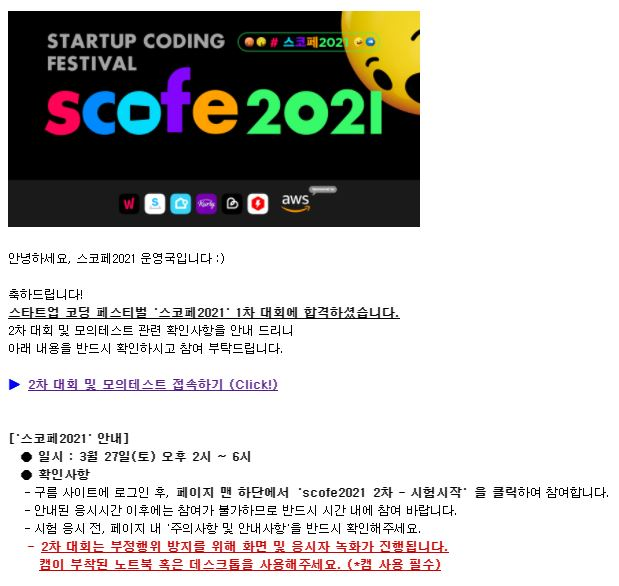
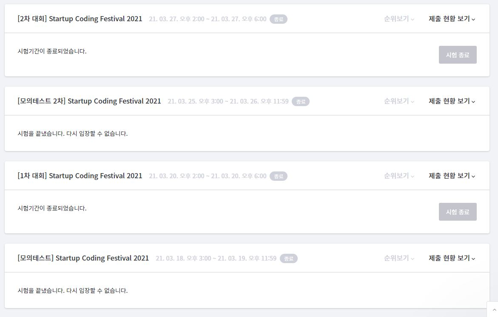
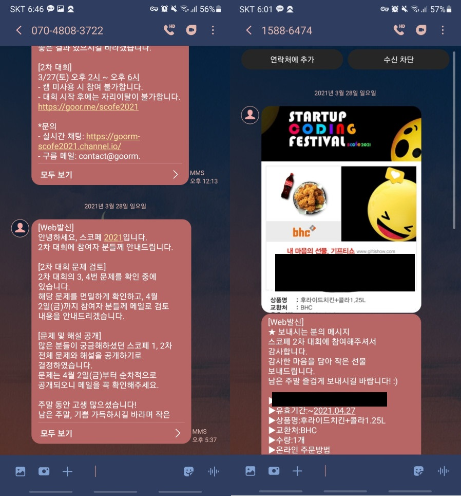

## 대회 준비

나는 이전에 한 번도 알고리즘 대회에 참가해본 적이 없어서 알고리즘 공부나 대회 개최일 등을 찾아본 적이 없었다. 그러던 와중에 이런 대회가 개최된다는 사실을 2일 전에 우연히 알게 됐는 데, 다행히도 1차 대회 전날까지 참가 신청을 받는 다는 걸 알게 되서 신청을 하고 부랴부랴 공부를 시작했다.

사람들이 많이 공부한다는 [백준](https://www.acmicpc.net/), [Programmers](https://programmers.co.kr/) 등에 들어가서 초급 ~ 중급 정도의 난이도를 풀어보고 다른 사람들의 코드도 리뷰해가며 생각을 다듬었다. 알고리즘 공부를 기존에 해오지 않아서 그런지 문제에 어떤 방식의 풀이를 대응해야 하는 지가 가장 힘든 일이었다.

그나마 다행인 것은 대학교 3, 4학년 때 자료구조와 알고리즘 조교로써 대학교 1, 2학년 학생들을 가르칠 기회가 생겼는 데 그 때 내가 자료구조나 알고리즘을 배울 때보다 오히려 더 공부를 꼼꼼하게 했고 그게 도움이 많이 됐다. 그 때 다른 사람들의 코드를 읽는 스킬이 많이 늘었고, 이론적인 부분을 알고 접근을 하니까 문제 유형별로 어떤 알고리즘을 사용해야할 지 감을 잡고 나서부터는 풀이가 수월해지기 시작했다. 2일이라는 짧은 준비 기간이었지만 나름 실력이 늘고 있다는 게 느껴졌다.

공부를 어느 정도 하고 난 후에는 스코페 홈페이지에 준비돼있는 모의 테스트를 풀어봤는 데 큰 어려움 없이 풀 수 있었다. 그냥 시험 환경을 확인하라는 의도였던 것 같다.

## 1차 대회

사실 공부 기간이 너무 짧기도 했고, 그냥 경험 삼아 나가볼까? 했던 거라서 큰 기대는 하지 않았지만 집에서 보는 시험인데도 첫 시험이라 그런지 긴장이 되긴 했다.

문제 수는 총 6개로 4시간이란 긴 시간동안 시험을 봤다. 첫 문제부터 감이 좋게도 쉽게 풀렸는 데 원래 모든 첫 문제는 몸풀이 문제로 쉽게 내주는 건가? 잘 모르겠다. 그러다 중간에 시험이 제출되지 않는 오류가 발생했고, 잠깐 멘탈이 흔들렸지만 다른 문제들을 풀면서 정신을 차렸다. 4시간이 정말 짧게 느껴졌는 데 문제 수가 많아서 그런지 점점 집중력이 낮아졌다. 당이 매우매우 땡기기 시작했다... 시험볼 때 꼭 초콜릿을 챙기는 습관을 가져야겠다고 다짐했다.

문제에 대한 구체적인 설명은 금지이기 때문에 결과만 말하자면 **6문제 중 5문제를 풀었다.** 물론 다른 한 문제도 시도는 했지만 만점이 나오지 않았다. **한 문제를 제대로 못 푼 가장 큰 요인이 시간의 분배와 문제를 꼼꼼하게 읽지 않은 것이다.** 문제에 나와 있는 조건을 제대로 읽지 않아서 생긴 문제로 그 조건만 처리하니 풀리는 문제였다. 하지만 난 그 사실을 깨닫기에 너무 많은 시간이 들었다.

2일 준비한 내가 이 정도면 다른 사람은 다 맞지 않았을까? 라는 생각에 탈락을 생각하며 주변 사람들한테도 말하지 않고 조용히 넘어갔다.

## 1차 대회 결과

**이럴 수가...**

**붙어버렸다...**

처음 이 메일을 받았을 땐 진짜 어안이 벙벙했다. 난 정말 당연히 떨어진 줄 알고 있었다.(~~정말정말정말 진심이다.~~) 너무 기뻤는 데 그와 함께 불안함이 밀려왔다. 1차가 당연히 떨어질 줄 알고 따로 공부를 하고 있지 않은 상태였다. 급하게 부랴부랴 다시 2차 공부를 시작했다.

## 2차 대회 준비

이 때부터는 대회 문제 난이도가 높을 거라고 생각하고 난이도가 좀 있는 문제들을 골라서 풀어보기 시작했는 데, 확실히 어려움이 느껴졌다. 접근 방법조차 모르겠는 문제들도 많아서 이게 풀라고 낸 문제가 맞나? 싶은 것도 여럿 있었다. 그래도 다른 사람들의 코드를 리뷰해가면서 이런저런 지식을 쌓아봤는 데 하면할수록 점점... 늪에 빠지는 기분이었다... 뭔가 공부를 진행할수록 **와... 진짜 코딩 잘하는 사람이 많구나...** 라는 사실과 **와... 나는 그냥 찐따구나... 죽어라해야겠다...**라는 생각이 교차했다.

**그렇게 하루하루가 지나 2차 대회날이 됐다.**

## 2차 대회

큰 기대는 없었지만 1차 대회 때 느꼈던 점만은 보완하고 시험을 보자는 생각에 **페레로로쉐 9알과 물, 노트와 펜**을 준비해뒀고, 캠과 모니터 화면을 촬영하기 때문에 자리를 이탈하면 안된다는 공지사항을 미리 받고 화장실도 다녀왔다.

문제 수는 총 4개로 1차와 같이 4시간이 주어졌다. 어찌보면 시간당 문제 수는 줄어들었다. 1차 때보다 좀 더 긴장된 상태로 시작을 했는 데, 모의테스트 때는 캠과 모니터화면 촬영 이슈가 따로 없었는 데 본 시험 들어와서 이슈 때문에 10분 정도 집중을 못했다. 하지만 개최 측에서 금방 이슈를 잡아줬고, 집중을 시작했다.

1번 문제는 여느 때와 같이 쉽게 풀려서 후.. 공부한 보람이 있는 건가? 했는 데, 2번, 3번, 4번이 모두 오답이 나오며 슬슬 멘붕에 빠져들기 시작했고, 어느 덧 초콜릿은 끝을 향해 달려갔다. 화장실이 가고 싶을 까봐 준비해둔 물은 입에도 안 댔는 데 **2시간 30분이 지난 시점부터 갑자기 화장실이 가고 싶어졌다...** 대형사고였다. 그래도 참고 참으며 집중을 해봤는 데 사실 내가 접근을 잘못한 게 맞는 것 같다. 시험이 끝난 지금 문득 풀이 방법이 새롭게 떠올랐고, 훨씬 효율적인 방법이다...

너무나 안타깝지만 **결과는 1번 제외 모두 초토화...** 4시간 동안 한 문제만 제대로 풀었다. 2번 문제는 그나마 지금이라도 대체 방법이 떠올랐는 데, 3번, 4번은 어떻게 해결해야할지 도통 모르겠다.

**이렇게 나의 첫 알고리즘 대회 도전기가 막을 내렸다.**

### 2차 대회 관련 개최측 연락

방금 개최측에서 연락이 왔다. 원래는 공개하지 않는 다고 했던 문제와 문제 해설이 공개된다는 내용과 bhc 치킨 + 콜라 쿠폰이었다.

**스코페 2021 개최측분들 감사합니다!!!!!!!!!! 문제에 해결 방법에 대한 궁금증과 식욕을 모두 해결해주시다니... 역시 갓갓...**

## 느낀 점

처음 도전한 알고리즘 대회여서 준비 기간도 길지 않았지만 긴장도 많이 했고 문제가 풀렸을 때는 엄청나게 희열이 느껴졌다. 이 맛에 다들 대회를 나가는 건가? 싶기도 하다. 내가 남들보다 엄청나게 뛰어난 머리를 가지고 있는 건 아니지만 어느 정도는 노력으로 커버할 수 있다는 것을 깨달았다. 그리고 내가 과거에 쌓아왔던 노력들은 헛된 것이 아니란 것도 깨달았다. 대학교 3, 4학년 때 자료구조, 알고리즘 조교를 하지 않았다면 이번 대회 1차는 절대 통과하지 못했을 것이다. 그 때 당시에는 내 전공 공부하랴 조교 문제 풀이 준비하랴 정말 힘들었지만 그게 다 나의 경험치가 된다는 것을 새삼느꼈다.

**젊을 때 고생을 사서한다는 말은 남이 나에게 해주는 것이 아닌 나 스스로에게 해주는 말이어야 된다고 느꼈다.**
