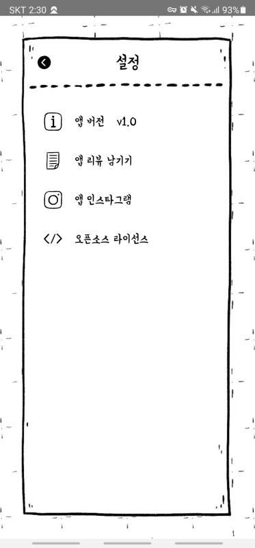

## 1. 서론

아래의 화면은 Antodo개발 1.0 초기 버전의 설정 페이지다. 어플을 개발하고 배포하고 나면 앱 리뷰 남기기와 앱 인스타그램 등의 타 어플을 바로 열 수 있는 코드가 필요하다. 처음에는 방법을 몰라서 webview로 띄웠는 데 너무 불편해서 1.0.2 버전에서 방법을 찾고 수정했다. 생각보다 간단하니 잘 따라오기 바란다.



## 2. 방법

매우 간단하게 Linking이라는 react native 내장 함수를 사용하면 된다.

### 2-1. iOS 설정

내가 진행한 프로젝트의 경로로 진행하도록 하겠다.

~/Antodo/ios/Antodo/info.plist 파일을 연다.
~/[만든 프로젝트 명]/ios/[만든 프로젝트 명]/info.plist

아래의 코드를 추가한다. app store, instagram, twitter를 필요한 경우만 각각 info.plist에 추가한다.

```xml
...

<key>LSApplicationQueriesSchemes</key>
<array>
	<string>itms-apps</string> <!-- app store -->
	<string>instagram</string> <!-- instagram -->
	<string>twitter</string>   <!-- twitter -->
</array>

...
```

**android는 따로 설정할 것이 없다. (매우 편안)**

### 2-2. 공통

설명은 아래의 주석을 보면 충분할 것으로 예상한다.

```tsx
import { Linking } from "react-native";

// 구글 플레이 스토어 링크
const GOOGLE_PLAY_STORE_LINK = "market://details?id=io.github.Antodo";
// 구글 플레이 스토어가 설치되어 있지 않을 때 웹 링크
const GOOGLE_PLAY_STORE_WEB_LINK =
    "https://play.google.com/store/apps/details?id=io.github.Antodo";
// 애플 앱 스토어 링크
const APPLE_APP_STORE_LINK =
    "itms-apps://itunes.apple.com/us/app/id1553604322?mt=8";
// 애플 앱 스토어가 설치되어 있지 않을 때 웹 링크
const APPLE_APP_STORE_WEB_LINK =
    "https://apps.apple.com/us/app/antodo-%EC%8B%AC%ED%94%8C%ED%95%9C-%EC%86%90%EA%B8%80%EC%94%A8-%ED%95%A0%EC%9D%BC-%EA%B3%84%ED%9A%8D-%EB%A9%94%EB%AA%A8/id1553604322";
// 인스타그램 링크
const INSTAGRAM_LINK = "instagram://user?username=coconut_dailyapp";
// 인스타그램이 설치되어 있지 않을 때 웹 링크
const INSTAGRAM_WEB_LINK = "https://www.instagram.com/coconut_dailyapp/";

// 위의 화면에서 버튼 클릭 이벤트
const onPress = useCallback(
    (index: number) => {
        if (index === 0) return; // 앱 버전은 클릭 이벤트가 없다.

        if (index === 1) {
            // 리뷰 남기기는 android와 ios의 링크를 각각 지정한다.
            if (Platform.OS === "android") {
                handlePress(GOOGLE_PLAY_STORE_LINK, GOOGLE_PLAY_STORE_WEB_LINK);
            } else {
                handlePress(APPLE_APP_STORE_LINK, APPLE_APP_STORE_WEB_LINK);
            }
        } else if (index === 2) {
            // instagram 링크를 지정한다.
            handlePress(INSTAGRAM_LINK, INSTAGRAM_WEB_LINK);
        } else {
            // opensource 목록은 만들어둔 페이지로 이동한다.
            navigation.navigate("OpensourceScreen");
        }
    },
    [navigation]
);

// 각각의 버튼에 대한 실행될 링크(url)와 링크가 실행되지 않을 때 대체 링크(alterUrl)
const handlePress = useCallback(async (url: string, alterUrl: string) => {
    // 만약 어플이 설치되어 있으면 true, 없으면 false
    const supported = await Linking.canOpenURL(url);

    if (supported) {
        // 설치되어 있으면
        await Linking.openURL(url);
    } else {
        // 앱이 없으면
        await Linking.openURL(alterUrl);
    }
}, []);
```
