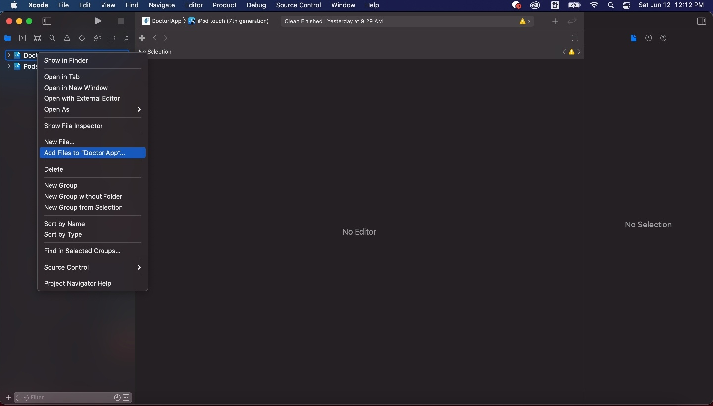
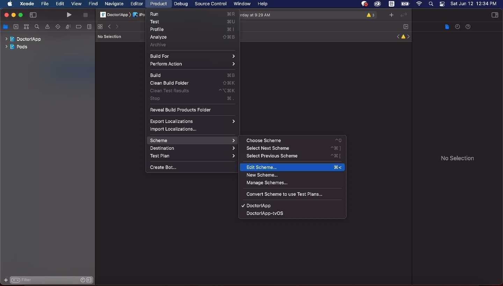
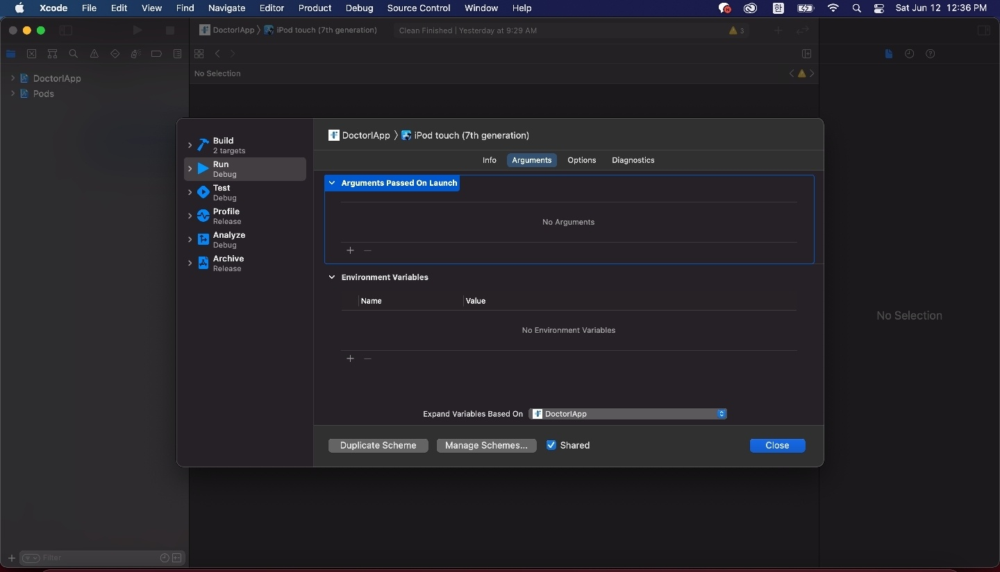
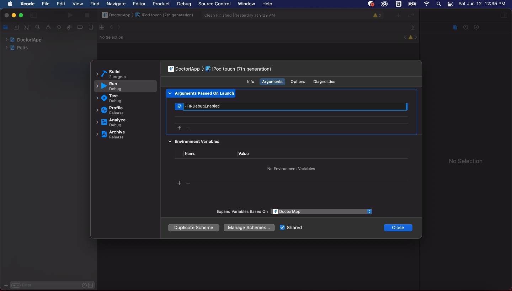

## 참고

firebase-ios-sdk v9+ (react-native-firebase v15+) 사용 시 pod install 에러에 관련된 해결방법은 [여기](https://millo-l.github.io/ReactNative-Firebase-2023-05-25/)서 확인해주세요.

## 1. 서론

우연한 만남을 계기로 창업을 준비하던 나와 팀원은 [프릭스 헬스케어](https://www.rocketpunch.com/companies/friggshealthcare)라는 회사에 입사하게 됐다. 백엔드 개발자로써 들어가고자 했지만, 나와 함께하는 팀원은 백엔드, 나는 프론트 개발자로 들어가고 3~6달 후 프론트 개발자를 채용한 후에 백엔드로 넘어가기로 했다. 그리하여 입사하고 처음 맡은 업무가 [닥터아이](https://www.notion.so/2021-Friggs-Healthcare-4fcb6f67bdb44bc8b3e2ae8467aff165)라는 영유아 성장 발달 모니터링 앱에 Firebase Analytics를 적용하는 것이었다. 설정 도중 크래쉬가 나는 경우가 생겨, 혹시나 다른 사람들도 그런 경우가 있을까해서 이 포스팅을 남긴다.

### [👋 잠깐] 개발 환경

> react-native 0.63.4 <br />
> typescript 3.8.3 <br />
> @types/react-native 0.63.2 <br />

추후에 이 포스팅을 보는 분들은 아래의 내용이 다소 차이가 생길 수 있으니 유의하기 바란다.

## 2. 필수 모듈 설치 및 필수 파일 다운로드

> @react-native-firebase/app 12.0.0 <br />
> @react-native-firebase/analytics 12.0.0

```bash
npm install @react-native-firebase/app @react-native-firebase/analytics
cd ios && pod install
```

[Firebase 홈페이지](https://firebase.google.com/)에 프로젝트를 등록하고 안드로이드와 iOS용 앱을 각각 등록하면 세팅 파일들(google-services.json, GoogleService-Info.plist)을 다운받을 수 있다. (이 부분은 간단하므로 생략)

### 2-1. iOS 설정

위의 세팅 파일들을 다운받을 때 나온 설정들이 있는 데, 그대로 따라하면 된다.

#### 1. GoogleService-Info.plist 저장

우선 위의 GoogleService-Info.plist 파일을 Xcode를 사용해서 ios/{ProjectName}/ 경로로 옮기면 된다. 아래의 이미지를 따라가면 된다.




#### 2. AppDelegate.m 수정

ios/{ProjectName}/AppDelegate.m 파일을 수정한다.
여기서 주의할 점은 <span style="color:red">**추가하는 모든 헤더들은 반드시 #ifdef FB_SONARKIT_ENABLED 위에 존재해야 한다**</span>는 것이다. 그렇지 않으면 빌드 시에 헤더 파일이 제대로 임포트되지 않는다. 이 점은 꼭 유의하기 바란다.

```cpp
...

// 헤더 임포트
#import <Firebase.h>

...

// 이 코드를 기준으로 위쪽에 헤더 삽입
#ifdef FB_SONARKIT_ENABLED

...

- (BOOL)application:(UIApplication *)application didFinishLaunchingWithOptions:(NSDictionary *)launchOptions {
  ...

  // 이 부분 추가
  if ([FIRApp defaultApp] == nil) {
    [FIRApp configure];
  }

  ...
}

...
```

#### 3. Podfile 수정하기

pod 'Firebase/Analytics' 부분을 추가해준다.

```python
target '{ProjectName}' do

  ...

  ## 이 부분 추가
  pod 'Firebase/Analytics'

  ...

end

...
```

여기까지 진행하면 [react-native-firebase 공식 홈페이지](https://rnfirebase.io/)에 나와있는 모든 설정을 진행한 것이다.

#### 4. DebugView 설정하기

Firbase Analytics는 약 30분 ~ 1시간 동안 취합한 데이터를 보여준다. 하지만 개발 중에는 그렇게까지 시간을 소요할 수 없으므로 DebugView를 사용한다. 아래의 이미지를 순서대로 따라하고, -FIRDebugEnabled를 추가해주면된다. 이렇게 개발된 부분의 확인은 Firebase Analytics의 DebugView 메뉴에서 확인할 수 있다.







#### 5. 테스트하기

제대로 실행되는지 테스트해보자!

```bash
cd ios && pod install --repo-update
cd ..
npx react-native run-ios
```

### 2-2. Android 설정

#### 1. google-services.json 저장

거의 대부분의 설정들에서 안드로이드는 항상 iOS보다 간단한다. 다운로드 받은 google-services.json 파일을 android/app/google-services.json 경로로 옮기면 된다.

#### 2. build.gradle 설정

```java
// android/build.gradle 경로

buildscript {
  dependencies {
    ...

    // 이 부분 추가
    classpath 'com.google.gms:google-services:4.3.8'

    ...
  }
}

...
```

```java
// android/app/build.gradle 경로

apply plugin: 'com.android.application'
// 이 부분 추가
apply plugin: 'com.google.gms.google-services'

...
```

#### 3. DebugView 설정하기

앱 실행 후

```bash
adb shell setprop debug.firebase.analytics.app <package_name>
```

DebugView 중단할 때

```bash
adb shell setprop debug.firebase.analytics.app .none.
```

#### 4. 테스트하기

```bash
npx react-native run-android
```

## [참고]

-   https://rnfirebase.io/
-   https://firebase.google.com/
-   https://dev-yakuza.posstree.com/ko/react-native/react-native-firebase-analytics/
