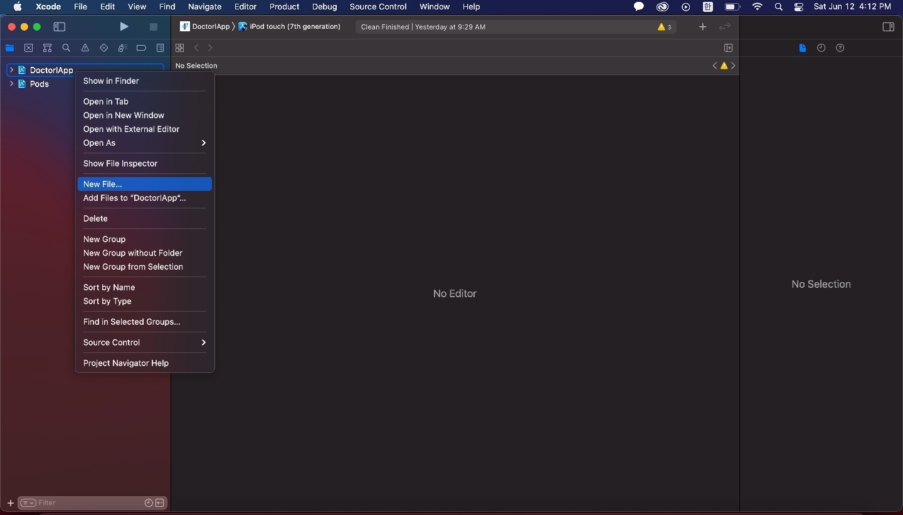
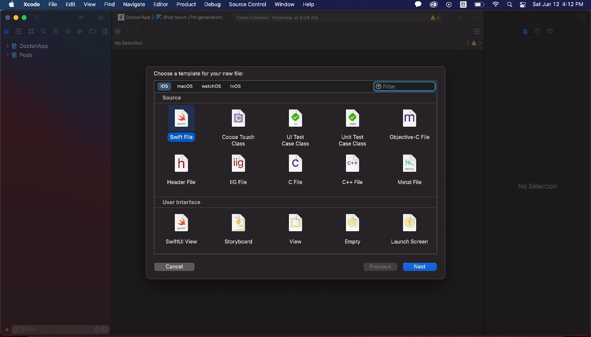
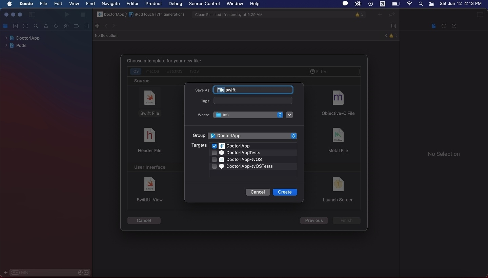
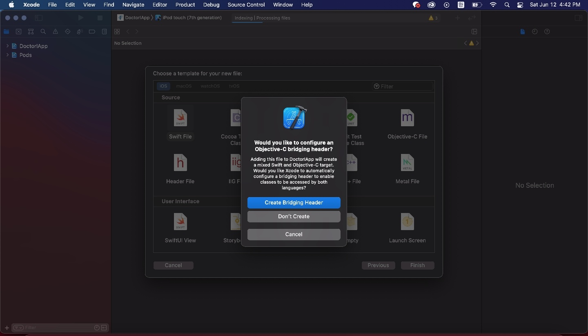

## 1. 서론

저번 포스팅에서는 Firebase Analytics를 설정하는 법에 대해서 포스팅했다. 이번에는 마케터 분의 요청으로 Facebook SDK를 설정하게 됐다. 그렇게 어렵지는 않지만 File.swift 파일을 생성하는 부분이 공식문서에 나와있지 않아서 구글링으로 해결법을 찾았다.

### [👋 잠깐] 개발 환경

> react-native 0.63.4 <br />
> typescript 3.8.3 <br />
> @types/react-native 0.63.2 <br />

추후에 이 포스팅을 보는 분들 및 다른 버전을 사용하시는 분들은 아래의 내용이 다소 차이가 생길 수 있으니 유의하기 바란다.

## 2. 필수 모듈 설치

> react-native-fbsdk 3.0.0

```bash
npm install react-native-fbsdk
cd ios && pod install
```

### 2-1. iOS 설정

#### 1. Info.plist 설정

아래의 코드를 삽입해준다. {APP-ID}에는 facebook sdk의 app id를 입력하고, {APP-Name}에는 등록시 입력한 앱의 이름을 입력하면 된다. {CLIENT-TOKEN} 부분은 페이스북 SDK App Dashboard의 `Settings > Advanced > Client Token`에서 확인할 수 있다.

```xml
...

<key>CFBundleURLTypes</key>
<array>
    <dict>
        <key>CFBundleURLSchemes</key>
        <array>
            <string>fb{APP-ID}</string>
        </array>
    </dict>
</array>
<key>FacebookAppID</key>
<string>{APP-ID}</string>
<key>FacebookClientToken</key>
<string>{CLIENT-TOKEN}</string>
<key>FacebookDisplayName</key>
<string>{APP-NAME}</string>
<key>LSApplicationQueriesSchemes</key>
<array>
    <string>fbapi</string>
    <string>fbapi20130214</string>
    <string>fbapi20130410</string>
    <string>fbapi20130702</string>
    <string>fbapi20131010</string>
    <string>fbapi20131219</string>
    <string>fbapi20140410</string>
    <string>fbapi20140116</string>
    <string>fbapi20150313</string>
    <string>fbapi20150629</string>
    <string>fbapi20160328</string>
    <string>fbauth</string>
    <string>fb-messenger-share-api</string>
    <string>fbauth2</string>
    <string>fbshareextension</string>
</array>

...
```

#### 2. AppDelegate.m 설정

ios/{ProjectName}/AppDelegate.m 파일을 수정한다.
지난 포스트에서도 언급했지만 여기서 주의할 점은 **추가하는 모든 헤더들은 반드시 <span style="color:red">#ifdef FB_SONARKIT_ENABLED</span> 위에 존재해야 한다**는 것이다. 그렇지 않으면 빌드 시에 헤더 파일이 제대로 임포트되지 않는다. 이 점은 꼭 유의하기 바란다.

```c
...

// 헤더 임포트
#import <FBSDKCoreKit/FBSDKCoreKit.h>
#import <React/RCTLinkingManager.h>

// 이 코드를 기준으로 위쪽에 헤더 삽입
#ifdef FB_SONARKIT_ENABLED

...

- (BOOL)application:(UIApplication *)application didFinishLaunchingWithOptions:(NSDictionary *)launchOptions {

  ...

  // 이 부분 추가
  [[FBSDKApplicationDelegate sharedInstance] application:application didFinishLaunchingWithOptions:launchOptions];

  ...

  return YES;
}

...

// 아래의 코드 전체 추가
- (BOOL)application:(UIApplication *)application
            openURL:(NSURL *)url
            options:(NSDictionary<UIApplicationOpenURLOptionsKey,id> *)options {
  if ([[FBSDKApplicationDelegate sharedInstance] application:application openURL:url options:options]) {
    return YES;
  }

  if ([RCTLinkingManager application:application openURL:url options:options]) {
    return YES;
  }

  return NO;
}

...

```

여기까지가 공식 문서에 나온 부분까지인데 이렇게하고 정상적으로 작동한다면 그대로 사용해도 되고, 만약 오류가 난다면 facebook-ios-sdk v7 이상인 경우 Swift.File 을 프로젝트에 생성해야해서 나는 오류일 가능성이 매우매우매우매우 높다.

#### 3. Swift.File 생성

이 부분 때문에 3번이나 다시 시도를 하고 겨우 성공했다. 그 다지 어렵지는 않고 아래의 이미지대로 따라가면 된다.









**여기서 꼭 <span style="color:red">Create Bridging Header</span>를 클릭해야한다.**

#### 4. 테스트하기

아래의 명령어로 실행해보고 만약 실행이 안되면 pod install을 해보고 다시 실행보도록 하자. 여기까지 따라왔으면 문제없이 진행될 것이다.

```bash
npx react-native run-ios
```

### 2-2. Android 설정

#### 1. build.gradle 설정

아래의 코드를 각각 android/build.gradle과 android/app/build.gradle에 추가한다.

```java
// android/build.gradle
buildscript {

    ...

    repositories {
        ...

        mavenCentral()
    }

    ...
}

```

```java
// android/app/build.gradle

...

dependencies {
  ...

  implementation 'com.facebook.android:facebook-android-sdk:[5,6)'
}

...
```

#### 2. strings.xml 설정

android/app/res/values/strings.xml에 아래의 코드를 추가한다.

```xml
<string name="facebook_app_id">Facebook App ID</string>
<string name="facebook_client_token">Facebook Client Token</string>
```

#### 3. AndroidManifest.xml 설정

android/app/manifests/AndroidManifest.xml에 아래의 코드를 추가한다. Provider 태그의 {APP-ID}에는 facebook app id를 입력하면 된다.

```xml
...

<uses-permission android:name="android.permission.INTERNET"/>

...

<application android:label="@string/app_name" ...>
    ...
    <meta-data android:name="com.facebook.sdk.ApplicationId" android:value="@string/facebook_app_id"/>
    <meta-data android:name="com.facebook.sdk.ClientToken" android:value="@string/facebook_client_token"/>
    <provider android:authorities="com.facebook.app.FacebookContentProvider{APP-ID}"
          android:name="com.facebook.FacebookContentProvider"
          android:exported="true" />
    ...
</application>

...
```

#### 4. 테스트하기

```bash
npx react-native run-android
```

## [참고]

-   https://www.npmjs.com/package/react-native-fbsdk
-   https://developers.facebook.com/docs/ios/getting-started/?sdk=cocoapods
-   https://developers.facebook.com/docs/android/getting-started/
