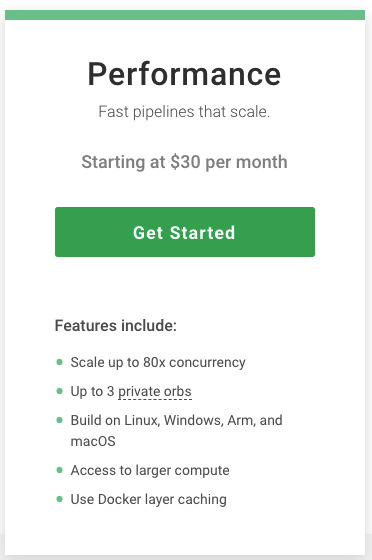
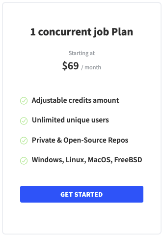
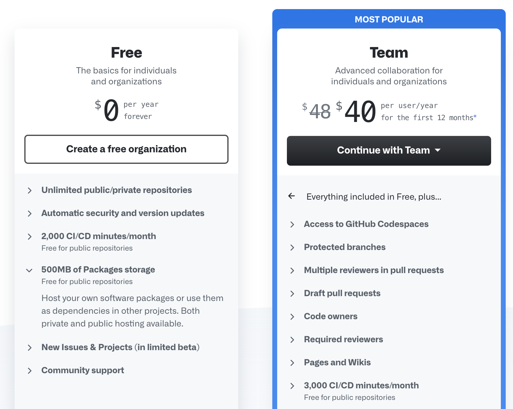

## 1. 서론

`이번 포스팅은 지극히 주관적인 의견을 띄고 있다는 것에 유의해주기 바란다.` 지난 포스팅까지 읽었다면 로컬 환경에서 배포 자동화하는 법에 대해서는 어느 정도 이해가 생겼을 것 같다. 하지만 로컬에서 배포를 진행한다는 것은 생각보다 유쾌하지만은 않다. 내 맥북이 그렇게 사양이 좋지 않은 문제도 있지만 안드로이드와 iOS 배포를 진행하는 데 걸리는 시간이 30분 이상 소요됐다. 물론 CPU 점유율이 높은 Android와 iOS 각각의 빌드 시기 이후인 배포 단계에서는 다른 작업을 진행할 수 있지만. 빌드 단계에서는 CPU 점유율이 99%까지 올라가서 다른 작업을 맥북에서 진행하기가 힘들 정도가 된다. 이런 문제점들을 해결하기 위해 원격 배포를 도입하고자 했고 CI/CD 툴을 고려하게 됐다.

## 2. 원격 환경 선택

### 2-1. AWS

우리 회사는 기존에 지원받은 AWS 크레딧이 있어서 우선 AWS에서 맥 환경을 지원하는 지 여부부터 조사해봤다. 조사 결과는 와우! 작년 2020년부터 Mac환경을 제공한다는 [공식 홈페이지](https://aws.amazon.com/ec2/instance-types/mac/)를 보고 바로 자세히 찾아보기 시작했지만 선택하지 못했던 이유는...

1. 가격

    뭐니뭐니해도 스타트업에서 가장 중요한 건 번레이트를 줄이는 것이다. 하지만 AWS Mac 인스턴스를 사용하게 되면 이 비용으로만 한 달 고정 지출이 988.42USD(= 120만원) 추가된다... 말도 꺼낼 수 없는 금액이어서 당연히 포기했다.

    

2. 지역

    위의 이미지에서 보이겠지만 Seoul 지역을 지원하지 않는다. 사용자들의 request를 받는 일반 서버에 비해 배포 서버의 위치는 그다지 중요하지 않은 요소지만 위의 가격 문제가 생긴 터라 서울을 지원하지 않는 다는 사실도 괜히 괘씸했다랄까... 그림에 떡이었다랄까... 기분이 별로 좋지 않았다.

이러한 이유들로 깔끔하게 아무 아쉬움 없이 AWS는 포기해버렸다!

### 2-2. Circle CI

AWS를 포기하고 빌드 서버를 제공해주는 CI 툴들 중에 Circle CI가 Mac을 지원한다는 사실을 알고 자세하게 찾아봤다. .circleci/config.yml을 작성해두고 Github을 연동해서 해당 브런치에 푸쉬가 되면 자동으로 빌드가 수행되는 형식이다. 내가 생각하는 주관적인 특징에 대해서 말해보도록 하겠다.

1. 가격

    [공식 문서](https://circleci.com/docs/2.0/credits/#performance-plan)를 참고한 결과 Mac OS로 빌드하기 위해서는 매달 30USD(3~4만원)정도가 지출된다. 그럼 한 달에 25,000크레딧이 지급되고 Mac OS를 사용하면 분당 50크레딧을 사용하게 된다. 그럼 한 달에 총 500분의 빌드 시간을 갖게 된다. Fastlane을 이용한 iOS 빌드 및 배포 시간을 30분 정도라고 생각해보면 한 달에 대략 16~17번의 배포를 진행할 수 있다는 건데 턱없이 모자라다...(우리 회사는 테스트 플라이트 배포를 통해 QA를 진행하기 때문에...) 더 높은 가격은 Custom Pricing으로 직접 문의를 통해서 지정해준다는 듯 한데, 대략 5만 크레딧이 필요하다고 하고 물론 2배 가격은 아니겠지만 단순 계산으로 60USD(7.2만원)라고 하면 AWS 형님에 비해서는 매우 괜찮은 듯 하면서도 조금 애매한 수치인듯 하다.

    

    

2. 편리성

    Github과 손쉽게 연동되고 자동으로 생성해놓은 config.yml 파일에 맞춰서 빌드를 진행하기 때문에 대단히 편리하다. jenkins에 비해서는 별도로 플러그인을 설치하거나 연동을 힘들게 할 필요가 없다.

3. 보안 파일 관련

    우리 회사에서는 안드로이드와 iOS 모두의 서명키와 배포 관련 파일들을 .gitignore에 등록해서 개발자들끼리 직접 Naver Works의 보안 메일로 주고 받는다. 혹여나 Github 계정 노출 등의 문제가 생겼을 때를 대비하기 위함인데 이를 위한 처리를 Circle CI에서 어떻게 해야할 지 감이 오지 않는다. 자동 배포를 위해서 이러한 보안 부분을 내려놓아야 하는 건지... 감이 오지 않는다.

### 2-3. Travis CI

Circle CI와 비슷하게 Mac OS 빌드 서버를 제공해주는 유명한 CI 툴이다. 다만, 나는 경험해본적이 없다. 간단하게 특징을 정리해봤다.

1. 가격

    [공식문서](https://www.travis-ci.com/plans)에서 보면 가격이... 확실히 세다. 무료로 10,000크레딧이 제공되는 프리티어도 있지만 Travis에서도 Mac OS를 사용하면 분당 50크레딧을 사용하게 된다. 그럼 의미가 없기 때문에 결국 결제를 하게 될 것 같은 데, 다음 가격이 69USD(8.2만원) 확실히 Circle CI에 비해서는 비싸다.

    

2. 편리성

    사용해보지는 않았지만 [이 글](https://www.lambdatest.com/blog/circleci-vs-travis/)을 본 봐로는 Circle CI와 동일 혹은 그보다 더 편리할 것으로 예상된다.

3. 보안 파일 관련

    이 부분은 위의 Circle CI의 설명과 동일하다.

### 2-4. Mac Mini(M1) + Jenkins

모든 경우의 수를 생각하기 위해 CI/CD용으로 사용할 Mac Mini(M1)도 생각해봤다. 올해인 2021년 4월에 Docker를 M1칩에도 설치할 수 있는 방법이 Docker 공식 홈페이지에 올라왔기 때문에 Docker부분에서는 걱정이 없었고, M1이 워낙 성능이 좋다고들 하길래 궁금하기도 했다. 배포 서버로 사용할거라 사양 자체는 크게 좋을 필요가 없다고 생각해서 가격대를 좀 낮게 잡고 검색해봤다.

1. 사양

    2021 Mac Mini Apple M1 칩

    - CPU 8코어
    - GPU 8코어
    - Neural Engine 16코어
    - 메모리 16GB
    - SSD 256GB
    - Gigabit Ethernet

2. 가격

    Mac mini라서 그런 지 가격은 애플치고는 너무 저렴한 1,115,000원이다. 위에서 Circle CI와 Travis CI를 1년 조금 넘게 쓰면 비슷한 가격일 것 같은 데, 괜찮지 않을까 싶은 느낌이든다.(1년 안에 회사가 망하진 않을 거라고 믿으니까!)

3. 편리성

    Jenkins를 설치해서 사용해야되는 데, 일단 필요한 플러그인들 모두 설치하고 기본적으로 Android Studio와 Xcode를 직접 설치해야한다. 그 외에도 git, ruby, fastlane, jdk 등 필요한 프로그램들은 모두 설치해야하고 환경 변수도 모두 설정해야 한다. 또한, 회사 사람들이 접근할 수 있게 고정 IP등록, 도메인 준비, https 연결, IP 선택적 허용 등 처리할 게 산더미다... 이래서 다들 빌드 서버 구매해서 쓰는구나 싶을 정도다.

4. 보안 파일 관련

    이 부분만은 위의 Circle CI와 Travis CI에서는 해결 방법이 감이 잡히지 않았던 것과 달리 Naver Works를 통해 보안메일로 미리 파일들을 준비해뒀다가 jenkins pipeline에서 프로젝트 폴더에 복사해서 넣는 방식으로 진행하면 되겠다는 감이 잡혔다.

5. Jenkins 사용

    맥 미니를 구매하게 되면 CI/CD 툴로 오픈 소스인 Jenkins를 사용하게 될 것 같은 데, Jenkins에서 제공하는 pipeline에 나쁘지 않은 경험을 갖고 있기도 하고, 워낙 사용하는 사람들도 많기 때문에 관련 자료도 많아서 괜찮을 것으로 예상된다.

### 2-5. Github Actions (2022 2/6 추가)

이 글을 쓸 때 당시에도 Github Actions가 엄청나게 뜨고 있어서 빨리 추가해야지! 추가해야지... 했지만 회사의 버전2 리뉴얼 때문에 시간이 없어서 이제야 추가한다. 우선, 공식문서부터 봤는 데 장점이 너무너무 많은 툴이란 생각이 든다. 차근차근 비교해보도록 하자.

1. 가격

    엄청나게 혜자다. 일단 public repository는 무료!라는 점에서 학생들이나 사이드 프로젝트에서 사용하기에는 충분하다고 생각한다. 심지어 private repository도 한 달에 2000분까지는 무료이기 때문에, 안드로이드+ios 배포 시간을 30분으로 잡는다면 66~67회 정도 빌드할 수 있는 데 기업 입장에서는 다소 적을 수 있지만, 사이드 프로젝트로써는 충분하다는 생각이 든다. 그 외에 가장 저렴한 달에 40달러 플랜을 보더라도 한 달에 3000분 최소 100회 정도의 빌드는 엄청난 조건이라는 생각이 든다. 따라서, 사이드 프로젝트 + 학생들에게는 매우 적합할 것 같다는 생각이 든다.

    

2. 편리성

    따로 할 말이 있을까? 이미 Github을 원격 저장소로 사용하고 있는 개발자 혹은 개발팀이라면 다른 툴을 사용하기 위해 가입해야하는 번거로움을 겪지 않을 수 있다. 또한, Github만큼 생태계가 활성화된 곳이 있을까? 싶을 정도라... 사실 자료는 찾으면 차고 넘칠 정도로 많다. 엄청나다.

3. 보안 파일 관련

    여기서 조금 고민이 생긴다. 만약, 사이드 프로젝트나 public repository라면?... 음... 사실 아무리 public repository라 해도 안드로이드 개발자 콘솔에 접근 가능한 api-...json 파일([안드로이드 배포에 필요한 파일](https://millo-l.github.io/ReactNative-fastlane/#5-1-api-%EC%95%A1%EC%84%B8%EC%8A%A4-%EC%84%A4%EC%A0%95))을 원격 저장소에 올려도 괜찮을까?... private repository라고 해도 api-...json 파일을 올려도 안전할까? 나는 현재 모든 배포와 관련된 파일들을 .gitignore에 추가하고 별도로 보관하고 있다.

    이쯤되면 나만 유독 걱정인 것 같긴하다. 해결을 위해 많은 글들을 읽어봤지만 이런 문제를 제기한 개발자는 따로 찾지 못했다. 워낙 이런 쪽에 걱정이 많은 성격이기도 하고, 회사 업무로 사용하는 것이다 보니 더 세심하게 생각하는 것 같긴 하다. ios의 경우 fastlane match를 적용하면 배포에 필요한 키들을 암호화 시켜서 업로드하기 때문에 원격에 저장하더라도 크게 문제가 생길 것 같진 않지만, 안드로이드에서 다소 걱정이 생기는 게 사실이다.(물론, 내가 찾아내지 못한 새로운 해결방법들이 존재할 수 있으니 많이 찾아보시길 바란다.)

## 3. 결정

결정된 최종 사안에 대해서 말하자면 나의 결정은 `Mac Mini(M1) + Jenkins 사용`이다. 현재는 설정을 모두 마치고 배포에 잘 사용하고 있으며, 로컬에서의 배포가 완전히 종료되는 시간보다 10~15분 정도 빠르게 배포가 진행되고 있다. 빌드 시간만 비교하면 맥 미니에서는 안드로이드와 iOS 빌드를 병렬로 수행해서 6분 정도가 소요되는 데 반해 나의 로컬 환경에서는 15~20분 정도가 소요된다.(~~물론, 회사에서 지금해준 내 맥북이 그렇게 좋은 사양이 아니라는 것은 비밀로...~~) M1칩이 빠르긴 빠르구나...라고 생각하고 있다. 하지만 초기 설정에서 역시나 시간이 많이 걸렸고 후에 버전 업데이트 관련 이슈가 생길 위험성도 있어서 잘한 선택인지는 1년 뒤의 나에게 물어봐야 알 수 있을 것 같다.

이 화면은 최근 배포를 성공한 예시인데 빌드 시간만 따로 계산했을 때는 길지 않지만 TestFlight에 업로드 여부를 Fastlane이 확인해주는 시간이 포함되서 총 20분 정도가 소요된다.

### 2022 2/6 추가

이번에 좋은 기회로 OO회사의 애자일랩에 입주하게 됐다. 기존에는 패스트 파이브 공유 오피스에 입주해서, 고정IP 신청 + 도메인 구매 + Letsencrypt + nginx를 적용해, 특정 IP만 접근 가능하게 설정 후 사용하고 있었다. 따라서, 재택 시에도 집의 IP만 일시적으로 허용하는 방식으로 사용했는 데, 이번에 입주한 에자일랩에서는 보안상의 문제로 제공된 고정IP도 외부에서 접근이 불가했다... 물론, Github Webhook기능을 통해 배포를 하고, 빌드 혹은 배포 시 오류도 슬랙을 통해 전달 받을 수 있지만, 다소 불편함이 생긴 건 사실이다. 혹시나 직접 맥 미니를 구매하고 젠킨스를 이용한 자동 배포 구축을 원하시는 분은 이 부분을 고려하셨으면 한다.

## [참고]

-   https://aws.amazon.com/ec2/instance-types/mac/
-   https://circleci.com/docs/2.0/credits/#performance-plan
-   https://www.lambdatest.com/blog/circleci-vs-travis/
