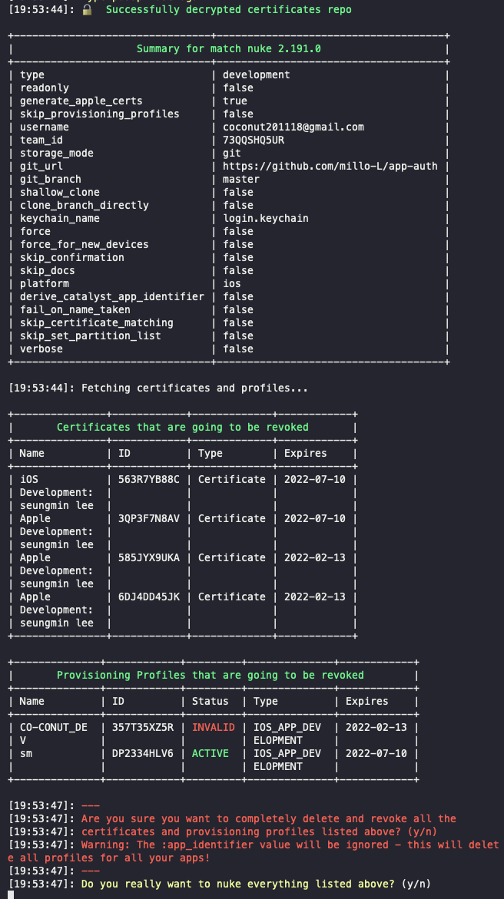
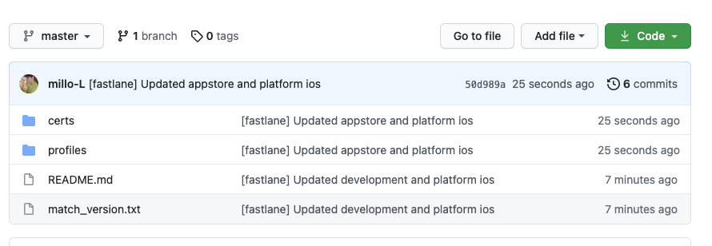

## 1. 서론

지난 포스팅에서 iOS와 Android에 fastlane을 적용하는 방법에 대해 알아봤다. 이렇게 설정만 하고 모든 것이 완벽하고 아름답게 마무리 됐으면 얼마나 좋겠냐만은... 현실은 그렇지 않았다.(만약, 팀 단위가 아니라 혼자 개발한다면 fastlane match는 필요하지 않을 수 있다.) 가장 문제가 됐던 부분이 어떤 Mac 환경에서는 해당 Code Signing으로 iOS 배포가 되는 데 다른 Mac 환경에서는 안되는 상황의 반복이었다. 처음에는 그저 인증서와 Provisioning profiles가 엉켜서 그렇겠거니 했지만... 수없이 반복해도 상황은 변하지 않았다. 그러던 와중 fastlane match라는 방식을 알게됐고 현재는 매우 유용하게 프론트 개발팀에서 사용하고 있다.

## 2. fastlane match란?

자세한 사항은 [공식문서](https://docs.fastlane.tools/actions/match/)와 [codesigning.guide](https://codesigning.guide/) 페이지를 통해서 알 수 있지만, 꼭 알아야 하는 부분만을 간략하게 설명하도록 하겠다.

iOS를 개발 및 배포하기 위해서는 `개발 인증서`와 `개발용 provisioning profile`, `배포 인증서`와 `배포용 provisioning profile`이 필요하다. provisioning 파일에는 기본적으로 `APP ID`, `인증서 public 키`, `Device 정보`가 포함되어 있다. 따라서, `APP ID`는 com.your.packagename 형식으로 팀원 모두가 동일하지만 `인증서 public 키`와 `Device 정보`는 팀원 마다 각자의 Mac이 있을 것이기 때문에 같을 수가 없다. 하지만 그렇다고 배포 인증서와 배포 Provisioning profile을 각자 받는 다고 배포가 원할히 진행되지도 않는다. 이상하게 엉켜버리는 문제가 생기기 때문이다.

위의 문제점을 해결해주는 것이 바로 fastlane match이다. fastlane match를 사용하면 기기에 상관없이 원격 저장소에서 `인증서`와 `provisionging profile`를 저장하고 팀원들 간에 원격 저장소에 존재하는 `인증서`와 `provisionging profile`를 공유하게 된다. 정확한 원리는 코드를 까보지 않아서 알지 못하지만... (혹시나 아는 분이 계시면 설명해주시면 감사하겠습니다.) 이 기능이 동작하는 것만으로도 충분히 많은 시간과 노력을 아낄 수 있는 유용한 툴이다.

여기서 개발자라면 반드시 들어야할 의문점은? 당연히 `보안`이다. 원격 저장소에 나의 소중한 배포키들을 두는 게 과연 안전하고 현명한 선택일까? 글쓴이도 이 점을 걱정하지 않았던 것은 아니지만 생각보다 괜찮은 해결 방법이 이미 포함돼있다. 바로 `원격 저장소에 올리는 모든 파일을 암호화` 시키는 것이다. 아래에서 실습을 진행할 때 나오겠지만 passphrase를 물어보는 부분에서 어떤 문자열로 암호화를 시킬 지를 명시할 수 있고, 등록 이후 다른 팀원들의 mac에 fastlane을 지정할 때 원격 저장소의 파일을 복호화할 passphrase를 물어보게 되는 데 이 때 암호화시킬 때 사용했던 문자열을 그대로 적어주면 된다. 따라서, `암호화와 복호화를 이용한 이중보안이 항시 작동`되고 있어 보안 측면에서는 큰 문제가 없을 것으로 예상된다.

## 3. fastlane match 설정

### 3-1. 원격 저장소 만들기

글쓴이는 기업에서 해당 기능을 사용하고 있어서 회사의 Github 계정으로 private repository를 만들어두고 글쓴이를 포함한 모든 팀원들의 Github 계정을 해당 repository에 초대하는 형식으로 파일들을 관리했다.

우선, Github에서 private repository를 생성한다. 해당 실습에서는 편안하게 Github private repository 주소를 `https://github.com/millo-L/app-auth`로 통일하도록 하겠다.


### 3-2. match 초기화

프로젝트의 ios 경로에서 fastlane match를 초기화한다.

```bash
## {your-project-path}
cd ios
fastlane match init
```

위의 명령어를 입력하면 아래와 같은 화면이 나온다. AWS S3와 google cloud도 지원하지만 글쓴이는 Github을 사용하므로 git을 선택한다. (다른 것들을 선택해도 설정은 동일하다.)


이제 아까 생성했던 원격 저장소 주소를 입력한다. (위에서 다른 저장소를 선택했어도 동일하게 저장소의 주소를 입력하면 된다.)


이제 `{your-project-path}/ios/fastlane`에 `Matchfile`이 생성된 것을 확인할 수 있다.


Matchfile의 type을 수정해보자. 아래와 같은 상황일텐데 type을 appstore로 설정하도록 하자.

```ruby
git_url("https://github.com/millo-L/app-auth")

storage_mode("git")

type("appstore") ## The default type, can be: appstore, adhoc, enterprise or development

## app_identifier(["tools.fastlane.app", "tools.fastlane.app2"])
## username("user@fastlane.tools") ## Your Apple Developer Portal username

## For all available options run `fastlane match --help`
## Remove the ## in the beginning of the line to enable the other options

## The docs are available on https://docs.fastlane.tools/actions/match

```

앞으로는 원격 저장소에서 모든 개발, 배포용 인증서와 provisioning profiles를 관리할 것이기 때문에 기존에 존재하던 모든 개발, 배포 관련 인증서 및 provisioning profiles를 삭제해야 한다.

fastlane match에서는 이런 때를 대비해서 전체 삭제 기능을 제공하고 있다. 오해하면 안되는 점은 `개발, 배포와 관련된 인증서들만 파기` 된다는 것이다. 애플 로그인, 푸쉬 알림 등 별도의 기능용 인증서들은 파기되지 않는다.

### 3-3. 개발용 인증서 파기

아래의 경로에서 명령어를 입력한다.

```bash
## {your-project-path}/ios
fastlane match nuke development
```

fastlane match init 이후 가장 먼저 fastlane match 관련 기능을 수행하면 원격 저장소의 암호화 문자열을 입력받게 된다. 여기서는 간단하게 password로 문자열을 지정하겠다. (만약, fastlane을 이용한 첫 설정이라면 애플 개발자 계정에 대한 이중 인증 절차가 진행될 수도 있다.)


아래와 같이 기존 목록들이 나오고 모두 삭제할 것인지 여부를 물어보는 데 당연히 y(es)다!



그럼 이렇게 삭제가 완료됐다는 문구를 확인할 수 있다.


### 3-4. 배포용 인증서 파기

아래의 경로에서 명령어를 입력한다.

```bash
## {your-project-path}/ios
fastlane match nuke distribution
```

위에서 이미 passphrase를 등록했기 때문에 이제는 별다른 입력없이 인증이 완료되고 삭제 여부를 물어본다. 당연히 y(es)를 처리하고 아까와 같은 성공화면을 확인할 수 있다.

### 3-5. 개발용 인증서 생성

이제 모든 팀원들이 공유할 단 하나의 인증서를 생성하면 된다. 생성 방법도 매우 간단하다. 아래의 경로에서 명령어를 입력한다.

```bash
## {your-project-path}/ios
fastlane match development
```

그냥 화면이 후루룩 지나가더니 생성됐다.

### 3-6. 배포용 인증서 생성

위의 개발자 인증서와 같이 아래의 경로에서 명령어를 입력한다.

```bash
## {your-project-path}/ios
fastlane match appstore
```

이 또한 빠르게 생성됐다. 여기까지 진행됐으면 우리가 생성해놓은 원격 저장소에 아래와 같이 생성한 인증서들이 보관되어 있는 걸 확인할 수 있다. 물론, Mac의 키체인에서도 해당 인증서들이 저장되어 있는 것을 확인할 수 있다.



이제 지금까지 작업한 프로젝트를 팀원들과 공유하는 깃헙에 푸쉬 또는 PR한다.

### 3-7. Xcode 확인

Xcode의 `Signing & Capabilities`에서 Provisioning Profile을 `match ... your packagename`로 설정하면 된다.

### 3-8. Fastfile 수정

지난 번 포스팅에서는 로컬에 존재하는 인증서와 Provisioning profile을 사용해서 인증을 진행했다. 하지만 Matchfile을 사용하기로 했으니 이제 Fastlane의 설정도 변경해야 한다.

```ruby
## 기존 코드
## 지난 포스팅에서 적었던 일반적인 방식
  desc "Push a new beta build to TestFlight"
  lane :beta do |options|
    cert
    sigh(force: true)
    updateVersion(options)

    increment_build_number(xcodeproj: "DoctorIApp.xcodeproj")
    build_app(workspace: "DoctorIApp.xcworkspace", scheme: "DoctorIApp")
    upload_to_testflight
  end

## 수정된 코드
  desc "Push a new beta build to TestFlight"
  lane :beta do |options|
    sync_code_signing(
      type: "appstore",
      app_identifier: 'com.friggs.DoctorI',
      readonly: true
    )
    updateVersion(options)

    increment_build_number(xcodeproj: "DoctorIApp.xcodeproj")
    build_app(workspace: "DoctorIApp.xcworkspace", scheme: "DoctorIApp")
    upload_to_testflight
  end

```

## 4. 팀원들에게 인증서 공유

이제 생성은 완료됐다. 다음은 모두가 공유할 수 있기만 하면 된다.

1. 팀원들을 인증서를 저장하는 원격 저장소에 초대한다. (저장소 권한에 대한 부분은 각자 유동적으로 정하기 바란다.)
2. 팀원들의 Mac에서 프로젝트를 위에서 진행한 부분이 존재하는 최신 버전으로 pull 받고 `{your-project-path}/ios`에서 `fastlane match appstore --readonly`와 `fastlane match development --readonly` 명령어를 실행시킨다.
3. Xcode에서 Provisioning Profile을 `match ... your packagename`으로 선택한다.

## 5. 암호화 문자열을 변경하고 싶다면?

### 5-1. 암호화 문자열을 잊어버렸다면?

이런 일이 별로 없을 줄 알았는 데 생각보다 이런 일이 잦게 일어난다는 사실에 놀랐다. 이런 일이 발생하면 아래의 절차를 따라가면 된다.

1. 원격 repository에 저장되어 있는 인증서 파일들을 모두 삭제한다.
2. Matchfile을 삭제한다.
3. 위의 [3. fastlane match 설정](https://millo-l.github.io/ReactNative-fastlane-match/#3-fastlane-match-설정)을 다시 시작한다.

### 5-2. 암호를 잊진 않았지만 변경하고 싶다면?

이런 경우는 더더욱 많을 거라고 예상한다. 암호는 자주 바뀔수록 본연의 역할을 더 잘 수행하기 때문이다. 근데 이상하게 그렇게되면 암호를 잊어버리는 경우가 자주 생긴다... 참으로 아이러니하다. 이 경우를 대비해서는 fastlane에서 준비를 해놨다.

아래의 경로에서 명령어를 입력한다.

```bash
## {your-project-path}/ios
fastlane match change_password
```

## [참고]

-   https://docs.fastlane.tools/actions/match/
-   https://codesigning.guide/
-   https://docs.fastlane.tools/codesigning/getting-started/
