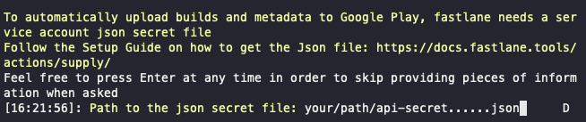

## 1. 서론

사실 순서상 Fastlane에 관한 이 포스팅이 직전에 썼던 [CodePush를 이용한 앱 업데이트](https://millo-l.github.io/ReactNative-codepush/)보다 먼저 나왔어야할 것 같은 데, 내가 지금 회사에 왔을 때 Fastlane을 사용한 자동 배포가 이미 세팅이 돼있는 상태여서 건드리고 있지 않다가, 협업을 위한 Fastlane match 설정과 Mac mini(M1) + Jenkins + Fastlane을 사용한 원격 자동배포를 오늘 마무리 지으면서, 시리즈물로 작성하기 위해 이렇게 포스팅을 시작하게 됐다. 물론 위에서 언급한 내용들은 이번 시리즈에 모두 들어갈 예정이니 기대하기 바란다.

## 2. Fastlane이란?

공식 사이트에서 말하는 [사전적 정의](https://fastlane.tools/)는 직접 확인할 수 있으니 건너뛰도록 하고, 내가 느낀 Fastlane은 ruby 기반 배포 자동화 툴로써, iOS와 Android에 각각 적용 가능한 아주 유용한 툴이다. 무료 오픈소스인 점에서 많은 개발자들이 사용할 수 있고, 이후에 포스팅하겠지만 가장 까다롭게 느껴지는 iOS의 Code Signing 부분을 [Fastlane Match](https://docs.fastlane.tools/actions/match/)라는 기능을 통해서 해소해주는 효자툴이다. 따라서, 사용하지 않을 이유가 없고, 사용해야만 하는 툴이므로 iOS 또는 Android를 배포해야하는 개발자들이라면 반드시 사용해봤으면 한다. 물론, 다른 유료 배포툴보다 뒤쳐지는 면도 있을 수 있지만, 글쓴이는 아직 다른 유료 툴을 경험해보지 않고 직접 배포만을 경험해봤기 때문에 현재 매우 만족스럽게 사용하고 있다.

## 3. Fastlane 설치

> [공식문서](https://docs.fastlane.tools/) <br />
> Homebrew가 설치돼있다고 가정한다.

우선 사용에 앞서 Fastlane을 설치해보도록 하자. 글쓴이는 맥을 사용하고 있으므로 mac os 기반으로 설명하겠지만, Windows 환경에서도 Android 배포 시에는 사용가능하다.

```bash
## ruby가 이미 설치되어 있다면 생략
brew install ruby

## Fastlane 설치
sudo gem install fastlane
```

## 4. iOS 설정

### 4-1. Fastlane 초기화

`{your-project-path}/ios`로 이동한 후 fastlane을 초기화한다.

```bash
## {your-project-path}
cd ios
fastlane init
```

위의 명령어를 실행하면 아래의 화면 같이 보기를 주는 데 글쓴이는 테스트 플라이트에 배포 후 내부 테스트를 거치고 앱을 배포하기 때문에 2번을 선택했다.


iOS 앱을 배포하기 위한 설정이므로 1번을 선택했다. (tvOS는 iOS와 다름)


이제 Fastlane을 설정하고자 하는 프로젝트의 팀원으로 등록되어 있는 애플 개발자 계정 이메일 로그인을 하면된다. 다른 기기에서의 로그인과 동일하게 2중 이증 절차를 거치게 된다.


이후부터는 엔터를 계속 누르다 보면 설정이 완료되고, `ios/fastlane` 경로에 `Appfile`과 `Fastfile`이 생성된다.


### 4-2. TestFlight 배포 설정

`Appfile`은 배포를 위한 정보들이 기록되어 있는 Fastlane 설정 파일이다. 정보 변경이 필요하지 않으면 별도로 수정하지 않는 걸 권장한다.

실제 실행되는 로직을 관리하는 파일은 `Fastfile`이므로 우리는 이 파일을 수정하도록 한다.

글쓴이는 테스트 배포만을 위한 기능을 추가할 것이므로 여러 가지 설정들은 [dev.yakuza](https://dev-yakuza.posstree.com/ko/react-native/fastlane/)님이 쓰신 글을 참고하길 바란다. dev.yakuza님이 작성하신 updateVersion을 그대로 가져와서 사용했다. updateVersion 함수를 사용하게 되면 자동으로 Info.plist의 버전을 올려줘서 번거로움을 덜 수 있다.

```ruby
default_platform(:ios)

platform :ios do
  def updateVersion(options)
    if options[:version]
      version = options[:version]
    else
      version = prompt(text: "Enter the version type or specific version\n(major, minor, patch or 1.0.0): ")
    end

    re = /\d+.\d+.\d+/
    versionNum = version[re, 0]

    if (versionNum)
      increment_version_number(
        version_number: versionNum
      )
    elsif (version == 'major' || version == 'minor' || version == 'patch')
      increment_version_number(
        bump_type: version
      )
    else
      UI.user_error!("[ERROR] Wrong version!!!!!!")
    end
  end

  desc "Push a new beta build to TestFlight"
  lane :beta do |options|
    cert
    sigh(force: true)
    updateVersion(options)

    increment_build_number(xcodeproj: "DoctorIApp.xcodeproj")
    build_app(workspace: "DoctorIApp.xcworkspace", scheme: "DoctorIApp")
    upload_to_testflight
  end
end
```

### 4-3. .env를 이용한 버전 관리

글쓴이는 앱 내에서도 버전 정보를 렌더링하고 있어서 .env 파일로 편리하게 버전을 관리하고 있다.

```py
## .env

VERSION=1.0.0
```

위의 .env 파일에서 VERSION 정보를 가져와서 `fastlane beta version:1.0.0`을 호출해주는 shell script를 생성한다.

모두 아는 사실이겠지만 .sh 파일을 만든 후에는 반드시 `chmod +x deploy-ios.sh`를 터미널에 입력해서 실행권한을 부여해야한다.

```bash
## deploy-ios.sh

VER=$(grep VERSION .env | cut -d '=' -f2)
echo "*** App store v$VER is going to be published ***"
cd ios
fastlane beta version:$VER
```

이제 위의 shell script를 실행시킬 명령어를 `package.json`에 등록한다.

```json
{
    ...
    "scripts": {
        "beta:ios": "./deploy-ios.sh"
    }
    ...
}
```

위의 설정들을 마치면 이제 버전 관리는 .env에서 할 수 있게 된다.

### 4-4. iOS 배포

위의 설정들을 모두 마쳤다면 이제 iOS를 간편하게 배포할 수 있다.

```bash
## {your-project-path}

npm run beta:ios
```

## 5. Android 설정

### 5-1. API 액세스 설정

안드로이드는 업로드 API에 접근할 수 있는 서비스 계정을 하나 생성해야 한다.

Google Play Console에 로그인해서 아래의 그림 처럼 API 액세스를 클릭한다.


아래의 `새 서비스 계정 만들기`를 클릭한다.


`Google Colud Platform` 링크를 클릭한다.


`서비스 계정 만들기`를 클릭한다.


서비스 계정으로 사용할 이름을 적고 `가입 완료 및 계속`을 누른다.


역할 선택에서 `서비스 계정` -> `서비스 계정 사용자`를 선택하고 아래의 `완료`버튼을 누른다.


`완료`를 누른다.


방금 생성한 서비스 계정을 클릭한다. 여기서는 아래의 이미지처럼 fastlane......


상단 탭의 `키`를 누르고 `키 추가`버튼을 눌러서 JSON방식으로 키를 만든다. 그럼 파일을 다운받을 텐데 배포에 필요한 키이므로 본인만의 경로에 잘 보관한다.


이제 다시 Google Play Console로 돌아와서 새로고침을 하면 방금 생성한 키가 보인다. 이 때 `엑세스 권한 부여`를 누른다.


별다른 변경 없이 아래의 `사용자 초대`를 누른다.


아까 위에서 `엑세스 권한 부여` 버튼이 `보기 엑세스 권한`으로 변경되어 있을텐데 다시 `보기 엑세스 권한을` 누르고 들어가면 아래와 같이 앱 권한 부분에 `애플리케이션 추가`버튼이 있다. 이 버튼을 누르고 Fastlane으로 배포하고자 하는 애플리케이션을 선택한다.


### 5-2. Fastlane 초기화

`{your-project-path}/android`로 이동한 후 fastlane을 초기화한다.

```bash
## {your-project-path}
cd android
fastlane init
```

위의 명령어 입력 후 자신의 android package name을 입력한다.


그 이후 아까 다운받았던 비밀키의 경로를 입력한다.



등록한 스토어 정보를 다운로드한다.


그 이후로는 엔터를 계속 누르면 Appfile과 Fastfile이 생성된다.


### 5-3. 내부테스트 배포 설정

iOS 설정에서와 동일하게 `Appfile`은 배포에 관련한 정보가 담겨 있으므로 별도로 수정할 필요가 없고 `Fastfile`만 수정하면 된다.

이번에도 dev.yakuza님의 내부 테스트 배포와 버전 업데이트를 사용했다. 자세한 설명은 [dev.yakuza](https://dev-yakuza.posstree.com/ko/react-native/fastlane/)를 방문하기 바란다.

```ruby
default_platform(:android)

platform :android do
  def increment_version_code()
    path = '../app/build.gradle'
    re = /versionCode\s+(\d+)/

    s = File.read(path)
    versionCode = s[re, 1].to_i
    s[re, 1] = (versionCode + 1).to_s

    f = File.new(path, 'w')
    f.write(s)
    f.close
  end

  def increment_version_number(bump_type: nil, version_number: nil)
    path = '../app/build.gradle'
    re = /versionName\s+("\d+.\d+.\d+")/
    s = File.read(path)
    versionName = s[re, 1].gsub!('"','').split('.')

    major = versionName[0].to_i
    minor = versionName[1].to_i
    patch = versionName[2].to_i

    if (bump_type == 'major')
        major += 1
        minor = 0
        patch = 0
    elsif (bump_type == 'minor')
        minor += 1
        patch = 0
    elsif (bump_type == 'patch')
        patch += 1
    end

    if(version_number)
      s[re, 1] = "\"#{version_number}\""
    else
      s[re, 1] = "\"#{major}.#{minor}.#{patch}\""
    end

    f = File.new(path, 'w')
    f.write(s)
    f.close
    increment_version_code()
  end

  def updateVersion(options)
    if options[:version]
      version = options[:version]
    else
      version = prompt(text: "Enter the version type or specific version\n(major, minor, patch or 1.0.0): ")
    end

    re = /\d+.\d+.\d+/
    versionNum = version[re, 0]

    if (versionNum)
      increment_version_number(
        version_number: versionNum
      )
    elsif (version == 'major' || version == 'minor' || version == 'patch')
      increment_version_number(
        bump_type: version
      )
    else
      UI.user_error!("[ERROR] Wrong version!!!!!!")
    end
  end

  desc "Submit a new Beta Build to Crashlytics Beta"
  lane :beta do |options|
    updateVersion(options)

    gradle(task: "clean bundleRelease")
    upload_to_play_store(
      skip_upload_metadata: true,
      skip_upload_changelogs: true,
      skip_upload_screenshots: true,
      skip_upload_images: true,
      skip_upload_apk: true,
      track: 'internal'
    )
  end
end
```

### 5-4. .env를 이용한 버전 관리

위의 iOS에서 설명한 .env를 그대로 사용하고 android 배포 스크립트를 `deploy-android.sh`에 작성한다. android는 pre-build로 데이터들을 정리하고 fastlane으로 배포를 시작한다.

이 때도 위와 마찬가지로 `chmod +x deploy-android.sh`를 터미널에 입력해서 실행권한을 부여한다.

```bash
## deploy-android.sh

VER=$(grep VERSION .env | cut -d '=' -f2)
echo "*** Play store store v$VER is going to be published ***"
cd android
./gradlew clean
cd ../

rm -rf ./android/app/src/main/assets/index.android.bundle
npx react-native bundle --platform android --dev false --entry-file index.js --bundle-output android/app/src/main/assets/index.android.bundle

cd android
fastlane beta version:$VER
cd ../
```

위의 배포를 실행할 명령어를 package.json에 입력하고, android와 ios를 함께 실행할 명령어도 추가한다.

```json
{
    ...
    "scripts": {
        "beta:android": "./deploy-android.sh",
        "beta:ios": "./deploy-ios.sh",
        "beta": "npm run android && npm run ios"
    }
    ...
}
```

### 5-5. Android 배포

위의 설정들을 모두 마쳤다면 이제 안드로이드를 간편하게 배포할 수 있다.

```bash
## {your-project-path}

npm run beta:android
```

## 6. 동시 배포

```bash
## {your-project-path}

npm run beta
```

## [참고]

-   https://fastlane.tools/
-   https://docs.fastlane.tools/
-   https://dev-yakuza.posstree.com/ko/react-native/fastlane/
