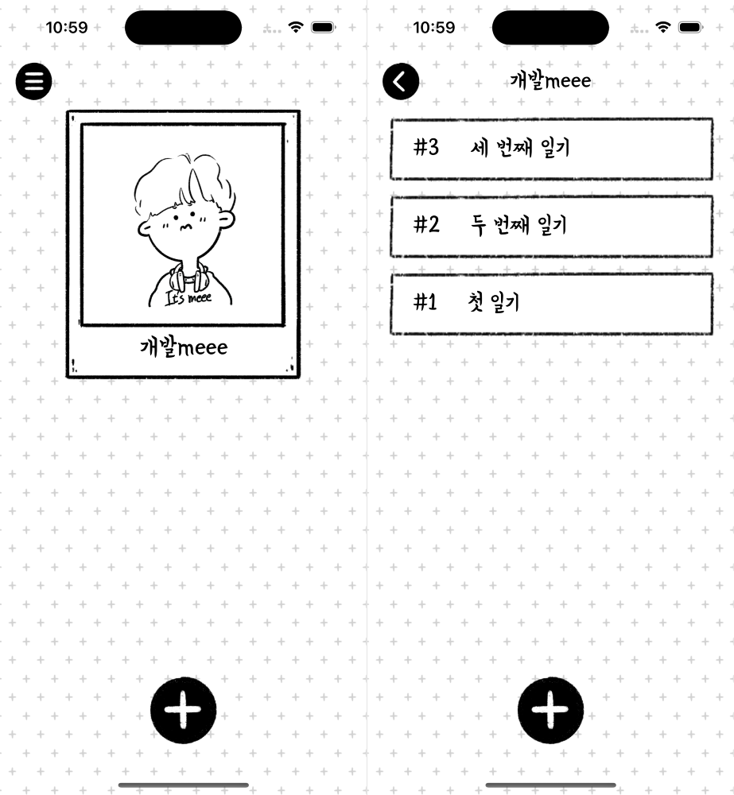

## 1. Introduction

While developing with one-to-many relationship structure in realm, I found an '[TypeError: Cannot read property 'push' of undefined]' error and solve the issue. So, I write this article to share the solution.

## 2. One-to-many relationship in realm

Let's follow the [official document]((https://www.mongodb.com/docs/realm/sdk/react-native/model-data/relationships-and-embedded-objects/#one-to-many-relationship)) and look at the project code I wrote first.

## 2-1. Understanding Flows on the Screen

The left screen is the avatar list screen generated, and it is a flow of writing or reading a diary that corresponds to the avatar on the right screen by clicking avatar. Therefore, the avatar model and the diary model should be created in a one-to-many relationship.



## 2-2. Models

### [👋 Wait] Version Info

> react-native 0.71.8 <br />
> realm 11.9.0 <br />
> @realm/react 0.4.3 <br />

### 2-2-1. avatar model

All parts are well documented, so it is omitted, and the diaries variable is connected to the diary model in a one-to-many relationship. The type uses Realm.List\<Diary>, a type made by rlem.


```ts
// ./models/avatar.ts

import { Realm } from '@realm/react';
import Diary from './diary';

class Avatar extends Realm.Object<Avatar> {
	_id!: Realm.BSON.ObjectId;

	name!: string;

	images!: string;

	diaries!: Realm.List<Diary>;

	createdAt!: Date;

	updatedAt?: Date;

	static generate(name: string, images: string) {
		return {
			_id: new Realm.BSON.ObjectId(),
			name,
			images,
			createdAt: new Date(),
			updatedAt: new Date(),
		};
	}

	static schema: Realm.ObjectSchema = {
		name: 'Avatar',
		properties: {
			_id: 'objectId',
			name: 'string',
			images: 'string',
			diaires: 'Diary[]',
			createdAt: 'date',
			updatedAt: 'date?',
		},
		primaryKey: '_id',
	};
}

export default Avatar;

```

### 2-2-2. diary model

In the diary, there is no need to have information about avatar, so no separate variables are required. If you need avatar's info, follow [official documents](https://www.mongodb.com/docs/realm/sdk/react-native/model-data/relationships-and-embedded-objects/#define-inverse-relationship-properties).

```ts
// ./models/diary.ts

import { Realm } from '@realm/react';

class Diary extends Realm.Object<Diary> {
	_id!: Realm.BSON.ObjectId;

	title!: string;

	content!: string;

	date!: Date;

	createdAt!: Date;

	updatedAt?: Date;

	static generate(title: string, content: string, date: Date, createdAt?: Date) {
		return {
			_id: new Realm.BSON.ObjectId(),
			title,
			content,
			date,
			createdAt: createdAt || new Date(),
			updatedAt: new Date(),
		};
	}

	static schema: Realm.ObjectSchema = {
		name: 'Diary',
		properties: {
			_id: 'objectId',
			title: 'string',
			content: 'string',
			date: 'date',
			createdAt: 'date',
			updatedAt: 'date?',
		},
		primaryKey: '_id',
	};
}

export default Diary;
```

### 2-2-3. RealmContext

```ts
// ./models/index.ts

import { createRealmContext } from '@realm/react';
import Avatar from './avatar';
import Diary from './diary';

const RealmContext = createRealmContext({
	schema: [Avatar, Diary],
});

export default RealmContext;

```

### 2-2-4. Use RealmProvider

Now that you have created all the models, you need to wrap up the other JSX components in App.tsx so that they can be used in all of the subcomponents.

```tsx
// App.tsx

import React from 'react';
// ...
import RealmContext from './models';

// ...

const { RealmProvider } = RealmContext;

export default function App() {
	return (
		<RealmProvider>
			{your components}
		</RealmProvider>
	)
}

```

## 3. Use one-to-many variable(diaries)

If you connect the diary to the avatar as shown in the code below, you can find out by modifying or deleting the diary (CASCADE is automatically applied).

```tsx
import React from 'react';
import { RouteProp, useRoute } from '@react-navigation/native';
// ...
import RealmContext from '~/models';
import Diary from '~/models/diary';

// ...
type WriteDiaryRouteProp = RouteProp<NaviParamList, 'WriteDiaryScreen'>;

const { useRealm } = RealmContext;

export default function WriteDiaryScreen() {
	// ...
	const realm = useRealm();
	const { avatar } = useRoute<WriteDiaryRouteProp>().params;
	const [data, setData] = useState<WriteDiaryData>({
		title: '',
		content: '',
		date: dayjs().toDate(),
	});

	// ...

	const onPressSave = useCallback(() => {
		try {
			// create new diary
			const newDiary = realm.write(() => {
				return realm.create(
					Diary,
					Diary.generate(
						data.title,
						data.content,
						dayjs(data.date).startOf('day').toDate(),
					),
				);
			});
			// connect avatar with new diary
			realm.write(() => {
				avatar.diaries.push(newDiary); 
			});
		} catch (e) {
			console.log(e);
		}
	}, [avatar]);

	// ...

	return (
		// ... 
	);
}

```

## 4. End

Today, we used realm to specify a one-to-many relationship and save data. You can use AsyncStorage and sqlite as local storage devices in the react-native environment, but they have the advantage of being simpler to use and easier to specify types, so I recommend using them at least once.