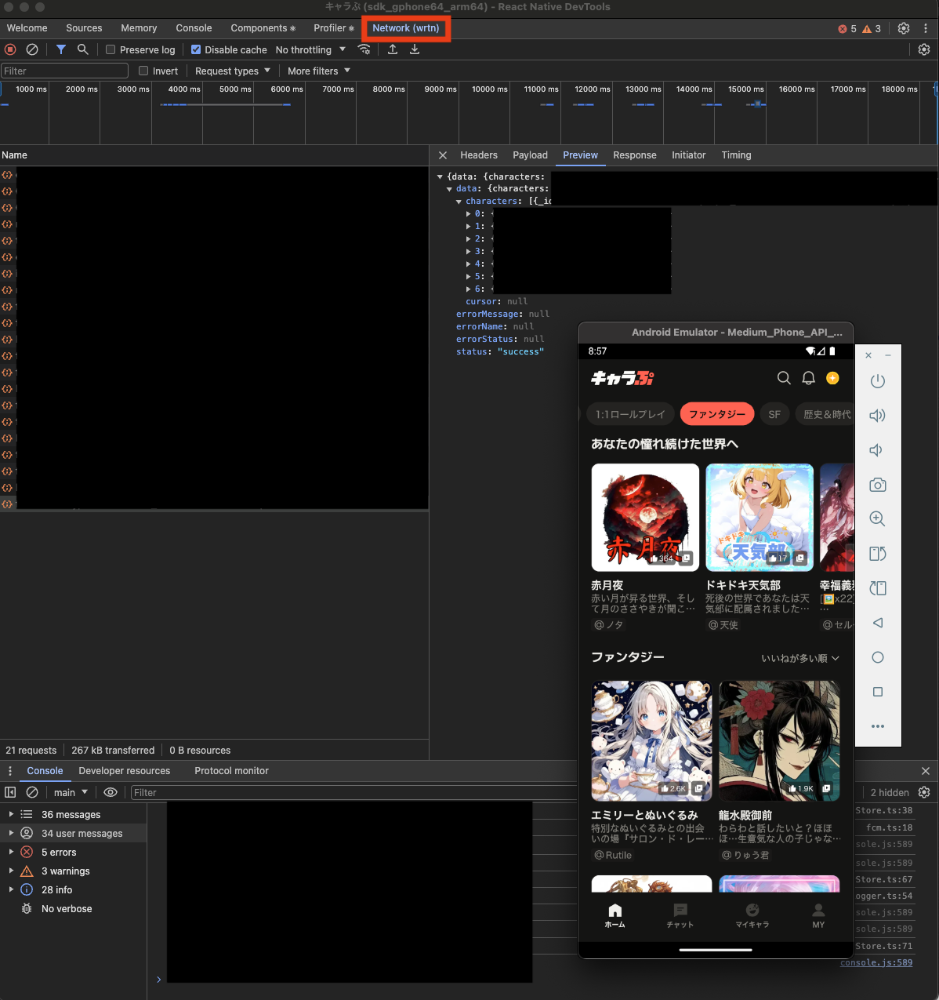
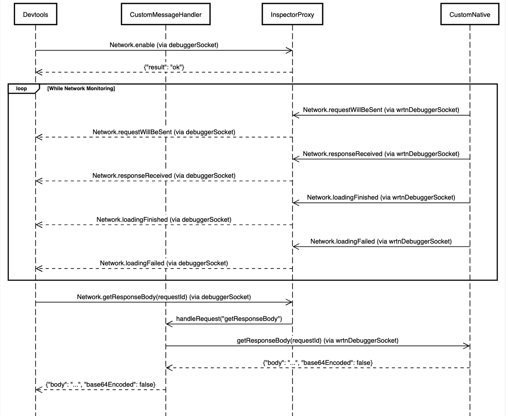

## 1. Background

It's been about 3 months since I joined [Wrtn](https://wrtn.io/) as a React Native developer, and I've successfully completed my probationary period. Although it was technically a probationary period, it felt nothing like one since I had to single-handedly develop a new Japanese market app called [Kyarapu](https://kyarapu.com) within 2 months. Fortunately, the web and backend developers were also experienced new hires, so we quickly bonded through shared challenges and built strong trust relationships while assessing each other's capabilities.

Now that the project is completed and we're in the service stabilization phase handling operational tasks, the network debugging issues that were constantly frustrating during development remain unresolved. Since there's no viable solution across our company's entire app chapter, I decided to create a new React Native network debugger for common use within the company.

### 1-1. Preview of the Result



## 2. Problem Statement

The legacy Flipper debugger has been deprecated and React Native DevTools has been adopted as the official debugger, but one of the most crucial features - network debugging - was missing.

### 2-1. Existing Issues

1. **Flipper Support Discontinued**: Flipper's Network plugin is no longer supported
2. **Missing DevTools Network Panel**: The official DevTools doesn't have a fully implemented Network panel yet
3. **Limitations of Log-based Debugging**: 
   - Difficulty tracking complex API call flows
   - Unable to inspect detailed Request/Response information
   - No real-time network status monitoring

### 2-2. Proposed Solution

We propose implementing a network panel in React Native DevTools using Chrome DevTools Protocol (CDP). This approach collects network data through Inspector Proxy and forwards it to DevTools via CDP events.

## 3. Technical Implementation

React Native DevTools operates based on Chrome DevTools Protocol (CDP). To implement a network panel, we need to utilize CDP's Network domain to collect network events and forward them to DevTools.

### 3-1. Understanding Chrome DevTools Protocol (CDP)

CDP is the protocol used by Chrome DevTools to communicate with browsers. It exchanges JSON-RPC 2.0 messages over WebSocket connections and is organized into various domains (Network, Runtime, Debugger, etc.).

#### 3-1-1. Network Domain Core Components

**Methods (DevTools → Runtime)**
- `Network.enable`: Start tracking network events
- `Network.getResponseBody`: Get Response Body for a specific Request

**Events (Runtime → DevTools)**
- `Network.requestWillBeSent`: Fired when a network request is about to be sent
- `Network.responseReceived`: Fired when HTTP response headers are received  
- `Network.loadingFinished`: Fired when a request completes successfully
- `Network.loadingFailed`: Fired when a request fails

#### 3-1-2. CDP Message Structure (Example)

```json
// DevTools to Runtime (Method Call)
{
  "id": 1,
  "method": "Network.enable",
  "params": {}
}

// Runtime to DevTools (Event)
{
  "method": "Network.requestWillBeSent",
  "params": {
    "requestId": "1234.1",
    "loaderId": "1234.1",
    "documentURL": "https://example.com",
    "request": {
      "url": "https://api.example.com/users",
      "method": "GET",
      "headers": {
        "Accept": "application/json"
      }
    },
    "timestamp": 1736686200.123456,
    "wallTime": 1736686200.123456
  }
}
```


### 3-2. Inspector Proxy Structure

React Native's Inspector Proxy is a core module provided by the `@react-native/dev-middleware` package. It runs alongside the Metro server and acts as a mediator for communication between DevTools and devices.

#### 3-2-1. Inspector Proxy's Role

1. **Connection Management**: Manages WebSocket connections between DevTools and devices
2. **Message Routing**: Routes CDP messages to appropriate targets
3. **Protocol Translation**: Converts device native events to CDP format when necessary

#### 3-2-2. Connection Structure

```
DevTools (Chrome) 
    ↕ (debuggerSocket)
Inspector Proxy (Metro Server)
    ↕ (deviceSocket) 
React Native App (Device/Simulator)
```


### 3-3. Adding Network Debugger WebSocket (wrtnDebuggerWebsocket)

Directly utilizing the existing Inspector Proxy's debuggerSocket and deviceSocket has several limitations. To solve stability issues in multi-connection environments, we added a separate WebSocket within the Inspector Proxy.

#### 3-3-1. Problems with the Existing Approach

1. **Connection Conflicts**: Message routing failures when WebSockets in Inspector Proxy have 1:n connections instead of 1:1
2. **Duplicate Data Transmission**: Using existing WebSockets causes duplicate data to be sent to Device or DevTools

#### 3-3-3. Improved Architecture

```
DevTools (Chrome) 
    ↕ (debuggerSocket)
Inspector Proxy (Metro Server)
    ↕ (wrtnDebuggerSocket) 
Native Network Interceptor (Custom Native below)
```



### 3-4. Native Interceptor Implementation

Since I heavily referenced [Toss's approach](https://static.toss.im/slash24/QR/slash24-06.pdf) for the native interceptor structure, I recommend referring to Toss's implementation for the native interceptor details.

## 4. Official Network Panel Development Status

The React Native team is officially developing a DevTools Network panel. Meta developer [Huntie](https://github.com/huntie) is leading the effort, and significant progress is being made.

### 4-1. Analysis of Development Delays

The main reasons for the delayed development of the official Network panel are related to React Native's network architecture changes.

#### 4-1-1. Limitations of the Legacy Architecture
- **Platform-specific Implementation**: iOS uses `URLSession`, Android uses `OkHttp3`
- **Interceptor Complexity**: Each platform requires different network interceptor implementations
- **Data Consistency**: Network data format differences between platforms

#### 4-1-2. New Architecture Solution
Starting from React Native v0.80.0, network processing has been unified into the C++ layer.

### 4-2. Advantages of the Official Implementation

1. **Unified Network Processing**: All network requests are handled in the C++ layer
2. **Performance Optimization**: Efficient data collection at the native level
3. **Consistent Interface**: Same network debugging experience across platforms

### 4-3. Expected Release Timeline

- **React Native v0.80.0+**: C++ network interceptor-based structure completed
- **Expected Release**: Second half of 2025 (React Native v0.81-0.82)
- **Current Status**: Under development by [Huntie](https://github.com/huntie)

## 5. Conclusion

The absence of a Network panel in React Native DevTools is a common problem faced by many developers. To solve this issue, we can implement a custom network debugger using Chrome DevTools Protocol, with the key implementation points as follows:

### 5-1. Core Achievements

1. **Improved Development Productivity**: Transition from log-based debugging to visual network panels
2. **Real-time Monitoring**: Real-time tracking of network requests/responses
3. **Team-wide Adoption**: Organization-level problem solving through library implementation

### 5-2. Technical Learning Points

- **CDP Understanding**: Structure and utilization of Chrome DevTools Protocol
- **Inspector Proxy**: Core structure of React Native debugging infrastructure
- **WebSocket Communication**: Implementation of real-time bidirectional communication
- **Data Transformation**: Logic for converting native data to CDP format

### 5-3. Future Outlook

When Meta's official Network panel is completed, it's expected to provide a better debugging experience. However, custom implementation is currently the only alternative, and it provided an opportunity to gain deeper understanding of DevTools operation and internal structure in React Native.

## References

- [Chrome DevTools Protocol - Network Domain](https://chromedevtools.github.io/devtools-protocol/tot/Network/)
- [Toss SLASH 24 - React Native Network Debugging](https://static.toss.im/slash24/QR/slash24-06.pdf)
- [@react-native/dev-middleware](https://www.npmjs.com/package/@react-native/dev-middleware)
- [@react-native/debugger-frontend](https://www.npmjs.com/package/@react-native/debugger-frontend)
- [Huntie GitHub Profile](https://github.com/huntie)