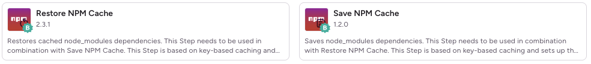
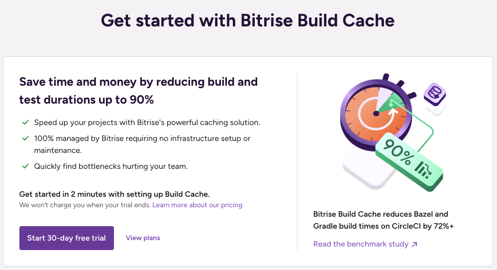
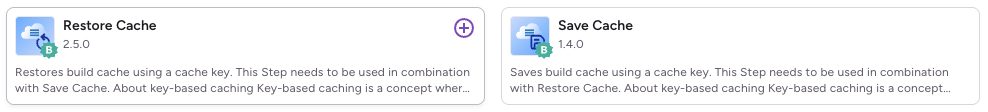

## 1. 서론

[Network Debugger](/reactnative-devtools-network-debugger/) 개발과 [React Query 에러 처리](/reactquery-handle-suspense-error/) 개선을 마치고 나니, 이제 개발 환경 자체의 효율성에 눈이 가기 시작했다. 특히, CI/CD 파이프라인에서 빌드 시간이 너무 오래 걸리는 문제가 지속적으로 발목을 잡고 있었다.

 

뤼튼에서는 Bitrise를 CI/CD 툴로 사용하고 있는데, React Native 0.76.9 (Old Architecture) 기반의 프로젝트를 빌드할 때마다 `Android와 iOS 각각 26분` 정도 소요되고 있었다. 이는 단순히 시간 낭비를 넘어서 실질적인 비용 문제로 이어졌다. Bitrise는 빌드 시간에 따라 과금이 되는 구조이기 때문에, 빌드 시간을 단축하는 것은 곧 비용 절감과 직결된다.

캬라푸 외의 다른 앱 팀들도 모두 빌드 시간 및 비용에 대해 불편함을 느끼고 있었고 이에 네이티브(iOS/Android) SDK 개발자인 원탁의 주도하에 비트라이즈 성능 개선 작업을 시작했다.

 

결론부터 말하자면 캐싱된 상태 기준 `안드로이드는 11분(약 58% 감소)`, `iOS는 7분(약 73% 감소)`으로 빌드 시간을 단축시킬 수 있었다.

### [여기서 잠깐 👋]

오해하지 않도록 먼저 말하자면 Bitrise는 yaml 파일 수정 외에 가시적으로 워크플로우와 파이프라인을 구축할 수 있는 매우 강력한 CI/CD 툴이다. 다소의 문제점을 말하는 것일뿐 이 점을 부인하는 것은 아니라는 점을 분명히 해두고자 한다. 실제로 뤼튼에서는 빌드 시간 단축을 이루고 현재도 비트라이즈를 사용하고 있다.

## 2. Bitrise 제공 캐싱 Step들의 아쉬운 점

사실 문제점이라고 하기에는 대체 방안(비트라이즈에서 제공하는 기본 캐싱 스텝을 고도화)이 있으나 공식적으로 지원하는 워크플로우 스텝인데 지원되지 않는 부분에 대한 문제 현황이라고 생각하면 된다.

### 2-1. Yarn Berry 캐싱 호환 문제

> **캐싱 대상**
>
> npm/yarn classic - `{project_folder}/node_modules/`
>
> yarn berry - `{project_folder}/.yarn/cache/`

 

 

위의 스텝은 비트라이즈에서 공식 지원하는 npm/yarn 캐싱 스텝들이다. 하지만 yarn classic(1.x.x) 버전 이상의 yarn berry에서는 제대로 동작하지 않는다. 캐싱 파일의 경로를 `node_modules`로 제한해뒀기 때문이다.

뤼튼에서는 모두 yarn berry를 사용 중이고 yarn berry와 npm/yarn classic의 캐싱해야하는 파일은 엄연히 다르기 때문에 별도의 작업이 필요했다.

### 2-2. Android 빌드 캐싱의 부재

안드로이드의 경우 CI 환경에서도 증분 빌드가 가능하다. 하지만 공식적으로 해당 부분을 지원하는 캐싱 스텝들은 없다. 물론 gradle configuration이나 sdk를 캐싱하는 기능들은 존재했지만 이것만으로는 러닝타임의 가장 큰 부분을 차지하는 빌드 시간을 개선할 수 없었다.

 

비트라이즈에서는 아래와 같이 빌드 최적화를 유료로 제공한다. 하지만 사실 직접 개선이 가능한 상태라면 굳이 유료로 사용할 필요가 없다고 생각한다. 물론, 각 팀마다 상황이 다르기 때문에 여유가 없는 경우 추가 결재를 통한 빠른 최적화는 큰 도움이 된다고 생각한다.

 

## 3. 적용할 수 있는 캐싱

 

비트라이즈에서는 `cache key`를 기준으로 특정 `paths`에 존재하는 파일을 아카이빙해서 캐싱하는 위와 같은 스텝을 제공하고 있다. 이를 이용해서 다양한 캐시를 적용할 수 있다.

1. yarn berry 캐싱
2. android configuration, gradle, build 캐싱
3. ios cocoapods 캐싱
4. fastlane에 필요한 gem bundle 캐싱
5. ccache로 cpp 컴파일 캐싱

크게 위와 같이 5가지의 캐싱을 처리했다. 각각의 자세한 내용은 다음 포스팅으로 이어서 하도록 하겠다.

## 결론

개발자에게 늘 중요한 건 문제에 대한 정확한 정의인 것 같다. 사실 익숙함 때문에 개선에 대한 의지가 생기지 않거나 비효율적인 상황을 그대로 받아들이는 경우가 종종 생긴다. 
`서비스 개발이 먼저니까~`, `그건 원래 오래걸리는 작업이니까~` 현실의 벽에 부딪히거나 단순히 당연하게만 받아들일 수 있는 부분들이 차별점이 된다는 걸 다시 한 번 느꼈다.

 

비단 개발의 영역에서만 바라볼 것이 아니라 우리의 삶에서 이런 페인 포인트를 찾아 나간다면 개발자로써 또 한 팀의 일원으로써 더 나아가 개인의 사업에서도 더 좋은 성과를 거둘 수 있지 않을까 하는 생각이 들었다.