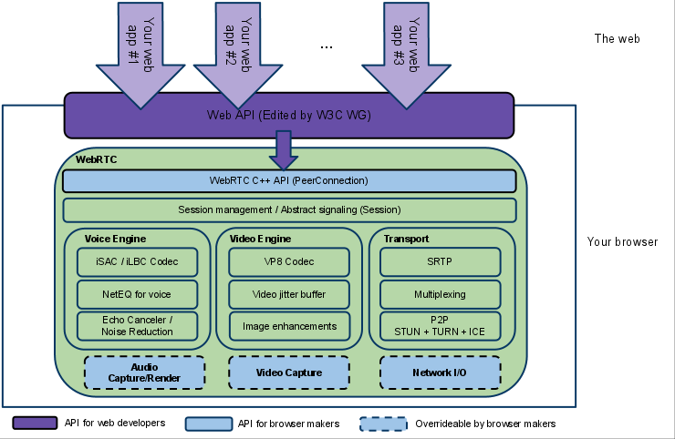
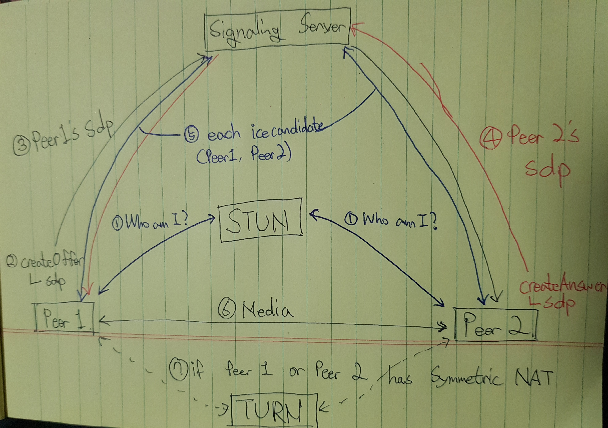

# 1. Explanation of terms

## MediaStream(getUserMedia)

It accesses data streams from places like the user’s camera and microphone.
It has the input created in navigator.mediaDevices.getUserMedia() and the output passed to the video tag or RTCPeerConnection.
3 parameters received by navigator.mediaDevices.getUserMedia() —

-   Constrained object (whether video is used (or resolution), audio is used, etc.)
-   Callback on success (MediaStream)
-   Callback on failure (error)

getUserMedia() must be used on a server other than a local file system. Otherwise, a PERMISSION_DENIED: 1 error occurs.

## RTCPeerConnection

It has the function of encryption and bandwidth management, and makes an audio or video connection.
It is a WebRTC component that processes data between peers in a stable and efficient manner.
The following is a WebRTC architecture diagram showing the role of RTCPeerConnection. The green part behind RTCPeerConnection is very complicated, but it is part that web developers do not have to deal with.

-   packet loss concealment
-   echo cancellation
-   bandwidth adaptivity
-   dynamic jitter buffering
-   automatic gain control
-   noise reduction and suppression
-   image 'cleaning'.
    

# 2. Implementation method

## Simple connection structure

The Fig. 2 below is a quick overview of the way we will implement it today. In the Fig. 2, the expressions Caller and Callee represent a method reminiscent of Google hangout. Caller sends its SessionDescription through Signaling Server, and Callee sends its SessionDescription through Signaling Server as well. In addition, ICECandidate is exchanged through the signaling server, the connection between peers is completed, and media data is exchanged between the caller and the callee.


## STUN server operation

In the Fig. 3 below, you can find out your own public address through the STUN server and find out whether you can access it (Symmetric NAT restriction). The other parts are the same as the Fig. 2 description above. Relay server represents a TURN server and is a method that bypasses symmetric NAT restrictions. This method incurs overhead and should be used only when there is no alternative.


## Data flow after connection

The Fig. 4 below shows the data flow between peers when the peer connection is completed. If a TURN server is not required (unless Symmetric NAT restrictions are applied), communication between peers is performed without a relay server, and if a TURN server is required ( If symmetric NAT restrictions are applied), data sent and received by all peers must be transferred to the TURN server together.


## Signals(Offer and Answer)

The Fig. 5 below is not clearly depicted in the above pictures, so the data exchanged through the actual Signaling server is not clearly drawn. In the above pictures, I explained what request the peer’s NAT sends to the STUN server, so I excluded the NAT part picture from the picture I drew (actually, each NAT exists in the peer). This is the part that I directly checked while recording logs on the client and signaling server. (If there is something wrong, please explain it in the comments and I will correct it!)

### Let’s look at the sequence.

1. First, each peer receives its own Public Address and whether it is accessible to the STUN server.
2. Peer1 first creates its SessionDescription through createOffer and delivers it to Peer2 through Signaling Server. (In this picture, Peer1 is the Caller role in the picture above)
3. Peer2 receives Peer1’s SessionDescription, creates its own SessionDescription through createAnswer in response to this, and delivers it to Peer1 through Signaling Server.
4. After both Peer1 and Peer2 create their own SessionDescription, they start to create their own ICECandidate information, and each transmits it to each other.
5. Each other’s MediaStream is exchanged through peer-to-peer communication.
6. If there is a Peer with Symmetric NAT among Peer1 and Peer2, you must use the TURN server to connect to the data relay.

The above explanation is about the signals that are sent and received. In fact, there are more parts to be concerned about when implementing the code.


# 3. Code

## Signaling Server(Node.js)

### Note: You must use socket.io version=2.3.0.

```js
let users = {};
let socketToRoom = {};
const maximum = 2;

io.on('connection', socket => {
    socket.on('join_room', data => {
        if (users[data.room]) {
            const length = users[data.room].length;
            if (length === maximum) {
                socket.to(socket.id).emit('room_full');
                return;
            }
            users[data.room].push({id: socket.id, email: data.email});
        } else {
            users[data.room] = [{id: socket.id, email: data.email}];
        }
        socketToRoom[socket.id] = data.room;

        socket.join(data.room);
        console.log(`[${socketToRoom[socket.id]}]: ${socket.id} enter`);

        const usersInThisRoom = users[data.room].filter(user => user.id !== socket.id);

        console.log(usersInThisRoom);

        io.sockets.to(socket.id).emit('all_users', usersInThisRoom);
    });

    socket.on('offer', sdp => {
        console.log('offer: ' + socket.id);
        socket.broadcast.emit('getOffer', sdp);
    });
RTCSessionDescription)
    socket.on('answer', sdp => {
        console.log('answer: ' + socket.id);
        socket.broadcast.emit('getAnswer', sdp);
    });

    socket.on('candidate', candidate => {
        console.log('candidate: ' + socket.id);
        socket.broadcast.emit('getCandidate', candidate);
    })

    socket.on('disconnect', () => {
        console.log(`[${socketToRoom[socket.id]}]: ${socket.id} exit`);
        const roomID = socketToRoom[socket.id];
        let room = users[roomID];
        if (room) {
            room = room.filter(user => user.id !== socket.id);
            users[roomID] = room;
        }
        socket.broadcast.to(room).emit('user_exit', {id: socket.id});
        console.log(users);
    })
});
```

As explained previously, Signaling Server only helps the connection between WebRTC peers, and there is no server load. Therefore, the server is configured very simply.

## Client(ReactJS, Typescript)

### Note: you must use socket.io-client version=2.3.0, @types/socket.io-client version=1.4.34.

### Variables to use in the client

```tsx
const [pc, setPc] = useState<RTCPeerConnection>()
const [socket, setSocket] = useState<SocketIOClient.Socket>()

let localVideoRef = useRef<HTMLVideoElement>(null)
let remoteVideoRef = useRef<HTMLVideoElement>(null)

const pc_config = {
    iceServers: [
        // {
        //   urls: 'stun:[STUN_IP]:[PORT]',
        //   'credentials': '[YOR CREDENTIALS]',
        //   'username': '[USERNAME]'
        // },
        {
            urls: "stun:stun.l.google.com:19302",
        },
    ],
}
```

### Socket event

```tsx
let newSocket = io.connect("http://localhost:8080")
let newPC = new RTCPeerConnection(pc_config)

newSocket.on("all_users", (allUsers: Array<{ id: string; email: string }>) => {
    let len = allUsers.length
    if (len > 0) {
        createOffer()
    }
})

newSocket.on("getOffer", (sdp: RTCSessionDescription) => {
    //console.log(sdp);
    console.log("get offer")
    createAnswer(sdp)
})

newSocket.on("getAnswer", (sdp: RTCSessionDescription) => {
    console.log("get answer")
    newPC.setRemoteDescription(new RTCSessionDescription(sdp))
    //console.log(sdp);
})

newSocket.on("getCandidate", (candidate: RTCIceCandidateInit) => {
    newPC.addIceCandidate(new RTCIceCandidate(candidate)).then(() => {
        console.log("candidate add success")
    })
})

setSocket(newSocket)
setPc(newPC)
```

### MediaStream setup and RTCPeerConnection event

```tsx
navigator.mediaDevices
    .getUserMedia({
        video: true,
        audio: true,
    })
    .then(stream => {
        if (localVideoRef.current) localVideoRef.current.srcObject = stream

        stream.getTracks().forEach(track => {
            newPC.addTrack(track, stream)
        })
        newPC.onicecandidate = e => {
            if (e.candidate) {
                console.log("onicecandidate")
                newSocket.emit("candidate", e.candidate)
            }
        }
        newPC.oniceconnectionstatechange = e => {
            console.log(e)
        }

        newPC.ontrack = ev => {
            console.log("add remotetrack success")
            if (remoteVideoRef.current)
                remoteVideoRef.current.srcObject = ev.streams[0]
        }

        newSocket.emit("join_room", { room: "1234", email: "sample@naver.com" })
    })
    .catch(error => {
        console.log(`getUserMedia error: ${error}`)
    })
```

### Send offer signal to other peer

```tsx
const createOffer = () => {
    console.log("create offer")
    newPC
        .createOffer({ offerToReceiveAudio: true, offerToReceiveVideo: true })
        .then(sdp => {
            newPC.setLocalDescription(new RTCSessionDescription(sdp))
            newSocket.emit("offer", sdp)
        })
        .catch(error => {
            console.log(error)
        })
}
```

### Send answer signal to other peer

```tsx
const createAnswer = (sdp: RTCSessionDescription) => {
    newPC.setRemoteDescription(new RTCSessionDescription(sdp)).then(() => {
        console.log("answer set remote description success")
        newPC
            .createAnswer({
                offerToReceiveVideo: true,
                offerToReceiveAudio: true,
            })
            .then(sdp1 => {
                console.log("create answer")
                newPC.setLocalDescription(new RTCSessionDescription(sdp1))
                newSocket.emit("answer", sdp1)
            })
            .catch(error => {
                console.log(error)
            })
    })
}
```

### Video rendering of yourself and the other user’s

```tsx
return (
    <div>
        <video
            style={{
                width: 240,
                height: 240,
                margin: 5,
                backgroundColor: "black",
            }}
            muted
            ref={localVideoRef}
            autoPlay
        ></video>
        <video
            id="remotevideo"
            style={{
                width: 240,
                height: 240,
                margin: 5,
                backgroundColor: "black",
            }}
            ref={remoteVideoRef}
            autoPlay
        ></video>
    </div>
)
```

# [GitHub]

-   https://github.com/millo-L/Typescript-ReactJS-WebRTC-1-1-P2P

# [References]

-   https://www.html5rocks.com/en/tutorials/webrtc/basics/
-   https://developer.mozilla.org/en-US/docs/Web/API/RTCPeerConnection
