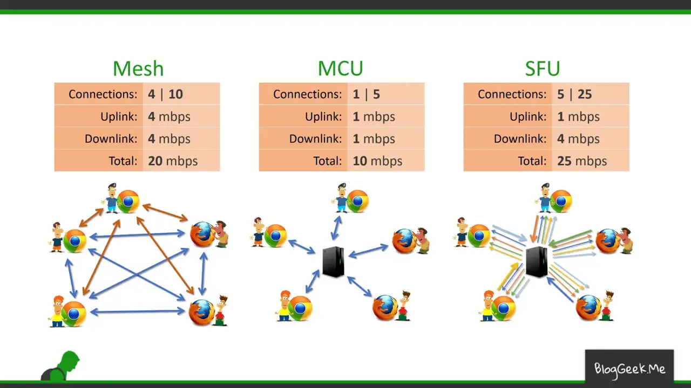

# 1. 서론

저번 포스트에서 작성했듯이 WebRTC는 ICE, STUN, TURN, SDP로 작동된다. 이 서버들과 프로토콜로만 작동이 된다면 매우 간편하겠지만 현실은 그렇지 않다.
P2P 연결을 완성시키기 위해서는 개발자가 peer간의 offer와 answer를 통한 session 정보를 중계해주는 서버를 만들어줘야한다.
하지만 P2P 연결로 3인, 4인 그리고 그 이상의 인원의 데이터 송수신을 지원하게 되면 클라이언트 측면에서의 과부하가 심하게 오기 때문에 권장하지 않는다.
이러한 문제의 해결책으로 나온 것이 SFU와 MCU 방식의 미디어 서버를 두는 것이다.

# 2. 서버의 종류

WebRTC를 위해 개발자가 구현할 수 있는 서버는 크게 세 종류가 있다. Signaling, SFU 그리고 MCU이다. 그렇다면 하나씩 알아보도록 하자.

## 2-1. Signaling 서버(위 그림의 Mesh)

-   특징
    -   **peer 간의 offer, answer라는 session 정보 signal만을 중계**한다. 따라서 **처음 WebRTC가 peer간의 정보를 중계할 때만 서버에 부하가 발생**한다.
    -   peer간 연결이 **완료된 후에는 서버에 별도의 부하가 없다.**
    -   **1:1 연결에 적합**하다.
-   장점
    -   서버의 부하가 적기 때문에 **서버 자원이 적게 든다.**
    -   **peer간의 직접 연결**로 데이터를 송수신하기 때문에 **실시간 성이 보장**된다.
-   단점
    -   N:N 혹은 N:M 연결에서 **클라이언트의 과부하가 급격하게 증가**한다.
        _예를 들어, 위의 그림같이 5인이 WebRTC 연결을 한다고 가정하면 Uplink(나의 데이터를 연결된 다른 사용자에게 보내는 갯수) 4개, Downlink(연결된 다른 사용자의 데이터가 나에게 들어오는 갯수) 4개로 한 명당 **총 8개의 link를 유지하며 데이터를 송수신**하게 된다. (그림에서는 데이터를 주고 받는 것을 하나의 링크로 표현했다.)_

## 2-2. SFU(Selective Forwarding Unit) 서버

-   특징
    -   **종단 간 미디어 트래픽을 중계하는 중앙 서버 방식**이다.
    -   클라이언트 peer간 연결이 아닌, **서버와 클라이언트 간의 peer를 연결**한다.
    -   1:1, 1:N, N:N 혹은 N:M 등 모든 연결 형식에서 클라이언트는 연결된 **모든 사용자에게 데이터를 보낼 필요없이 서버에게만 자신의 영상 데이터를 보내면 된다.**(즉, Uplink가 1개다.)
    -   하지만 1:N, N:N 혹은 N:M 형식이라면 **상대방의 수만큼 데이터를 받는 peer를 유지해야한다.**(Downlink는 P2P(Signaling서버)일 때와 동일하다.)
    -   **1:N 형식** 또는 소규모 N:M 형식의 **실시간 스트리밍에 적합**하다.
-   장점
    -   데이터가 서버를 거치고 **Signaling 서버(P2P 방식)**를 사용할 때 보다 느리긴하지만 **비슷한 수준의 실시간성을 유지**할 수 있다.
    -   Signaling 서버를 사용하는 것보다 **클라이언트가 받는 부하가 줄어든다.**
-   단점
    -   Signaling 서버보다 **서버 비용이 증가**한다.
    -   **대규모 N:M 구조에서는 여전히 클라이언트가 많은 부하를 감당**한다.

## 2-3. MCU(Multi-point Control Unit) 서버

-   특징
    -   **다수의 송출 미디어를 중앙 서버에서 혼합(muxing) 또는 가공(transcoding)하여 수신측으로 전달하는 중앙 서버 방식**이다.
        _예를 들어, 5인이 WebRTC 연결을 한다면 자신을 제외한 다른 4인의 video 데이터를 하나의 video 데이터로 편집하고, audio 데이터도 마찬가지로 편집하여 한 명에게 보낸다. 이 작업을 남은 4명에게도 동일하게 적용한다._
    -   클라이언트 peer간 연결이 아닌, **서버와 클라이언트 간의 peer를 연결**한다.
    -   모든 연결 형식에서 클라이언트는 연결된 모든 사용자에게 데이터를 보낼 필요없이 **서버에게만 자신의 영상 데이터를 보내면 된다.**(즉, Uplink가 1개다.)
    -   모든 연결 형식에서 클라이언트는 연결된 사용자의 수와 상관없이 **서버에게서 하나의 peer로 데이터를 받으면 된다.**(즉, Downlink가 1개다.)
    -   **중앙 서버의 높은 컴퓨팅 파워가 요구**된다.
-   장점
    -   **클라이언트의 부하가 현저히 줄어든다.**(항상 Uplink 1개, Downlink 1개로 총 2개)
    -   **N:M 구조에 사용 가능**하다.(~~적합...하다고 할 수 있을 지는 잘 모르겠다.~~ 다른 서버들보다는 적합하다.)
-   단점
    -   WebRTC의 최대 장점인 **실시간성이 저해**된다.
    -   video, audio를 결합하는 과정에서 **비용이 많이 든다.**

# 3. 느낀 점

항상 느끼지만 정답인 기술은 없다. 항상 상황에 맞게 최적의 기술을 사용하고 구현해내는 것이 개발자의 일인 것 같다. 늘 새로운 것을 배우고 다음 프로젝트에서 비슷한 업무를 맡았을 때 여러 가지 선택의 폭을 갖게 된다면 그것만으로도 충분히 공부한 의미가 있다고 생각한다. WebRTC를 공부하는 사람들에게 이 포스팅이 조금이나마 도움이 됐으면 한다.

# [참고]

-   https://webrtcglossary.com/mixing/
-   https://seunghyum.github.io/webrtc/WebRTC/#
-   https://medium.com/pplink/1000%EB%AA%85%EC%9D%B4%EC%84%9C-%EC%8B%A4%EC%8B%9C%EA%B0%84-%EC%BB%A4%EB%AE%A4%EB%8B%88%EC%BC%80%EC%9D%B4%EC%85%98%EC%9D%84-%ED%95%98%EB%8A%94-%EA%B0%80%EC%9E%A5-%ED%9A%A8%EA%B3%BC%EC%A0%81%EC%9D%B8-%EB%B0%A9%EB%B2%95-ca039fbcaedb
