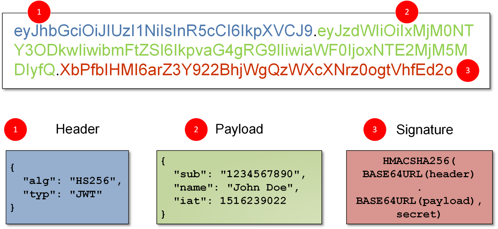
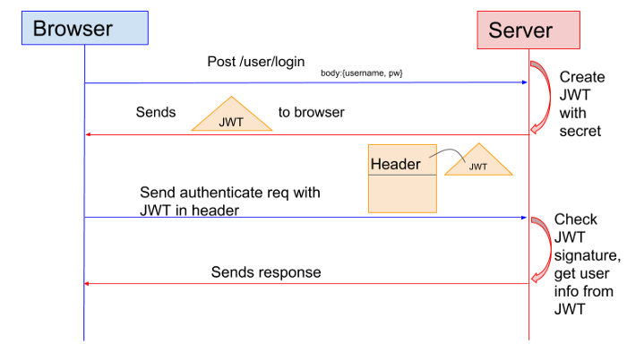

# 1. 서론

지난 포스팅에서는 Session 기반 인증 방식에 대해서 알아봤다. Session 방식에 여러 가지 장점이 있지만, 반대로 단점도 있었다. 그중 Session 기반 인증 방식의 단점인 확장성, [CORS 방식](https://millo-L.github.io/Nodejs-express-cors-%EC%82%AC%EC%9A%A9%ED%95%98%EA%B8%B0/) 사용 시 쿠키 및 세션 관리의 어려움 등에 대한 해결 방법으로 제시된 인증 방식인 JWT에 대해 알아보도록 하자.

# 2. 간단한 용어 정리

## 2-1. JWT 정의

JWT는 JSON Web Token의 약자로 전자 서명 된 URL-safe (URL로 이용할 수 있는 문자만 구성된)의 JSON이다. 전자 서명은 JSON 의 변조를 체크할 수 있게 되어 있다. JWT는 속성 정보 (Claim)를 JSON 데이터 구조로 표현한 토큰으로 RFC7519 표준이다. JWT는 HMAC 알고리즘을 사용하여 비밀키 또는 RSA를 이용한 Public Key/ Private Key 쌍으로 서명할 수 있다.
JWT는 서버와 클라이언트 간 정보를 주고 받을 때 HTTP request header에 JSON 토큰(access token)을 넣은 후 서버는 별도의 인증 과정 없이 헤더에 포함되어 있는 JWT 정보를 통해 인증한다.

## 2-2. JWT 구성

JWT는 세 파트로 나누어지며 . 을 통해 구분되며, 순서대로 Header, Payload, Signature로 구성된다.

1.  Header는 토큰의 타입과 해시 암호화 알고리즘으로 구성되어 있다. 첫 째는 토큰의 유형 (JWT)을 나타내고, 두 번째는 HMAC, SHA256 또는 RSA와 같은 해시 알고리즘을 나타내는 부분이다.
2.  Payload는 토큰에 담을 클레임(claim) 정보를 포함하고 있다. Payload에 담는 정보의 한 ‘조각’을 클레임이라고 부르고, 이는 name / value의 한 쌍(JSON 형식)으로 이뤄져 있다. 토큰에는 여러 개의 클레임 들을 넣을 수 있다.
    클레임의 정보는 등록된 (registered) 클레임, 공개 (public) 클레임, 비공개 (private) 클레임으로 세 종류가 있다.
3.  Signature는 secret key를 포함하여 암호화되어 있다.

## 2-3. access token과 refresh token

access token과 refresh token 모두 사용자가 로그인을 하고 인증됐을 경우 서버에서 Secret Key를 사용해서 발급하는 토큰이다.

1.  access token은 글자 그대로 사용자가 서버에 request를 보낼 때 header에 함께 보내는 접근용 토큰으로 만료 기간을 10~15분으로 짧게 두어 자주 발급받게 한다. 이로써, 만약 access token이 다른 사람에게 도난당하더라도 금방 만료되어 안정성이 유지된다.
2.  refresh token은 access token이 만료됐을 때, access token을 재발급받기 위한 인증용 토큰이다. 평소의 요청에는 request에 포함되지 않으면 오직 access token을 재발급받는 용도로만 사용한다. 만료 기간은 자동 로그인 기능을 몇 달로 지정할 것인 가에 따라 조절하면 되고, 만료 기간이 끝나면 사용자에게 로그인을 다시 요청하면 된다.

# 3. 동작 방식

1.  사용자가 로그인을 요청하고 id, pw 정보가 유효하다면, 서버에서 Secret Key를 사용해서 JWT(access token, refresh token)을 발급한다.
2.  서버에서 JWT를 브라우저로 전달한다. 이때, 사용자의 local storage에 JWT(access token, refresh token)를 저장한다.
3.  브라우저는 모든 request의 헤더에 access token을 함께 전송한다.
4.  서버는 브라우저가 보낸 access token을 식별하고 유효하다면, 원하는 응답을 제공해준다.

# 4. 특징

1.  서버는 클라이언트의 정보를 저장하지 않고, JWT의 발급과 매 요청마다 header에 넘어오는 access token의 유효성 검사만 진행한다.
2.  클라이언트는 JWT를 local storage에 저장한다.
3.  서버가 클라이언트의 정보를 저장하지 않으므로 Stateless 서버이다.

# 5. 장점

1.  JWT를 클라이언트에서 저장하므로 서버의 메모리, DB 등의 부담이 없다.
2.  로드 밸런싱을 사용한 서버 확장이 용이하다.
3.  멀티 디바이스 환경에서 부담이 없다.
4.  access token의 만료 기간이 짧아 타인에게 도난당하더라도 안정성이 높다.
5.  [CORS 방식](https://millo-L.github.io/Nodejs-express-cors-%EC%82%AC%EC%9A%A9%ED%95%98%EA%B8%B0/)(여러 도메인에 request를 보내는 브라우저)을 사용하기 용이하다.

# 6. 단점

1.  서버에서 클라이언트의 상태를 저장하고 있지 않으므로, 사용자의 로그인 여부 확인, 경우에 따른 강제 로그아웃 등의 제재를 가하는 데 어려움이 있다.
2.  클라이언트가 임의로 토큰을 수정하거나 구조가 변경되게 되면 서버에서 확인할 수 없어 세션 방식에 비해 상대적으로 안정성이 낮다.
3.  refresh token이 도난됐을 경우 계속해서 access token을 발급받으며 악용될 가능성이 있다.
4.  위의 문제점들을 해결하기 위해 서버에서 session 방식과 같이 token의 리스트를 유지하게 되는 경우 메모리 또는 DB의 부하가 생길 수 있다.
5.  일반적으로 Payload 부분에 사용자의 필요한 모든 정보를 저장하는 경우가 많아 SessionId의 길이보다 길다. (즉, HTTP request가 무거워질 수 있다.)
6.  XSS 공격에 취약할 수 있어 민감한 정보를 포함하는 경우 위험할 수 있다.

# [참고]

-   http://www.opennaru.com/opennaru-blog/jwt-json-web-token/
-   https://medium.com/@sherryhsu/session-vs-token-based-authentication-11a6c5ac45e4#:~:text=Many%20web%20applications%20use%20JSON,instead%20of%20sessions%20for%20authentication.&text=The%20biggest%20difference%20here%20is,on%20the%20client%20side%20instead.
-   https://mangkyu.tistory.com/55?category=925341
-   https://jins-dev.tistory.com/entry/Session-%EA%B8%B0%EB%B0%98-%EC%9D%B8%EC%A6%9D%EA%B3%BC-Token-%EA%B8%B0%EB%B0%98-%EC%9D%B8%EC%A6%9D
-   https://research.securitum.com/jwt-json-web-token-security/
