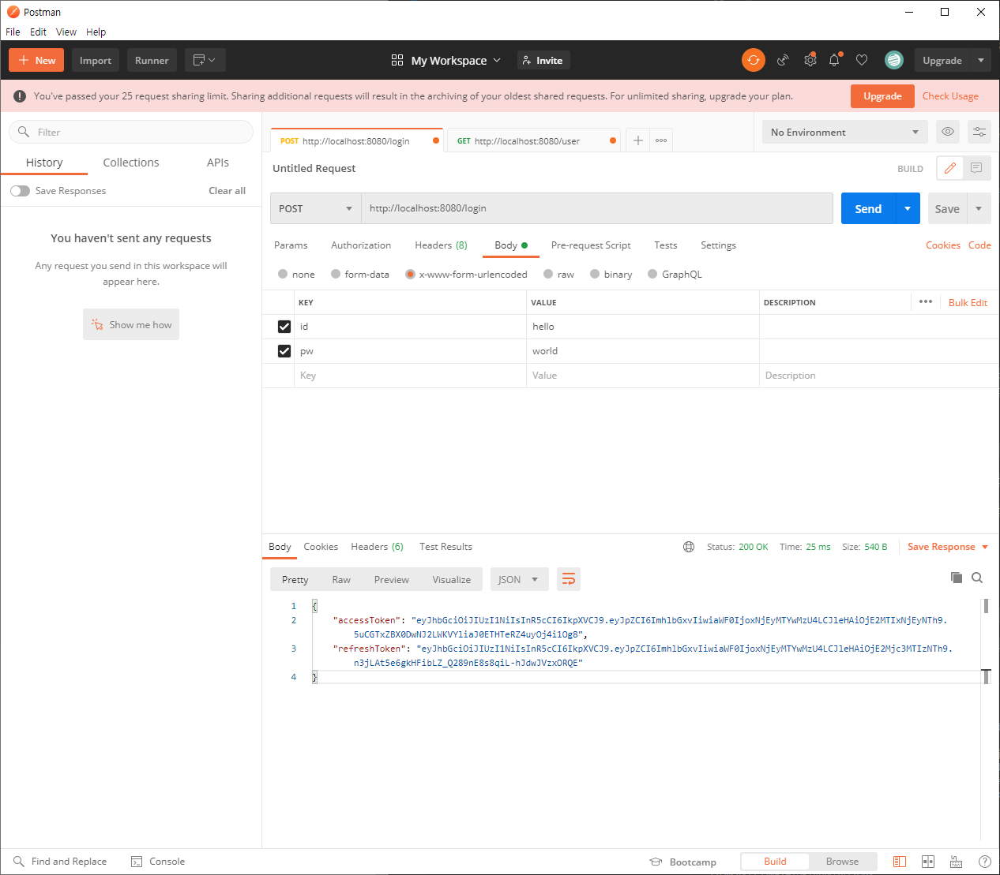
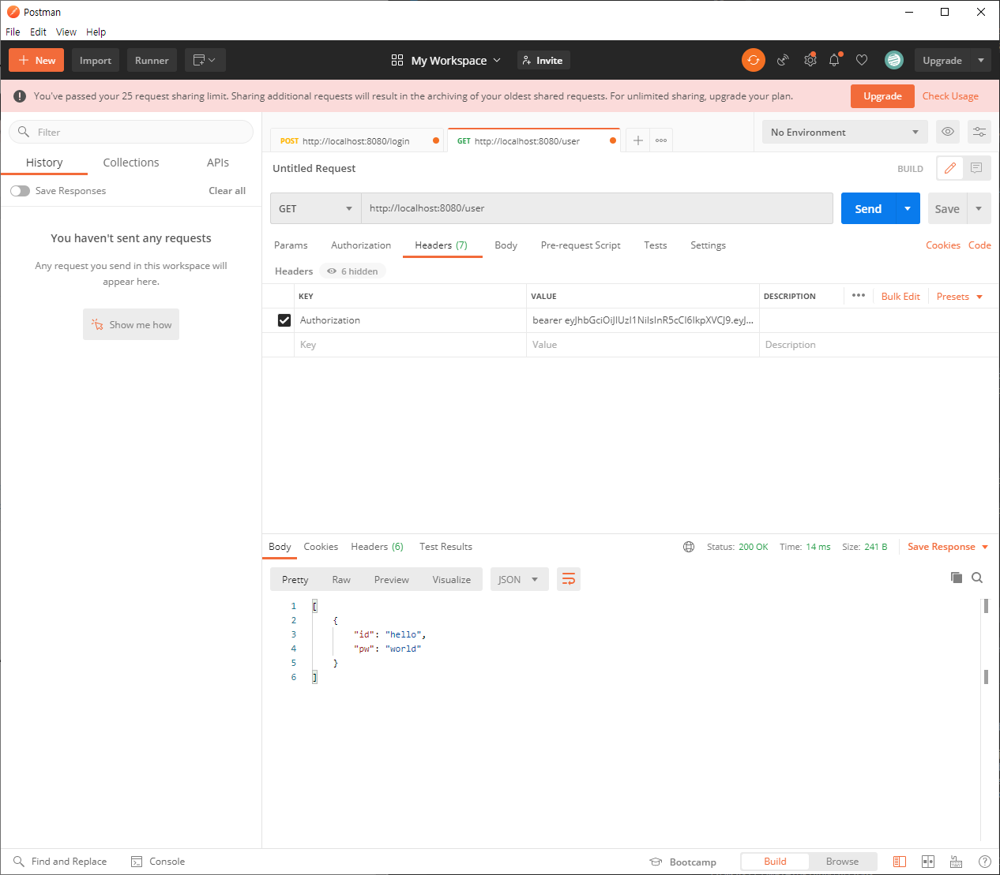
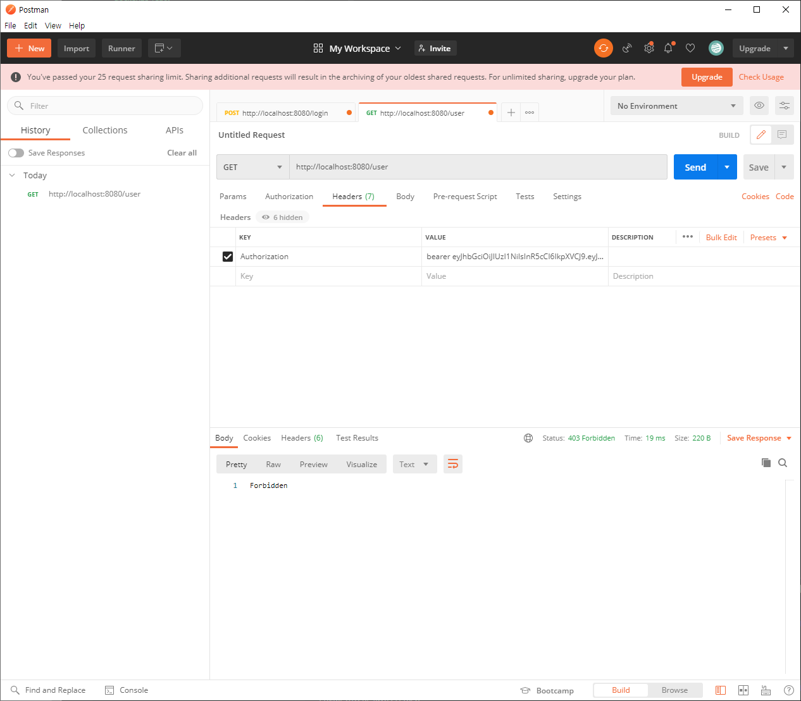
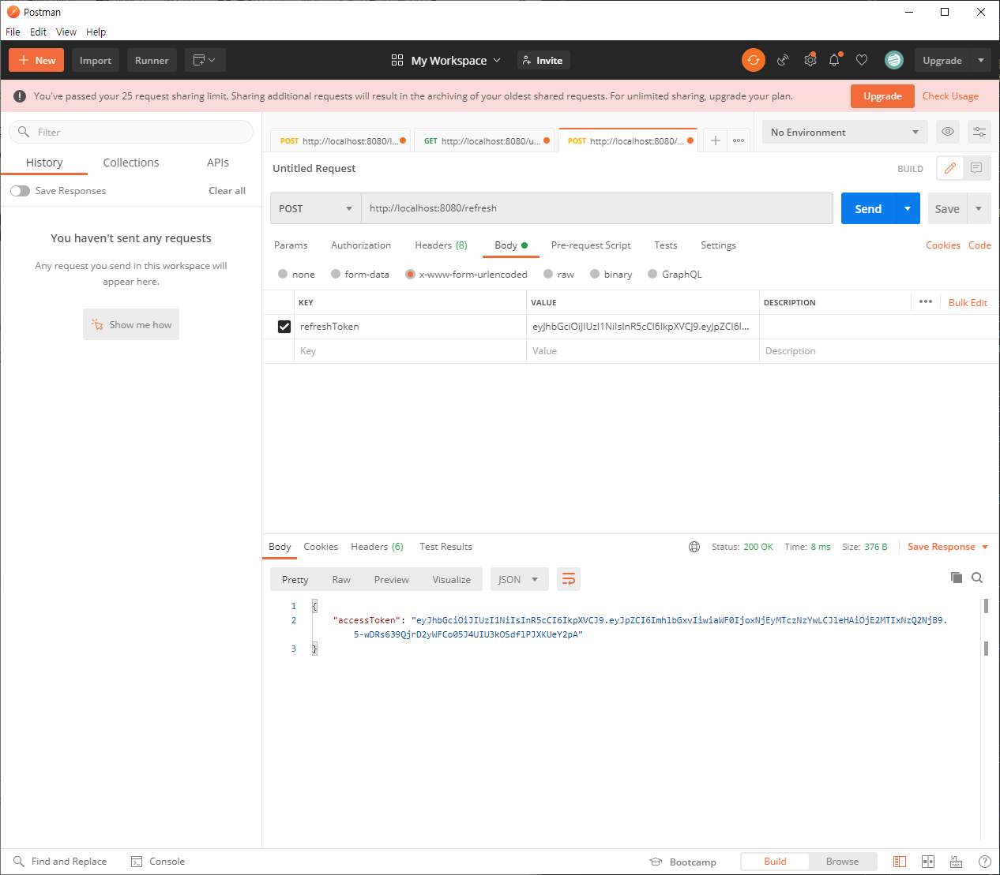

# 1. 서론

지난 포스팅에서는 JWT 기반 인증 방식에 대해 알아봤다. 이번엔 Node.js로 JWT를 직접 구현해보도록 하자. 구현 방법은 어렵지 않으나 이 포스팅에서는 jsonwebtoken을 사용한 토큰의 발급과 만료 기간 설정 등 기본 개념에 대한 구현만 하도록 하겠다. 운영하려는 서비스마다 JWT를 사용하는 방식이나 메모리 적재 여부 등이 다르기 때문에 위의 인증 방식 정리하기에서 JWT 기반 인증 방식의 이론적 개념을 보고 필요한 부분을 수정하여 구현해보길 바란다.

# 2. 환경 설정

우선, 실습을 진행할 폴더를 생성하고 필요한 모듈들을 모두 설치하도록 하자.

```bash
# 폴더 생성 및 열기
mkdir jwt-practice
cd jwt-practice

# package.json 생성
npm init -y

# 필요한 모듈 설치
npm install http express body-parser jsonwebtoken dotenv
```

# 3. 폴더 구조

폴더 구조는 아래와 같이 access token과 refresh token의 secret key를 저장할 환경 변수 파일(.env)과 실제 구현할 jwt.js 파일로 구성된다.

```
📦jwt-practice
 ┣ 📂node_modules
 ┣ 📜.env
 ┣ 📜jwt.js
 ┣ 📜package-lock.json
 ┗ 📜package.json
```

# 4. .env

환경 변수를 저장할 파일로써 access token과 refresh token의 secret key를 저장할 파일이다. 일반적으로 secret key는 절대로 외부로 유출되서는 안 되므로 보안을 철저히 해야 한다. 아래의 secret key는 샘플로 만든 랜덤 한 키이다.

```env
ACCESS_TOKEN_SECRET=d7d34917fbd11fdd89357decfb506b5e563e418bf7b136d30436dfa0dddbd4a6e318099c8e4918b87fd8e47e23196c441a5c892a6895d6061e27f89ed1ba19d6
REFRESH_TOKEN_SECRET=3a13ce20d9e44269e1a01f31e6cb67b6f200450ecc7cf09c3d0a199e512037422145d7727fa874e128bfbbc198b06e99ae1f6e24b57e8cd598102b61bffa8e69
```

# 5. jwt.js

아래의 코드는 임의로 만든 users라는 id, pw 배열을 지정하고(실제로는 pw는 반드시 암호화하여 DB에 저장해야 한다.), 로그인 시 해당 id, pw와 일치하는 요청이 들어오면 access token과 refresh token을 발급하는 코드이다. 이렇게 발급된 token은 클라이언트에서 요청을 보낼 때마다 headers에 authorization: 'bearer ' + accessToken 방식으로 넘겨받아 해당 요청의 token이 유효한 지 검사한다. 자세한 설명은 아래에서 예시를 보며 설명하도록 하겠다.
이 예제에서는 /user 요청에서 token이 유효할 시 id와 pw를 넘겨주는 응답을 보냈는 데 실제로는 pw를 넘겨주는 일은 결코 없으니 유의하기 바란다. 그저 예시일 뿐이란 걸 이해하고 넘어가길 바란다.

```js
// jwt.js

require("dotenv").config();

const http = require("http");
const express = require("express");
const jwt = require("jsonwebtoken");
const bodyParser = require("body-parser");
const { request } = require("../session-practice/db");

const app = express();
const server = http.createServer(app);
const PORT = 8080;

app.use(bodyParser.urlencoded({ extended: false }));
app.use(bodyParser.json());

// 임시 id, pw 배열
const users = [
    { id: "hello", pw: "world" },
    { id: "good", pw: "bye" },
];

// 로그인 id, pw 확인
const login = (id, pw) => {
    let len = users.length;

    for (let i = 0; i < len; i++) {
        if (id === users[i].id && pw === users[i].pw) return id;
    }

    return "";
};

// access token을 secret key 기반으로 생성
const generateAccessToken = id => {
    return jwt.sign({ id }, process.env.ACCESS_TOKEN_SECRET, {
        expiresIn: "15m",
    });
};

// refersh token을 secret key  기반으로 생성
const generateRefreshToken = id => {
    return jwt.sign({ id }, process.env.REFRESH_TOKEN_SECRET, {
        expiresIn: "180 days",
    });
};

// login 요청 및 성공시 access token, refresh token 발급
app.post("/login", (req, res) => {
    let id = req.body.id;
    let pw = req.body.pw;

    let user = login(id, pw);
    if (user === "") return res.sendStatus(500);

    let accessToken = generateAccessToken(user);
    let refreshToken = generateRefreshToken(user);

    res.json({ accessToken, refreshToken });
});

// access token의 유효성 검사
const authenticateAccessToken = (req, res, next) => {
    let authHeader = req.headers["authorization"];
    let token = authHeader && authHeader.split(" ")[1];

    if (!token) {
        console.log("wrong token format or token is not sended");
        return res.sendStatus(400);
    }

    jwt.verify(token, process.env.ACCESS_TOKEN_SECRET, (error, user) => {
        if (error) {
            console.log(error);
            return res.sendStatus(403);
        }

        req.user = user;
        next();
    });
};

// access token을 refresh token 기반으로 재발급
app.post("/refresh", (req, res) => {
    let refreshToken = req.body.refreshToken;
    if (!refreshToken) return res.sendStatus(401);

    jwt.verify(
        refreshToken,
        process.env.REFRESH_TOKEN_SECRET,
        (error, user) => {
            if (error) return res.sendStatus(403);

            const accessToken = generateAccessToken(user.id);

            res.json({ accessToken });
        }
    );
});

// access token 유효성 확인을 위한 예시 요청
app.get("/user", authenticateAccessToken, (req, res) => {
    console.log(req.user);
    res.json(users.filter(user => user.id === req.user.id));
});

server.listen(PORT, () => {
    console.log(`Server running on ${PORT}`);
});
```

# 6. 실행 예시

이 포스팅에서는 검사 방식으로 postman을 사용했다. 아래와 같이 존재하는 id, pw를 입력하면 access token과 refresh token을 발급받게 된다.



발급받은 access token을 사용하여 다른 요청을 보낼 때 headers에 authorization: 'bearer ' + access token를 첨부한다. 만약 token이 유효하다면 위에서 설명한 대로 id, pw를 발급받게 된다. (예시일 뿐 실제로 pw를 주는 경우는 결코 없다.)



만약 만료 기간이 지난 경우는 아래와 같이 접근 금지 에러가 발생한다. 이런 경우 access token을 refresh 해야 하는 데 이때 사용하는 토큰이 바로 refresh token이다.



access token을 재발급받을 때는 refresh token을 서버로 보내야 한다.(refresh token을 기반으로 access token을 발급받기 때문에) 만약 refresh token 또한 만료된 경우는 처음 지정한 자동 로그인 기간이 종료된 것이므로 로그인 페이지로 redirect 시키면 된다.



# [참고]

-   https://www.npmjs.com/package/jsonwebtoken
-   https://www.youtube.com/watch?v=mbsmsi7l3r4
