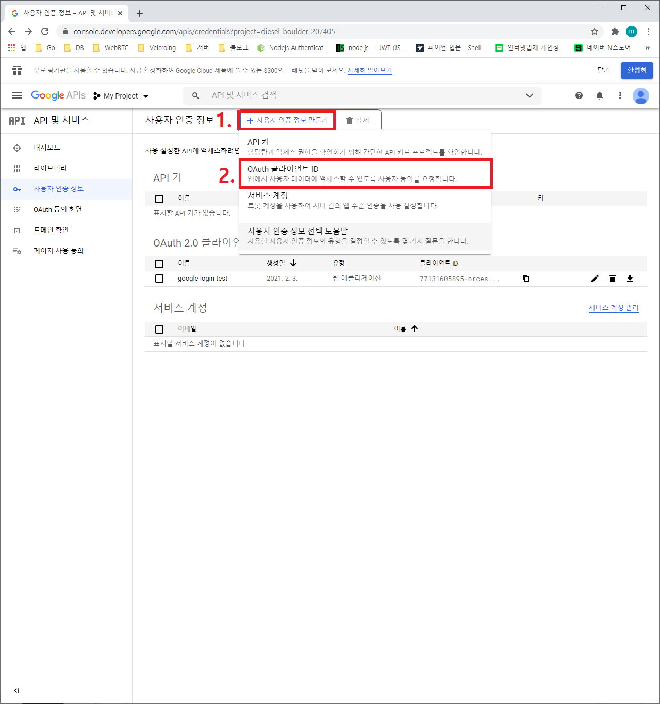
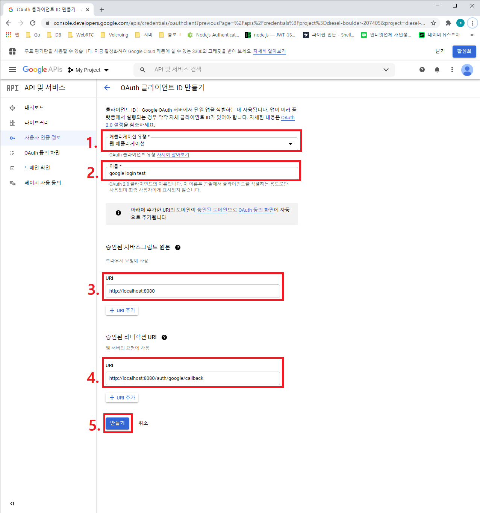
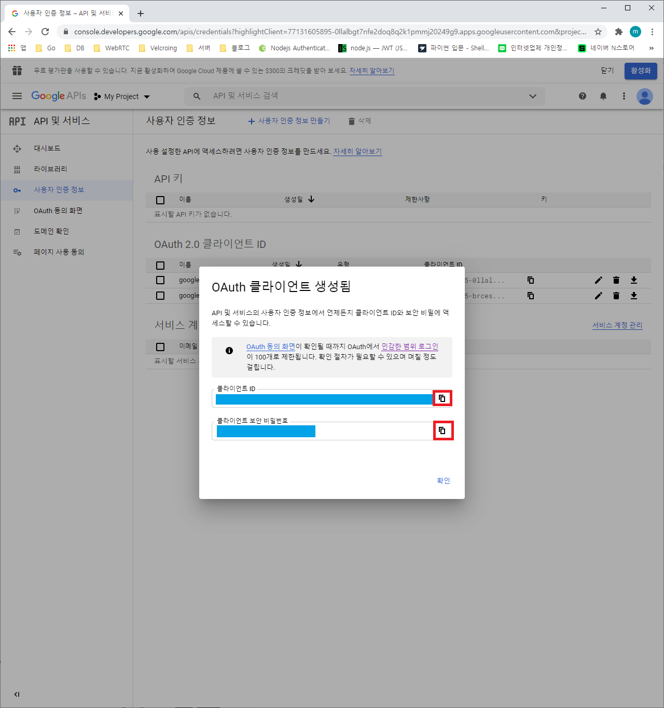

# 1. 서론

지난 포스팅에서 OAuth 2.0이 무엇이고 종류에 따른 인증 방식에 대해 알아봤다. 그럼 실제로 node.js에서 OAuth 2.0을 통한 구글 로그인을 구현해보도록 하자. 이 포스팅에서 구글 로그인을 구현할 때 사용할 모듈은 passport로 passport로 session을 관리하는 부분이 포함되기 때문에 만약 잘 모르는 부분이라면 이 포스팅을 참고하기 바란다.

# 2. Google Developers Console에서 OAuth 2.0 클라이언트 생성

https://console.developers.google.com/apis 에 접속해서client ID와 client secret를 발급받아야 한다. 아래의 그림 1과 같이 OAuth 클라이언트 ID를 생성한다.



아래의 그림2와 같이 애플리케이션 유형을 웹 애플리케이션으로 설정하고, 이름은 임의로 수정 가능하다. URI는 실습을 수행하기 위해 아래와 같이 사용하고, 실습을 마친 후에 원하는 URI로 수정하기 바란다.



아래의 그림3과 같이 생성된 클라이언트 ID와 보안 비밀번호를 각각 복사해둔다. 만약 이 페이지를 실수로 넘어갔다면 OAuth 2.0 클라이언트 ID 부분에서 생성된 이름을 클릭하면 다시 볼 수 있는 화면이 나온다.



# 3. 환경 설정

> **전제 조건** <br/>
> Node.js는 당연히 설치되어 있어야 한다. <br/>
> MySQL로 DB Session을 구현할 것이므로 MySQL을 설치하기 바란다. <br/>
> 당연히 MySQL은 RDS나 Docker 등의 원격 DB로 대체 가능하다.

하지만 MySQL을 사용하길 원치 않는 사람이 있다면, 이 포스팅을 방문해 memory store 또는 file store를 적용해도 무방하다. 세션 부분만 변경하면 되기 때문에 어려움 없이 대체 가능하다.
우선, 실습을 진행할 폴더를 생성하고 필요한 모듈을 설치하자.

````bash
# 폴더 생성 및 열기
mkdir passport-google-practice
cd passport-google-practice

# package.json 생성
npm init -y

# 필요한 모듈 설치
npm install http express express-session express-mysql-session passport passport-google-oauth2
 ``

MySQL을 사용하는 경우 실습에 사용할 데이터 베이스를 아래의 명령어를 사용하여 생성하도록 하자. (MySQL 대신 memory store 또는 file store를 사용한다면 이 부분은 지나가도 된다.)
```sql
# MySQL Command Line Client
CREATE DATABASE session_test;
````

구글 로그인 버튼 이미지를 [파일 다운로드](https://developers.google.com/identity/images/signin-assets.zip?hl=ko)를 눌러 다운로드 받도록 하자. 이 포스팅에서는 다운로드 받은 이미지 파일들 중 /web/2x/btn_google_signin_dark_normal_web@2x.png를 사용한다.
(사실, 실습에서는 원하는 이미지 아무거나 사용해도 무방하다. 다만, 실제 서비스에서는 https://developers.google.com/identity/branding-guidelines?hl=ko 를 방문해서 가이드라인을 반드시 준수해야 한다.)

# 4. 폴더 구조

```
📦passport-google-practice
 ┣ 📂node_modules
 ┣ 📂public
 ┃ ┗ 📂images
 ┃ ┃ ┗ 📜btn_google_signin_dark_normal_web@2x.png
 ┣ 📂webpage
 ┃ ┣ 📜login.html
 ┃ ┗ 📜main.html
 ┣ 📜google.js
 ┣ 📜package-lock.json
 ┗ 📜package.json
```

# 5. login.html

로그인을 진행할 간단한 html 파일을 작성해보자. 페이지에는 구글 로그인과 연동할 버튼만 존재한다.

```html
<!-- login.html -->

<!DOCTYPE html>
<html>
    <head>
        <title>login</title>
        <meta charset="UTF-8" />
        <style>
            #google_login_btn {
                background: url("/images/btn_google_signin_dark_normal_web@2x.png")
                    no-repeat;
                background-size: 100% 100%;
                cursor: pointer;
                width: 200px;
                height: 50px;
            }
        </style>
    </head>
    <body>
        <form method="GET" action="/auth/google">
            <input id="google_login_btn" type="submit" name="" />
        </form>
    </body>
</html>
```

# 6. main.html

로그인이 성공했을 때의 html 파일을 작성햏보자. 간단하게 logout 링크 기능만 존재하고 해당 링크를 클릭 시에 세션 정보가 삭제되어 다시 로그인을 진행해야 한다.

```html
<!-- main.html -->

<!DOCTYPE html>
<html>
    <head>
        <title>Main</title>
        <meta charset="UTF-8" />
    </head>
    <body>
        <h1>Main page</h1>
        <a href="/logout">logout</a>
    </body>
</html>
```

# 7. google.js

passport 초기화와 session에 대한 설명은 지난 포스팅을 참고하기 바란다. 아래에서 주석으로 설명을 다 적어놓긴 했지만, flow을 작성해본다면,

1.  사용자가 http://localhost:8080/login 으로 접속한다.
2.  구글 로그인 버튼을 클릭한다. (http://localhost:8080/auth/google 호출)
3.  생성한 GoogleStrategy 설정에 따른 로그인 페이지를 제공한다.
4.  구글 로그인 페이지에서 아이디, 비밀번호를 입력 후 확인 버튼을 누른다.
5.  로그인 성공 시 GoogleStrategy 내의 콜백 함수로 파라미터들을 넘겨받고 http://localhost:8080/auth/google/callback에 의해 http://localhost:8080 페이지로 리다이렉트 된다.
6.  로그인 실패 시 http://localhost:8080/auth/google/callback에 의해 http://localhost:8080/login 페이지로 리다이렉트 된다.

passport 모듈 자체가 워낙 잘 만들어져 있어서 구현하는 데 큰 어려움은 없었다. 플로우만 이해한다면 어디든 사용할 수 있을 것이다. 추가적으로 facebook 로그인 등도 passport에서 지원하니 웹 페이지를 만들 때는 참고해서 사용하면 좋을 것 같다. 하지만, Android, IOS 등의 애플리케이션에서는 passport의 기능을 사용할 수 없으니 자체적으로 구현하면 된다.

```js
// google.js

const http = require("http");
const express = require("express");
const session = require("express-session");
const MySQLStore = require("express-mysql-session")(session);
const passport = require("passport");
const fs = require("fs");
const GoogleStrategy = require("passport-google-oauth2").Strategy;

const app = express();
const server = http.createServer(app);
const PORT = 8080;

// 위의 Google Developers Console에서 생성한 client id와 secret
const GOOGLE_CLIENT_ID = "your_google_client_id";
const GOOGLE_CLIENT_SECRET = "your_google_client_secret";

// db session store options
const options = {
    host: "localhost",
    port: 3306,
    user: "root",
    password: "root",
    database: "session_test",
};

// mysql session store 생성
const sessionStore = new MySQLStore(options);

// express session 연결
app.use(
    session({
        secret: "secret key",
        store: sessionStore,
        resave: false,
        saveUninitialized: false,
    })
);
// image 사용을 위한 static folder 지정
app.use(express.static("public"));

// passport 초기화 및 session 연결
app.use(passport.initialize());
app.use(passport.session());

// login이 최초로 성공했을 때만 호출되는 함수
// done(null, user.id)로 세션을 초기화 한다.
passport.serializeUser(function (user, done) {
    done(null, user.id);
});

// 사용자가 페이지를 방문할 때마다 호출되는 함수
// done(null, id)로 사용자의 정보를 각 request의 user 변수에 넣어준다.
passport.deserializeUser(function (id, done) {
    done(null, id);
});

// Google login 전략
// 로그인 성공 시 callback으로 request, accessToken, refreshToken, profile 등이 나온다.
// 해당 콜백 function에서 사용자가 누구인지 done(null, user) 형식으로 넣으면 된다.
// 이 예시에서는 넘겨받은 profile을 전달하는 것으로 대체했다.
passport.use(
    new GoogleStrategy(
        {
            clientID: GOOGLE_CLIENT_ID,
            clientSecret: GOOGLE_CLIENT_SECRET,
            callbackURL: "http://localhost:8080/auth/google/callback",
            passReqToCallback: true,
        },
        function (request, accessToken, refreshToken, profile, done) {
            console.log(profile);
            console.log(accessToken);

            return done(null, profile);
        }
    )
);

// login 화면
// 이미 로그인한 회원이라면(session 정보가 존재한다면) main화면으로 리다이렉트
app.get("/login", (req, res) => {
    if (req.user) return res.redirect("/");
    fs.readFile("./webpage/login.html", (error, data) => {
        if (error) {
            console.log(error);
            return res.sendStatus(500);
        }

        res.writeHead(200, { "Content-Type": "text/html" });
        res.end(data);
    });
});

// login 화면
// 로그인 하지 않은 회원이라면(session 정보가 존재하지 않는다면) login화면으로 리다이렉트
app.get("/", (req, res) => {
    if (!req.user) return res.redirect("/login");
    fs.readFile("./webpage/main.html", (error, data) => {
        if (error) {
            console.log(error);
            return res.sendStatus(500);
        }

        res.writeHead(200, { "Content-Type": "text/html" });
        res.end(data);
    });
});

// google login 화면
app.get(
    "/auth/google",
    passport.authenticate("google", { scope: ["email", "profile"] })
);

// google login 성공과 실패 리다이렉트
app.get(
    "/auth/google/callback",
    passport.authenticate("google", {
        successRedirect: "/",
        failureRedirect: "/login",
    })
);

// logout
app.get("/logout", (req, res) => {
    req.logout();
    res.redirect("/login");
});

server.listen(PORT, () => {
    console.log(`Server running on ${PORT}`);
});
```

# [목차]

-   https://developers.google.com/identity/protocols/oauth2
-   http://www.passportjs.org/packages/passport-google-oauth2/
