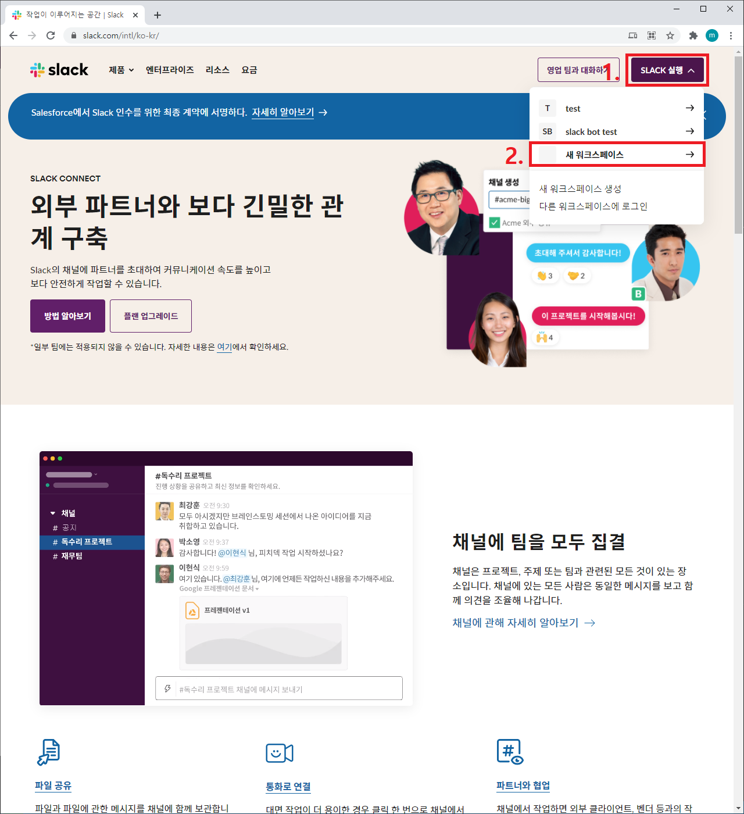
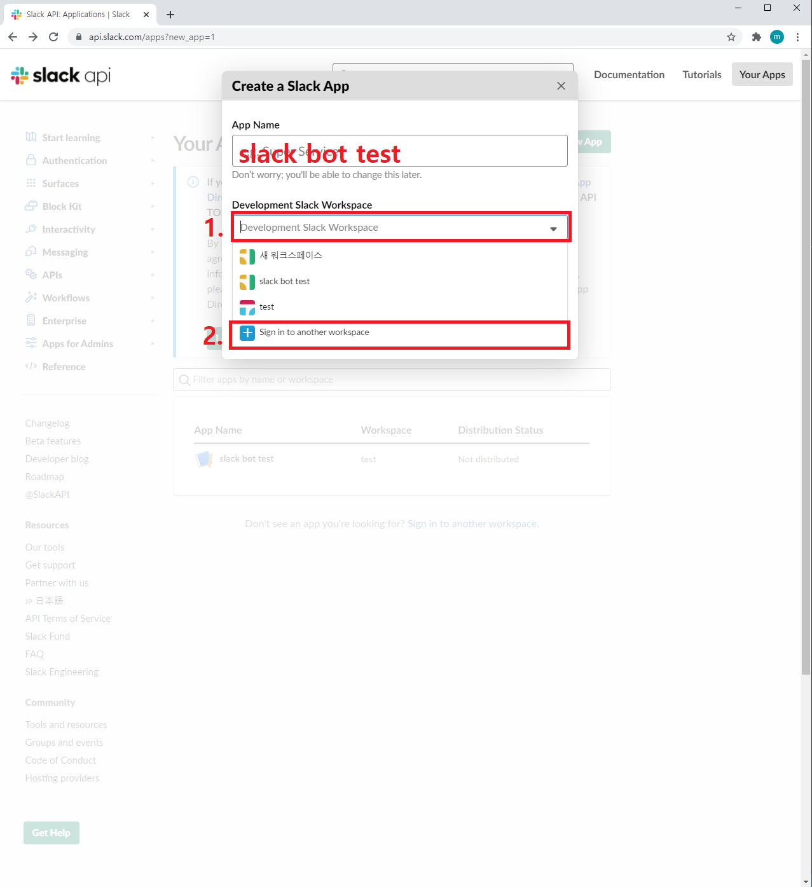
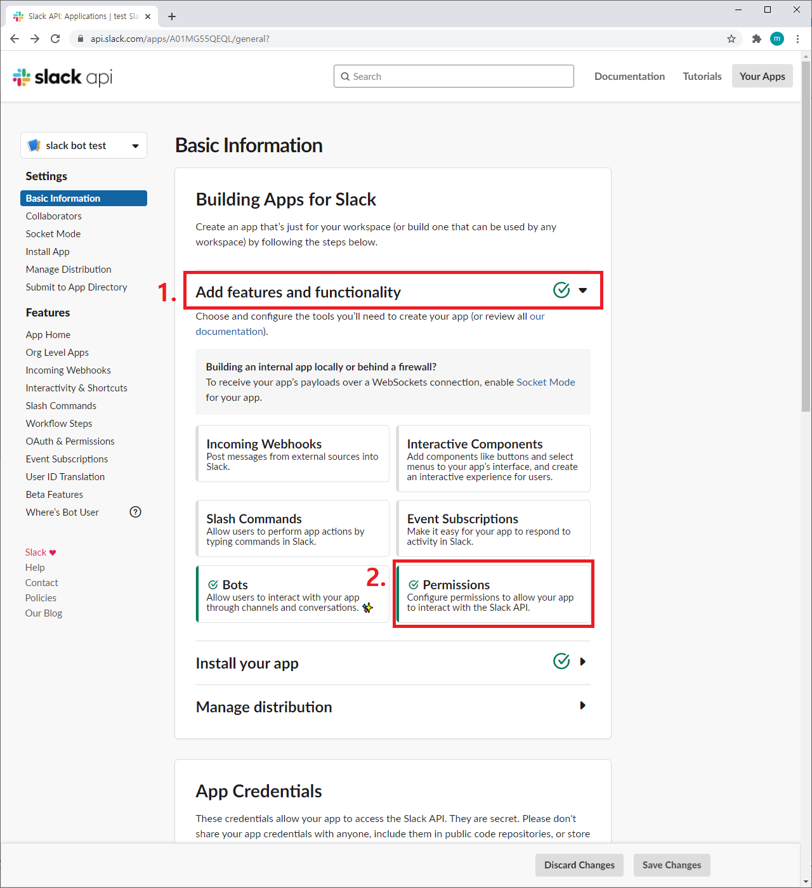
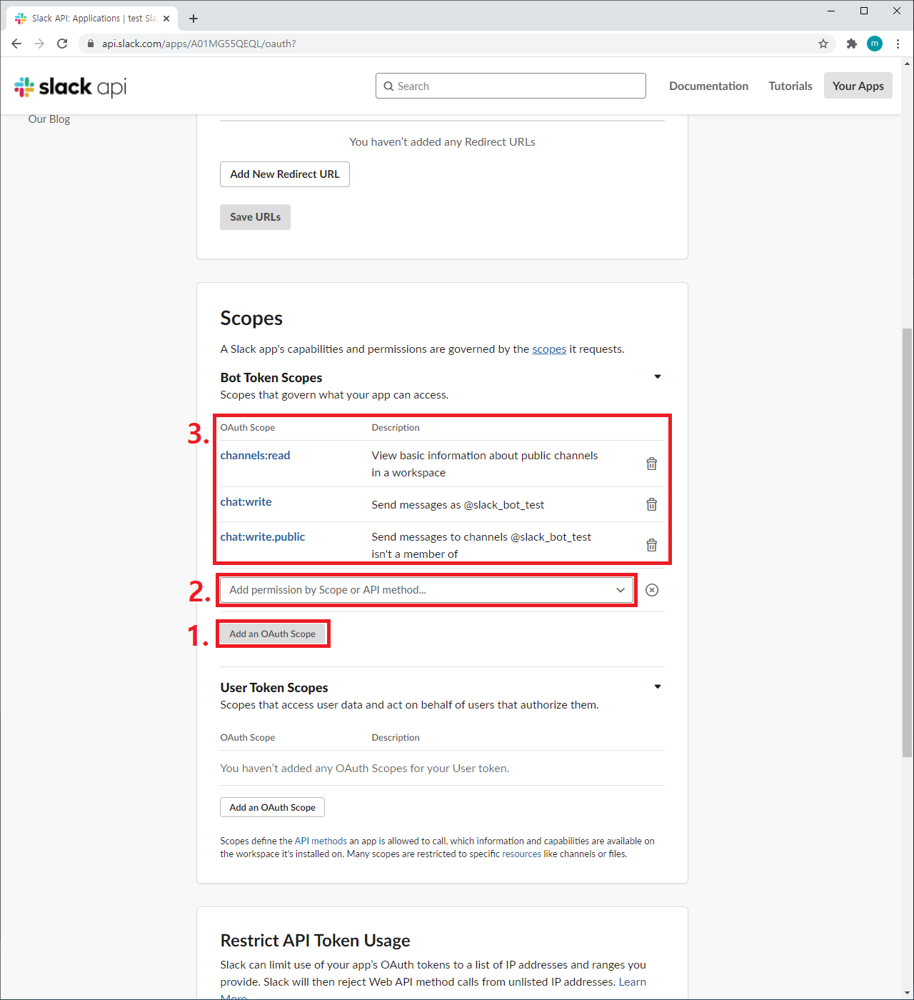
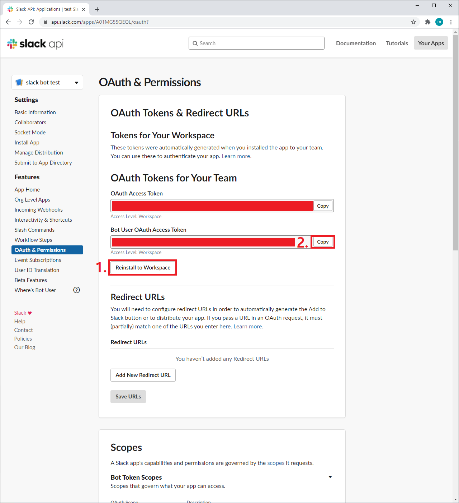
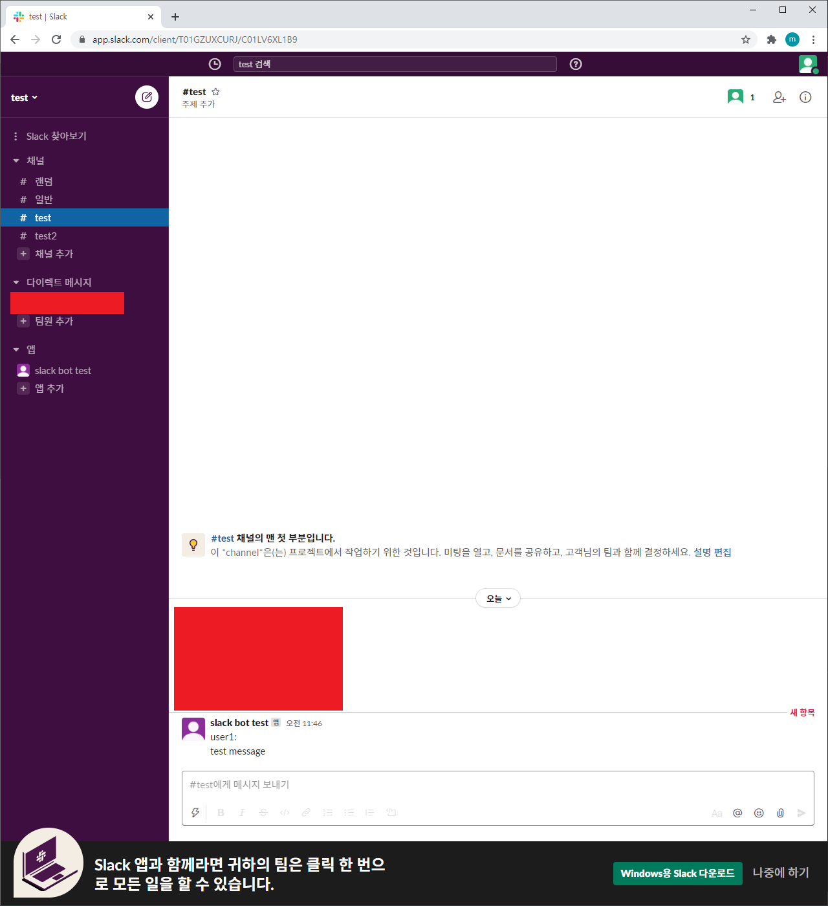
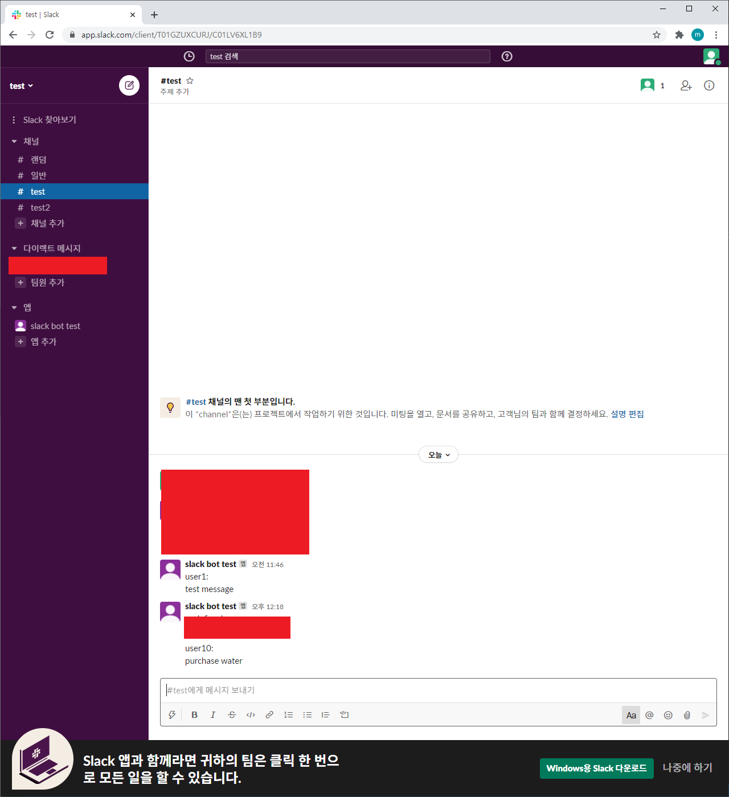

# 1. 서론

요즘 협업에서 가장 핫한 communication tool 중 하나는 slack이다. 회사라는 공적인 공간과 집이라는 사적인 공간이 분리된 것처럼, 의사소통 또한 사적인 공간(카카오톡, 인스타 DM 등)과 공적인 공간(slack)을 나누는 것이다. 또한, 공적인 공간에서도 업무에 따른 채널을 생성하며 순도 높은 대화를 이어갈 수 있다. 이렇게 최근 협업 및 스타트업에서 많이 사용하는 slack을 통해 알림봇을 구현한다면 사용자들의 실시간 구매 알림 등으로 편리하게 사용 및 확인할 수 있다.

# 2. slack token 발급

> **전제 조건** <br />
> 당연히 slack 계정은 존재해야 한다. <br />
> google login 기능도 있으니 사용하길 바란다.

다소 복잡한 감이 있으니 잘 따라오기 바란다.

우선, 채팅을 위한 공식 문서를 확인해야 한다. https://api.slack.com/messaging/sending 로 들어가보도록 하자. 이 창은 켜 두고 만약 설명이 불충분하다고 느껴지면 참고하기 바란다.

첫 번째로 할 일은 알림봇을 설정할 워크스페이스를 생성하는 것이다. https://slack.com/intl/ko-kr/ 로 접속해서 로그인 후 아래의 그림과 같이 새 워크스페이스를 생성한다. <br />
**생성 시에 워크스페이스 명은 slack bot test로 진행하고, 채널 명은 test로 만들도록 하자.**



그 이후 https://api.slack.com/apps?new_app=1 로 접속해서 Create New App 버튼을 클릭하면 아래와 같은 화면이 나온다. 그때 App Name을 slack bot test로 지정하고 Development Slack Workspace는 Sign in to another workspace를 클릭한다.<br />
**그 이후 나오는 화면에서는 위에서 생성한 slack bot test 워크스페이스를 선택하면 된다. 그 후 다시 아래의 그림과 같은 창이 나오면 Development Slack Workspace에서 slack bot test를 선택하면 된다.**



이제 api 생성은 완료됐으므로 토큰만 발급하면 된다.
https://api.slack.com/apps/A01MG55QEQL/general? 로 접속해서, 아래의 그림과 같이 클릭해서 권한 설정 페이지로 이동하자.



아래의 Add an OAuth Scope 버튼을 클릭해서

-   channels:read
-   chat:write
-   chat:write.public

을 모두 허용한다.

여기서 공식문서와 달랐던 점이 **공식 문서에서는 channels:read, chat:write만 허용하라고 돼있는 데, 그렇게 되면 <span style="color:red"> not in channel 오류</span>가 나온다.** <br />
_이 오류는 slack에서 채널에 가입되어 있지 않은 회원이 글을 못 쓰는 규정과 관련이 있는 것이어서, chat:write.public으로 워크스페이스에 존재하는 **모든 채널에서 글을 쓸 수 있는 권한을 주면 해결**된다._



아래의 내용을 수정했으면 반드시 install 또는 reinstall을 해야 한다. 그 후에 우리가 앞으로 사용할 토큰을 복사해두면 된다. **우리가 사용할 token은 Bot User OAuth Access Token이다.**

_여기까지가 토큰 발급이다. 정말 수고 많았다. 구현 자체는 어렵지 않으니 조금만 힘내도록 하자._



# 3. 환경 설정

> **전제 조건** <br />
> 당연히 node.js가 설치되어 있어야 한다.

실습을 진행할 폴더와 모듈을 설치하도록 하자.

```bash
# 폴더 생성 및 열기
mkdir slack-bot
cd slack-bot

# package.json 생성
npm init -y

# 모듈 설치
npm install http express slack-node
```

# 4. slack 알림봇 만들기

딱히 설명할 게 없을 정도로 간단하다. 이렇게 send 함수를 생성해두고 필요할 때 사용하면 된다.

```js
// index.js

const Slack = require("slack-node");

// 생성한 token
const API_TOKEN = "Bot User OAuth Access Token";

const slack = new Slack(API_TOKEN);

const send = async (sender, message) => {
    slack.api(
        "chat.postMessage",
        {
            text: `${sender}:\n${message}`,
            channel: "#test",
            icon_emoji: "slack",
        },
        (error, response) => {
            if (error) {
                console.log(error);
                return;
            }
            console.log(response);
        }
    );
};

send("user1", "send message");
```



# 5. express request에 동작하기

만약, 사용자가 특정한 행동(결제, 고객 문의 등)을 진행했을 때에 반응하게 하려면 express 모듈로 request가 왔을 때 위에서 만들어 놓은 send 함수가 동작하게 하면 된다. 아래의 코드를 실행하고 http://localhost:8080/pay?user=user10&product=water 로 브라우저에서 접속해보자.

```js
// index.js

const Slack = require("slack-node");
const http = require("http");
const express = require("express");

const app = express();
const server = http.createServer(app);

const PORT = 8080;
// 생성한 token
const API_TOKEN = "Bot User OAuth Access Token";

const slack = new Slack(API_TOKEN);

const send = async (sender, message) => {
    slack.api(
        "chat.postMessage",
        {
            text: `${sender}:\n${message}`,
            channel: "#test",
            icon_emoji: "slack",
        },
        (error, response) => {
            if (error) {
                console.log(error);
                return;
            }
            console.log(response);
        }
    );
};

app.get("/pay", async (req, res) => {
    let user = req.query.user;
    let product = req.query.product;

    await send(user, `purchase ${product}`);

    res.send("<h1>Thank you for purchasing our product</h1>");
});

server.listen(PORT, () => {
    console.log(`Server running on ${PORT}`);
});
```



# [참고]

-   https://www.npmjs.com/package/node-slack
-   https://api.slack.com/
