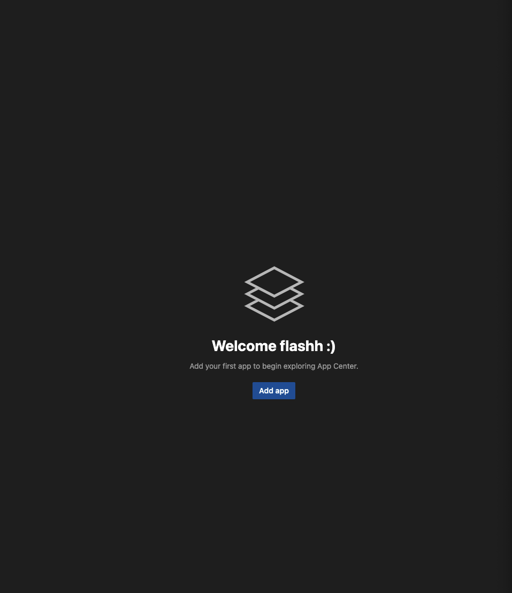
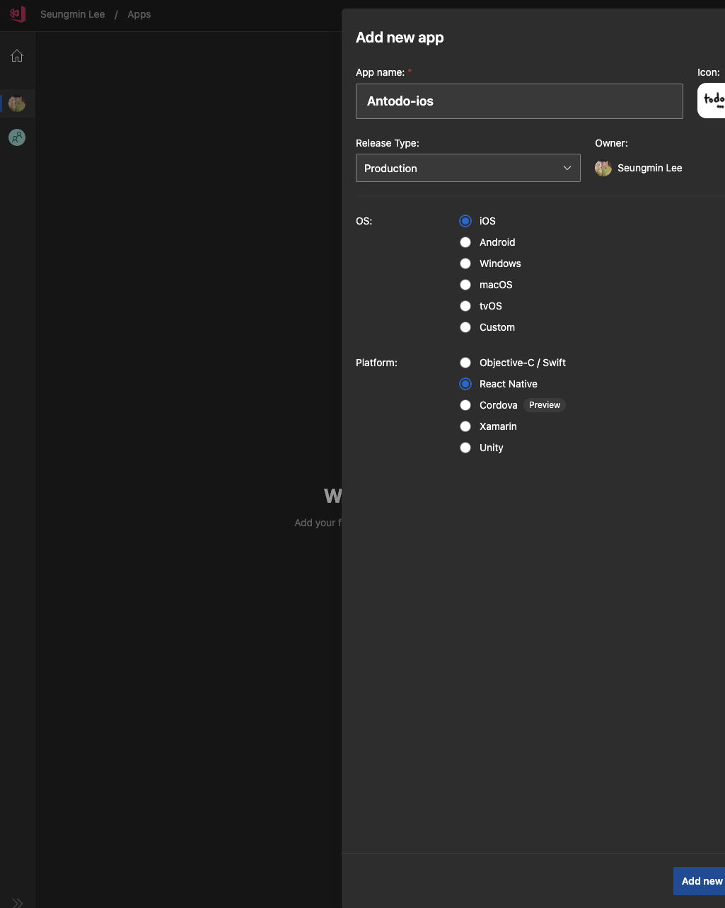
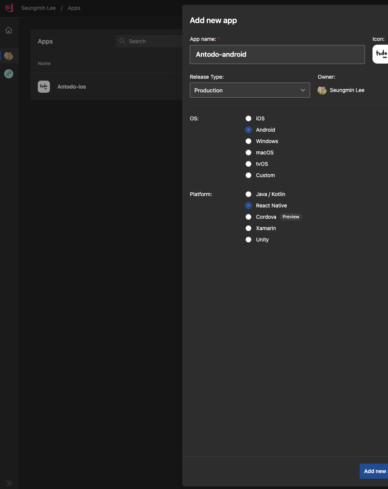
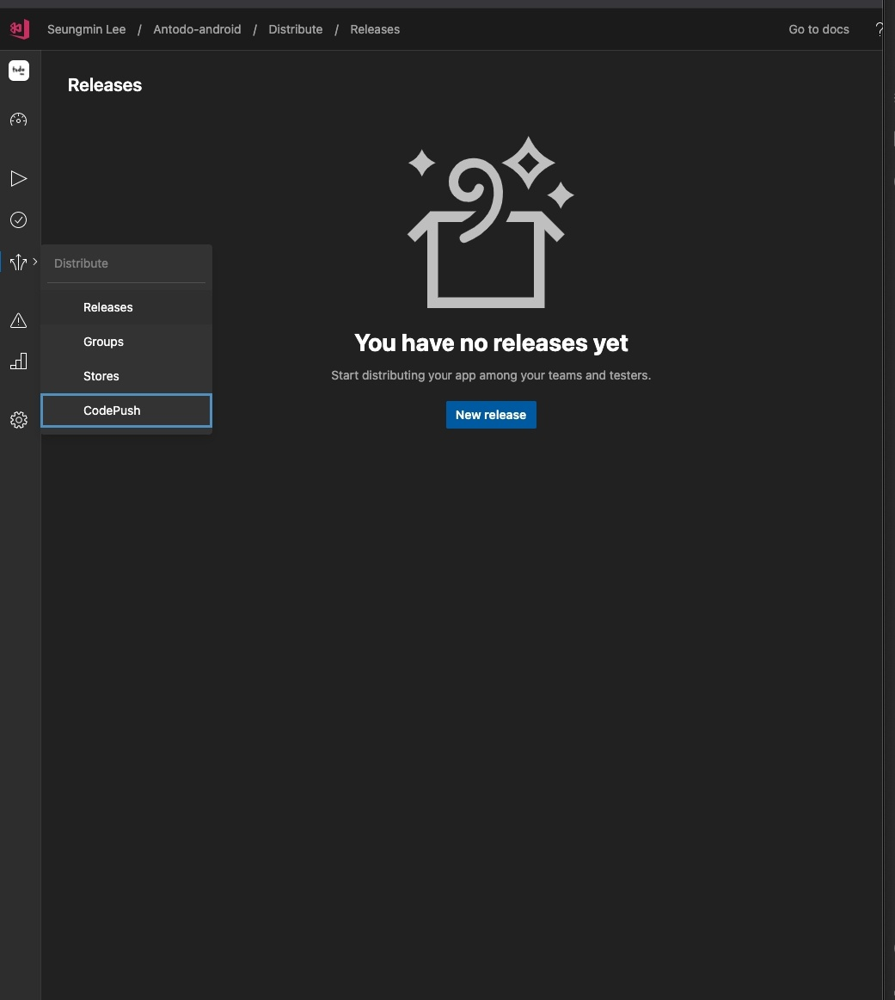
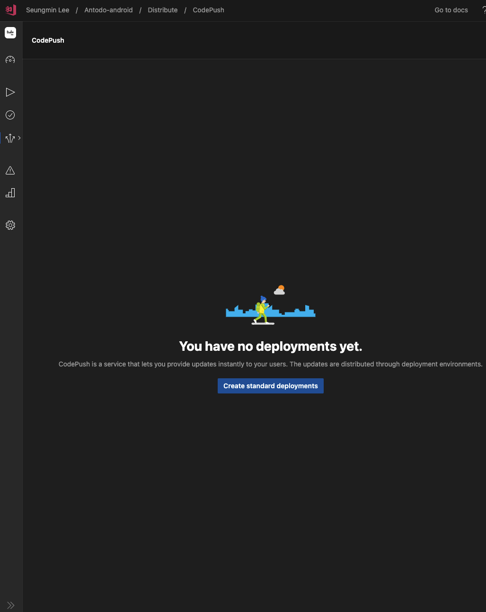
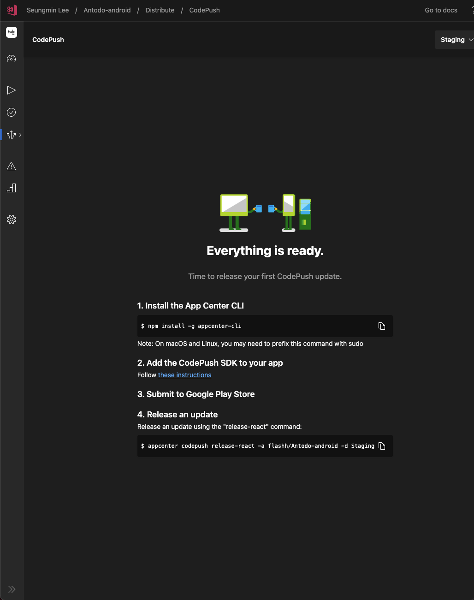
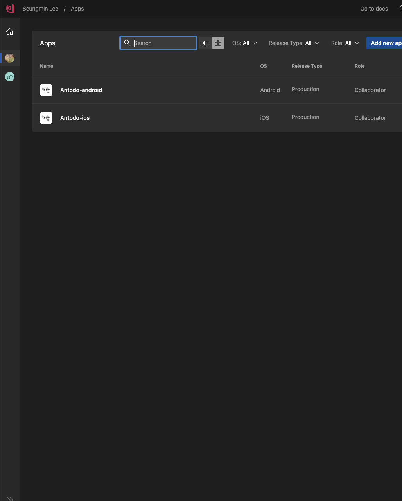
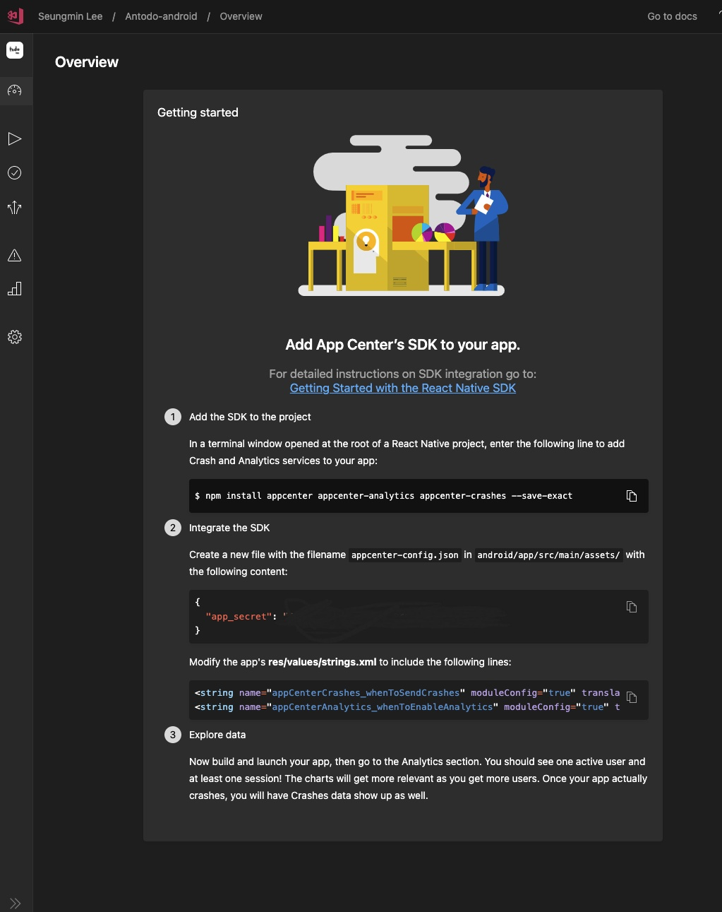

# 1. 서론

Play store는 조금 덜한 편이지만 App store의 심사는 정말 까다롭다. 물론 까다로운 심사 절차에는 많은 장점도 있지만, 당장 배포가 리젝트된 나에게 있어서는 정말 짜증나는 일이 아닐 수 없다. 심지어 저번 심사에서는 언급조차 없던 부분이 다음 심사에서는 갑자기 리젝트 요인이라니... 까라면 까야하지만 정말 힘들다. 이런 짜증들을 해결할 수 있는 방법을 찾아보다가 CodePush라는 것을 알게됐다. 마이크로소프트에서 서비스 중인 오픈 소스인데 javascript 부분에 한해서 심사 없이 배포를 진행해준다. 이미지 등도 함께 지원해주긴 하지만 정확한 정보는 [여기서](https://github.com/microsoft/react-native-code-push#supported-components)확인하면 된다. 당연한 얘기겠지만 Native를 수정하게 되면 업데이트 한 앱에서 무수한 크래쉬가 날 것이기 때문에, `Native를 수정했다면 반드시 각 스토어들에 심사를 올려서 배포해야한다.`

# 2. 앱 등록

처음에는 Pricing 태그가 붙어서 유료인 줄 알았는 데, 빌드와 테스트를 수행하면 유료화로 진행되고 그렇지 않고 `앱 업데이트 기능만 사용하면 무료로 사용이 가능하다.` 우선은 https://appcenter.ms/ 에 방문해서 회원가입을 한다.

그 이후 아래와 같이 앱을 iOS, Android로 각각 등록한다.





이 부분은 사실 cli를 사용해도 되지만 글쓴이는 웹페이지가 훨씬 편하게 느껴저서 웹페이지로 글을 작성했다. 아래처럼 Antodo-android에 들어가서 distribute -> CodePush에 들어가서 Create를 하고 Antodo-ios도 동일하게 진행한다.





위의 이미지처럼 appcenter 세팅을 마쳤다면, appcenter-cli를 설치하고 appcenter에 로그인한다.

```bash
npm install -g appcenter-cli
appcenter login
```

## 2-1. react-native-code-push 설치 및 로그인

이제 `react-native-code-push`를 설치하고 세팅을 진행해보자.

```bash
npm install react-native-code-push
# or
yarn add react-native-code-push

cd .. && pod install && cd ..
```

# 3. Android 설정

## 3-1. 앱 키 등록

안드로이드를 먼저 세팅해보자. 아래의 그림에서 Antodo-Android를 먼저 선택해보자.



그렇다면 이런 화면이 나올텐데, 이 것만으로도 충분히 친절한 설명이기 때문에 이렇게 세팅을 하면 된다고 하고 넘어가겠다. app_secret은 비밀키이므로 가렸다.



## 3-2. react-native-code-push 세팅

누누히 말하지만 네이티브 언어를 수정할 때는 해당 언어에 대한 에디터(안드로이드 스튜디오)를 실행시켜서 진행하는 게 가장 효율적이고 오류가 날 확률이 적다.

안드로이드 설정에 관한 자세한 내용은 [여기서](https://github.com/microsoft/react-native-code-push/blob/master/docs/setup-android.md) 확인할 수 있다.

### settings.gradle

`android/settings.gradle`파일에 아래의 내용을 추가하고 Sync Now를 클릭한다.

```diff
...
+ include ':app', ':react-native-code-push'
+ project(':react-native-code-push').projectDir = new File(rootProject.projectDir, '../node_modules/react-native-code-push/android/app')
```

### build.gradle

`android/app/build.gradle`에 아래 코드를 추가하고 Sync now를 클릭한다. defaultConfig 부분 코드를 추가하지 않으면 안드로이드에서 업데이트 시 오류가 발생하면서 업데이트 적용이 제대로 되지 않는다.

```diff
...
// 이 줄은 기존에 있는 코드
apply from: "../../node_modules/react-native/react.gradle"
// 반드시 위의 코드 밑에 이 줄을 삽입해야 한다.
+ apply from: "../../node_modules/react-native-code-push/android/codepush.gradle"

android {
    defaultConfig {
+        resValue 'string', "CODE_PUSH_APK_BUILD_TIME", String.format("\"%d\"", System.currentTimeMillis())
    }
}
...
```

### MainApplication.java

`android/app/src/main/java/your/path/MainApplication.java`를 아래와 같이 수정한다.

```java
...
// 1. Import the plugin class.
import com.microsoft.codepush.react.CodePush;

public class MainApplication extends Application implements ReactApplication {

    private final ReactNativeHost mReactNativeHost = new ReactNativeHost(this) {
        ...

        // 2. Override the getJSBundleFile method in order to let
        // the CodePush runtime determine where to get the JS
        // bundle location from on each app start
        @Override
        protected String getJSBundleFile() {
            return CodePush.getJSBundleFile();
        }
    };
}
```

### strings.xml

아까 생성한 앱에 대한 배포키를 확인한다. 여기서 ownerName은 회원가입할 때 작성한 username이다. appcenter.ms의 프로필 변경에서 확인 또는 변경할 수 있다. 뒤의 appName은 아까 만든 Antodo-ios와 Antodo-android가 된다.

```bash
appcenter codepush deployment list -a <ownerName>/<appName> -k
# appcenter codepush deployment list -a flashh/Antodo-android -k
# 아래와 같이 출력된다.
┌────────────┬───────────────────────────────────────┐
│ Name       │ Key                                   │
├────────────┼───────────────────────────────────────┤
│ Staging    │ Staging-Key                           │
├────────────┼───────────────────────────────────────┤
│ Production │ Production-Key                        │
└────────────┴───────────────────────────────────────┘
```

`android/app/src/main/res/values/strings.xml`에 아래의 내용을 추가한다.

staging과 production이 구분되어 있지만 실제로 staging으로 배포하면 모든 기기에서 업데이트가 진행되서... production의 기능을 잘 모르겠다. staging에서 production으로 promote하는 기능이 있기는 하지만 안전한 배포 버전을 옮겨놓는 용도인 건지... (혹시 아시는 분은 알려주시면 감사하겠습니다.)

```xml
<string moduleConfig="true" name="CodePushDeploymentKey">{Staging-Key}</string>
```

# 4. iOS 설정

## 4-1. 앱 키 등록

[안드로이드 앱 키 등록](https://millo-l.github.io/ReactNative-codepush/#3-1-%EC%95%B1-%ED%82%A4-%EB%93%B1%EB%A1%9D)과 동일하게 진행하면 된다.

## 4-2. react-native-code-push 세팅

### AppDelegate.m

`ios/{project-name}/AppDelegate.m`를 수정한다. AppDelegate.m에 헤더를 임포트할 때는 항상 `#ifdef FB_SONARKIT_ENABLED`보다 위에 코드를 작성해야한다. `return [[NSBundle mainBundle] URLForResource:@"main" withExtension:@"jsbundle"];`를 찾아서 `return [CodePush bundleURL];`로 변경한다.

```diff
...
+ #import <CodePush/CodePush.h>
...
#ifdef FB_SONARKIT_ENABLED
...

- return [[NSBundle mainBundle] URLForResource:@"main" withExtension:@"jsbundle"];
+ return [CodePush bundleURL];
```

### Info.plist

안드로이드 설정 때 설명한대로 ios 배포키를 확인한다.

```bash
appcenter codepush deployment list -a <ownerName>/<appName> -k
# appcenter codepush deployment list -a flashh/Antodo-ios -k
# 아래와 같이 출력된다.
┌────────────┬───────────────────────────────────────┐
│ Name       │ Key                                   │
├────────────┼───────────────────────────────────────┤
│ Staging    │ Staging-Key                           │
├────────────┼───────────────────────────────────────┤
│ Production │ Production-Key                        │
└────────────┴───────────────────────────────────────┘
```

`ios/{project-name}/Info.plist`에 아래 코드를 추가한다.

```diff
+ <key>CodePushDeploymentKey</key>
+ <string>{Staging-Key}</string>
```

# 5. 공통 설정

`App.tsx`에 react-native-code-push를 적용한다. 이렇게 적용하면 default 옵션이 적용되고 다른 옵션을 적용하고 싶다면 [공식 문서](https://github.com/microsoft/react-native-code-push#plugin-usage)를 참고하기 바란다.

```tsx
import CodePush from 'react-native-code-push';
...
export default CodePush(App);
```

# 6. 배포하기

배포하는 방법은 매우 간단하다. javascript 부분만 업데이트 시키기 때문에 빌드도 필요하지 않다. 대신 유료가 아닌 경우 테스트를 빡세게 하고 배포하길 바란다.

[공식 문서](https://docs.microsoft.com/ko-kr/appcenter/distribution/codepush/cli)에서 appcenter-cli 관련 많은 기능(롤백, 릴리즈 삭제 등)들을 확인할 수 있다.

아래의 명령어를 치면 ios와 Android를 각각 업데이트할 수 있다.

```bash
# 경로는 ~/{project-name} 이다. (android, ios 폴더 내부 아님)
appcenter codepush release-react -a <ownerName>/<appName> -d Staging
# appcenter codepush release-react -a flashh/Antodo-android -d Staging
# appcenter codepush release-react -a flashh/Antodo-ios -d Staging
```
